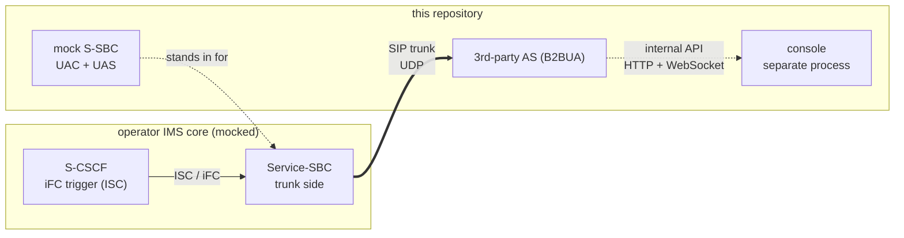
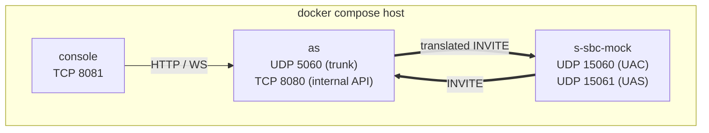
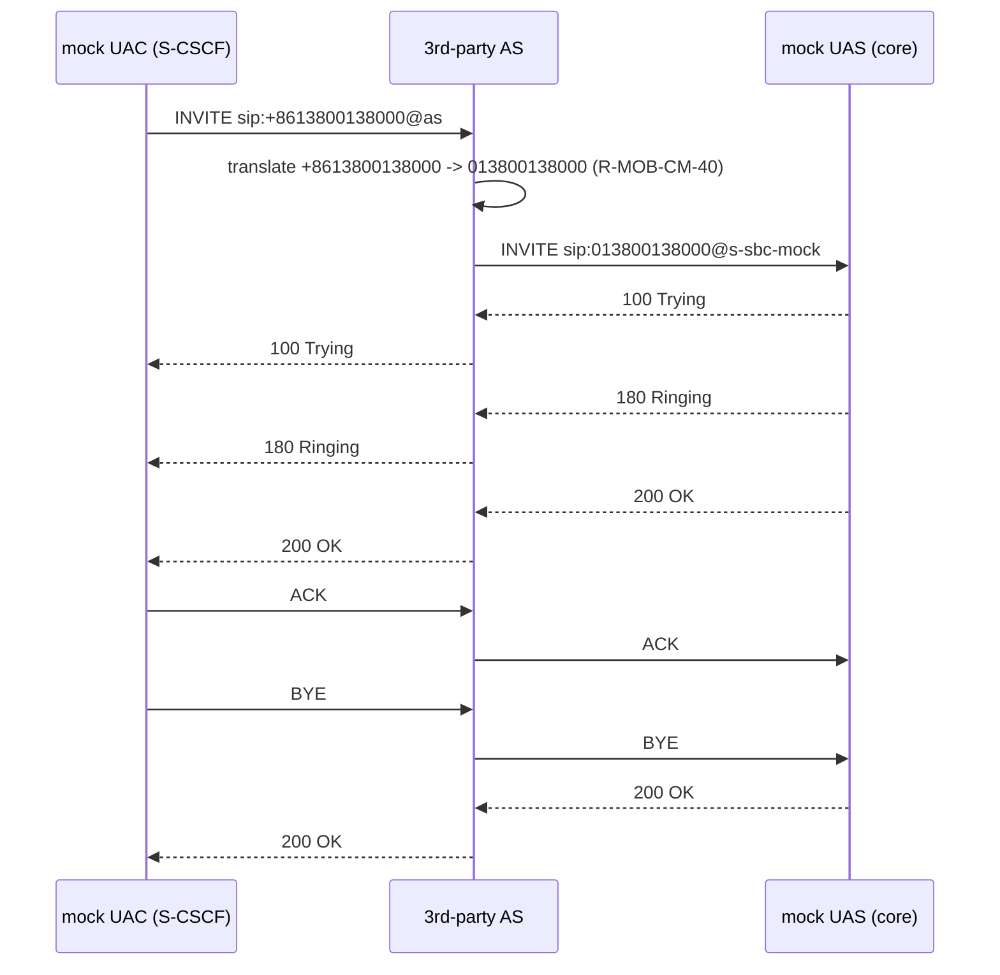
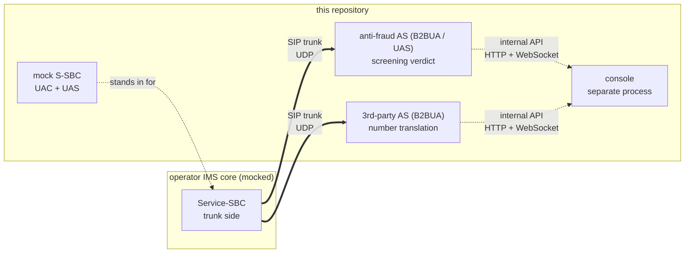
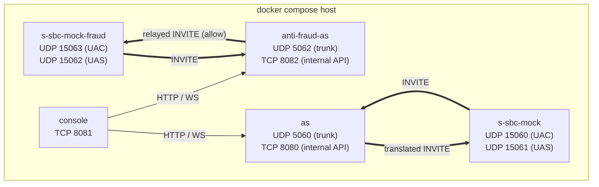
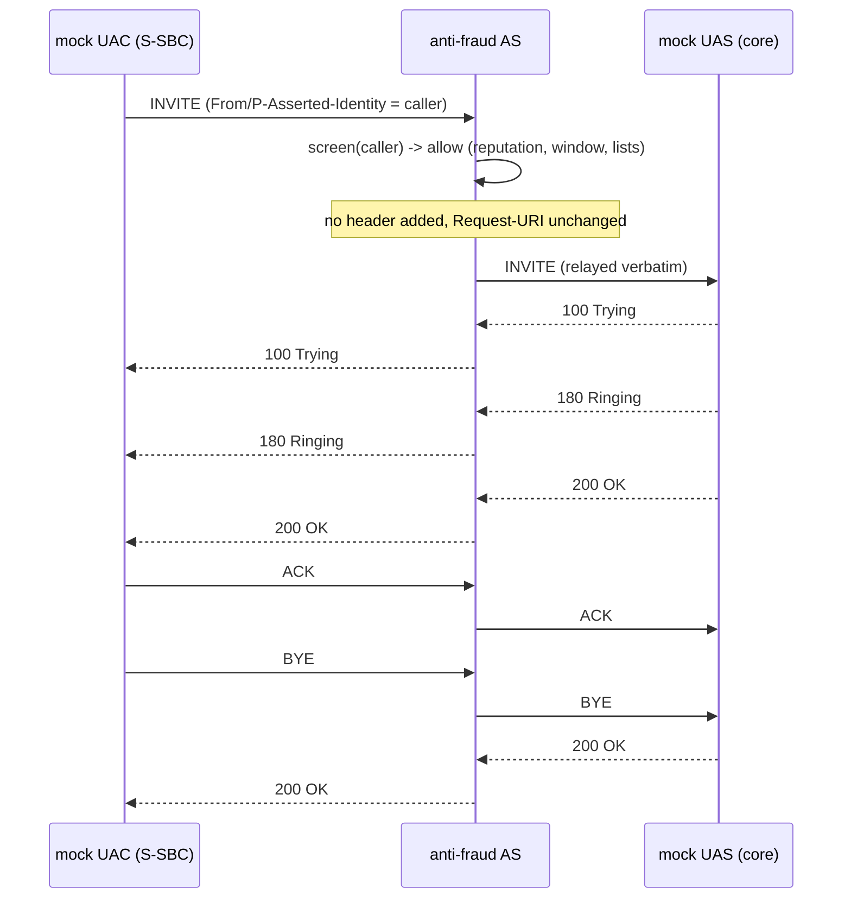
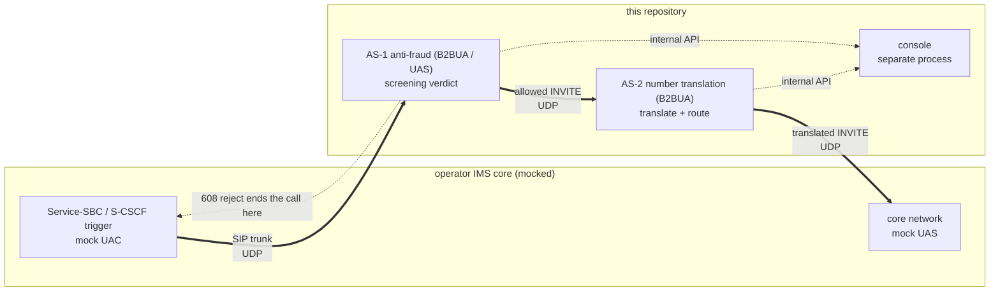
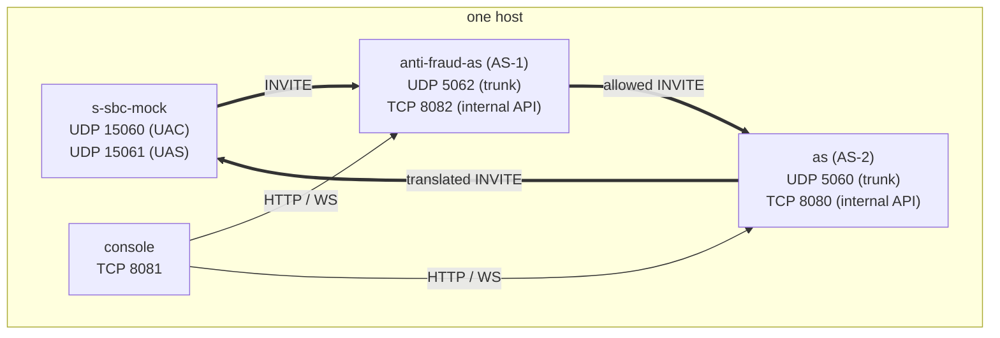
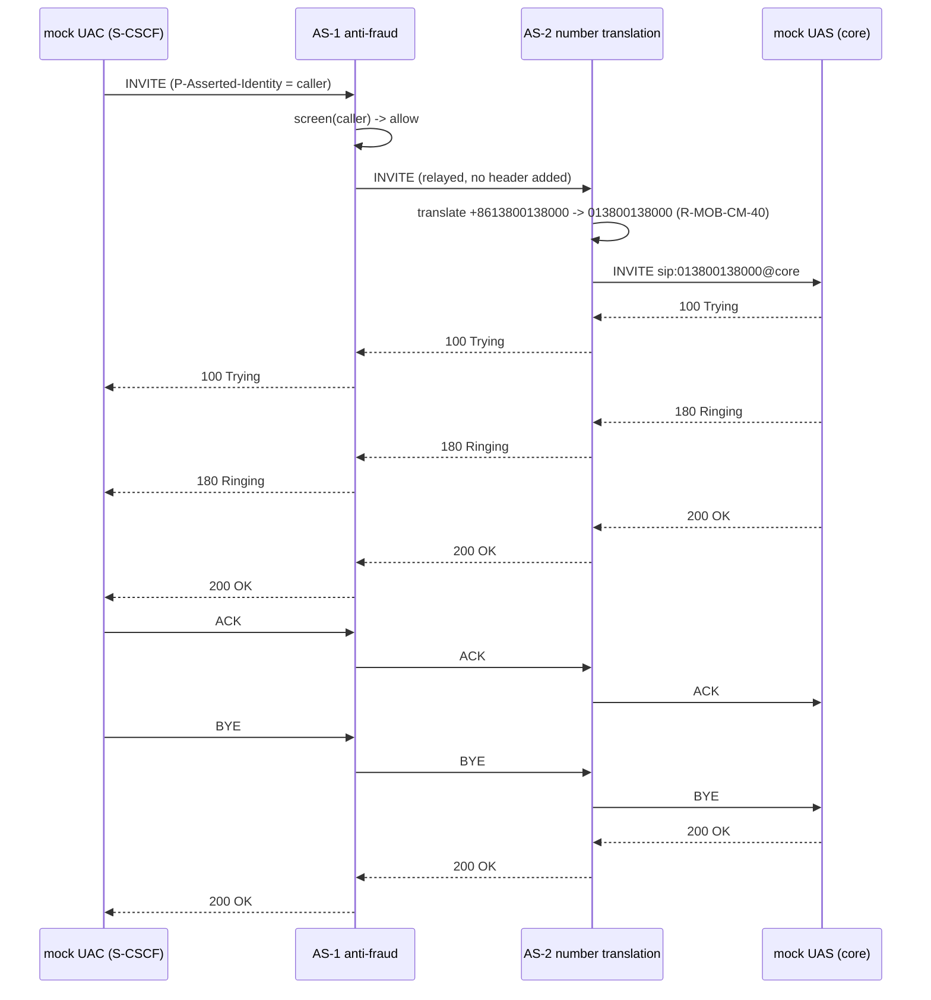

# High level design

## 1. Purpose and context

The system under design is a **third-party Application Server (AS)** that lives outside
the operator's IMS network and is reached over a SIP trunk from the operator's
Service-SBC (S-SBC). It performs number translation and intelligent routing for an
enterprise. It is a **B2BUA**: it terminates the incoming INVITE and originates a new
INVITE back towards the S-SBC. It is **signalling only** (ADR-0006).

The S-SBC, the S-CSCF and the core network behind them are **not** part of this system.
They are replaced by a local mock, and every peer address is configuration, so the same
code can be pointed at a real S-SBC by changing configuration only.



## 2. Deployment view

Three processes. The AS and the console are separate on purpose (ADR-0002): sippy's
`ED2.loop()` blocks its thread and must never share it with a web server.



| Service | Process | Ports | Purpose |
| --- | --- | --- | --- |
| `as` | `python -m as_app.main` | `5060/udp` trunk, `8080/tcp` internal API | The B2BUA under design |
| `s-sbc-mock` | `python -m s_sbc_mock.main` | `15060/udp` UAC side, `15061/udp` UAS side | Emulates the S-CSCF trigger and the core network |
| `console` | `python -m console.main` | `8081/tcp` | Operations UI, reaches the AS over the internal API |

Ports are configuration; see `docs/operations/deployment.md` for the full port matrix.

## 3. Interface view

| Interface | Direction | Protocol | Notes |
| --- | --- | --- | --- |
| SIP trunk | S-SBC → AS | SIP over UDP (RFC 3261) | Only interface that carries calls; source address verified against `ALLOWED_PEERS` |
| SIP trunk | AS → next hop | SIP over UDP | New INVITE originated by the B2BUA towards `SBC_PEER_*` |
| Internal API | console → AS | HTTP (REST) + WebSocket | `GET /healthz`, `/api/v1/metrics`, `/api/v1/rules`, `/api/v1/traces`, `WS /ws/events` |
| Rules file | operator → AS | YAML file | `config/routing_rules.yaml`, read-only on the console, hot reloaded (ADR-0004) |

## 4. Key message flows

### 4.1 Successful call



### 4.2 Error branches

| Case | Trigger | AS behaviour |
| --- | --- | --- |
| No matching rule | called number matches no enabled rule | `404 Not Found`, error code `AS-ROUTE-001` |
| Policy rejection | rule action `reject` (premium-rate blocklist) | `603 Decline`, error code `AS-ROUTE-002` |
| Caller abandons | `CANCEL` before answer | `487 Request Terminated` on the trunk, outbound leg torn down |
| Unknown peer | source address not in `ALLOWED_PEERS` | `403 Forbidden`, error code `AS-PEER-001` |

## 5. Quality attributes

| Attribute | Approach in this POC |
| --- | --- |
| Testability | Translation and routing are pure functions (`routing/engine.py`); three test layers with dynamically allocated UDP ports |
| Observability | Structured JSON log lines keyed by Call-ID, counters, per-Call-ID trace, operations console |
| Operability | Startup self-check and fail-fast; configuration from the environment; graceful shutdown |
| Changeability | Routing policy is data, not code (ADR-0004); switching mock ↔ real S-SBC is configuration only |
| Security (baseline) | Source address allowlist, no secrets committed, payload logging off by default. TLS and Digest are **not** implemented — see `docs/production-gaps.md` |
| Performance | Explicitly out of scope (REQ-NF-009): no throughput or latency target |

## 6. Constraints

- Python 3.10, sippy 2.4.2 pinned (`AGENT.md` section 6, ADR-0001).
- sippy's `ED2.loop()` blocks; no blocking operation inside sippy callbacks.
- UDP only (ADR-0003). No media (ADR-0006).
- Console without third-party front-end libraries and without a build step.
- The AS must never import from the mock (`AGENT.md` section 5).

## 7. Design decisions

| ADR | Decision |
| --- | --- |
| 0001 | Use sippy as the SIP stack and B2BUA framework |
| 0002 | Run the console as a separate process, talking over an internal API |
| 0003 | UDP only |
| 0004 | Declarative YAML routing rules with reload |
| 0005 | Mock the S-SBC on the same stack as the AS |
| 0006 | Signalling only, no media |
| 0007 | Anti-fraud AS: use case, `608 Rejected` semantics and cross-call state ownership |
| 0008 | Chained AS topology: configuration-only chaining and `Call-ID` preservation across two B2BUAs |

## 8. The second AS instance — anti-fraud (P8)

`docs/phase2-plan.md` D2 puts a second AS use case before any platform work, and D6 makes
it a **separate, independently runnable process**. This section adds that second instance to
the system context, the deployment view and the interface view. It extends the views above
rather than replacing them: the number-translation AS and its console are unchanged.

### 8.1 System context

The anti-fraud AS is a second B2BUA on the same trunk pattern, but it inspects the
**calling** party and returns a **verdict** instead of rewriting the called number
(`docs/phase2-plan.md` D4, ADR-0007). It is reached over a SIP trunk from the same
S-SBC/mock and relays the allowed call back to it.



The two AS instances are **independent**: neither imports the other, each has its own
configuration, data file, ports and lifecycle. The chained topology
(`SBC → anti-fraud AS → number-translation AS → core`) is P9's, not P8's; D6 builds it
before the platform work precisely to expose the friction between the two instances
(section 9).

### 8.2 Deployment view

**Five processes now**: the two AS instances, the two mocks and the console. The anti-fraud
AS is a separate process for the same reason as the number-translation AS (ADR-0002):
sippy's `ED2.loop()` blocks, so its internal API runs in its own process and on its own port,
and the two AS instances must not share a listen port (D6, and the port-collision trap in
`docs/phase2-plan.md` section 6). Each AS has its **own mock** so either instance can be
demonstrated on its own; P8 does not chain them (that is P9).



| Service | Process | Ports | Purpose |
| --- | --- | --- | --- |
| `as` | `python -m as_app.main` | `5060/udp` trunk, `8080/tcp` internal API | Number translation and routing (Phase 1) |
| `anti-fraud-as` | `python -m anti_fraud_as.main` | `5062/udp` trunk, `8082/tcp` internal API | Caller screening: allow or `608 Rejected` (P8) |
| `s-sbc-mock` | `python -m s_sbc_mock.main` | `15060/udp` UAC side, `15061/udp` UAS side | Emulates the S-CSCF trigger and the core network for `as` |
| `s-sbc-mock-fraud` | `python -m s_sbc_mock.main` | `15063/udp` UAC side, `15062/udp` UAS side | Same mock, dedicated to `anti-fraud-as` |
| `console` | `python -m console.main` | `8081/tcp` | Operations UI, reaches **either** AS over its internal API and reports which instance it is displaying |

Every port is configuration and **no default silently points at a real network**. The
distinct listen port (`5062`) is a deliberate default: without it, running both instances
locally collides on `5060`, which is the trap recorded in `docs/phase2-plan.md` section 6.
The full port matrix is in `docs/operations/deployment.md` section 2.

### 8.3 Interface view

| Interface | Direction | Protocol | Notes |
| --- | --- | --- | --- |
| SIP trunk (reject) | S-SBC → anti-fraud AS → S-SBC | SIP over UDP | The AS terminates the INVITE and answers it **from the UAS side only**: `608 Rejected`, no second leg, no `Call-Info` (ADR-0007). The answer is **unconditional** — it does not depend on the UAC's `Feature-Caps` declaration, which only bears on RFC 8688 section 3.4's announcement obligation and is recorded as `sip_608_declared` |
| SIP trunk (allow) | S-SBC → anti-fraud AS → S-SBC | SIP over UDP | The AS relays the INVITE as a B2BUA: the Request-URI and the SDP body are kept and the **pass-through header set** is copied, **no header is added**, and the response is relayed back. `Feature-Caps` is **not** in that set, so the `sip.608` declaration does not cross the AS (ADR-0007 decision 6) |
| Calling identity | inside the INVITE | `P-Asserted-Identity` | The screening input: the AS inspects the *calling* party, not the called number (D4) |
| Internal API | console → anti-fraud AS | HTTP (REST) + WebSocket | `GET /healthz` (answers the stable **instance identity** the console renders), `/api/v1/metrics`, `/api/v1/screening`, `/api/v1/traces`, `WS /ws/events` |
| Screening data file | operator → anti-fraud AS | YAML file | `config/caller_screening.yaml`: block/allow lists, reputation seed, window parameters. Read-only; validated on load and hot reloaded like the routing rules (ADR-0004 pattern) |

The `608` reject path and the allow path are the two external outcomes, and both are
covered by the flows below.

### 8.4 Key message flows

**Allow path — verdict allow, then a relayed call.** The screening decision is taken before
the outbound leg exists; once the verdict is *allow*, the call is an ordinary B2BUA relay
with nothing added to the wire.



**Reject path — UAS-only answer, no second leg.** The AS terminates the INVITE and answers
it from the answering leg. No `INVITE` is ever originated towards the core, so the core side
of the mock sees nothing.

```text
UAC (S-SBC)                         anti-fraud AS                         core
    |                                    |                                 |
    |--- INVITE ------------------------>|                                 |
    |                                    | screen(caller) -> reject        |
    |                                    |   reason: block_list /          |
    |                                    |           rate_window /         |
    |                                    |           reputation            |
    |<-- 100 Trying ---------------------|                                 |
    |<-- 608 Rejected -------------------|   CCEventFail((608,"Rejected"))  |
    |                                    |   no Call-Info, no media         |
    |--- ACK --------------------------->|                                 |
    |                                    |                                 |
    |          (no INVITE is ever sent towards the core side)              |
```

The reject is emitted exactly as the two-leg path emits its `404`/`603`: a `CCEventFail`
carrying `(608, "Rejected", None)` on the answering leg. The observable difference is that
the originating leg (`uaO`) is **never created**, so the controller must tolerate a call
with a single leg for its whole lifetime (`docs/architecture/lld.md` section 9).

**The reject does not branch on the declaration.** RFC 8688 section 3.4 requires the `608`
to be forwarded as the final response to the INVITE and places the announcement duty on the
element that inserts `sip.608` (ADR-0007 decision 5). The presence or absence of
`Feature-Caps: *;+sip.608` therefore selects no status code: the AS always answers `608`,
and an absent declaration only means the announcement obligation is unmet. Because that
distinction has to be visible, every screened INVITE carries the declaration state
(`sip_608_declared`) in the trace and the structured log.

## 9. The chained topology (P9)

> **Pending rework — the `Call-ID` statements below describe the current, defective behaviour
> (maintainer ruling, 2026-09-19).** The chain is wired by configuration only, which stands;
> but the claim in section 9.3 that one `Call-ID` is preserved across the whole chain is an
> observation of the code as it stands, and the maintainer has ruled that behaviour a
> **Phase 1 defect** — the AS reuses the inbound `Call-ID` on its outbound leg, against the
> design intent of `docs/architecture/lld.md` section 2.3. The fix lands on **`main`** and is
> merged back into `phase2`; **P9 is paused** until then, and this section is to be
> **reworked when P9's design stage is redone** (`docs/phase2-plan.md` section 3, P9). The
> measurements are kept — they are true observations of the code as it stands.

`docs/phase2-plan.md` D6 puts the two AS instances **in series** before the platform work:
`SBC → AS-1 (anti-fraud) → AS-2 (number translation) → core`. This section adds the chained
deployment view, the interface view and the key flows. It extends the views above rather
than replacing them: the two instances, their consoles and their independent demos are
unchanged (section 8), and the chain is wired **by configuration only** — no code change, no
iFC emulation in the mock, and neither AS imports the other (ADR-0008 decision 1).

### 9.1 System context

The S-CSCF trigger reaches AS-1, whose **allowed** INVITE is relayed to AS-2 instead of back
to the core; AS-2 translates the number and originates the call towards the core. A `608`
reject at AS-1 ends the call there.



The chain adds **no** new node type and no new process kind: it is the two existing B2BUAs
connected trunk-to-trunk, with the mock playing the S-CSCF on one side and the core on the
other.

### 9.2 Deployment view

In production the chain is the **three processes** of sections 2 and 8.2 wired in series — the
anti-fraud AS, the number-translation AS and the mock that plays either end — plus the
console. Each AS's next hop is pointed at the next instance, and **no new port is needed**:
`5060` and `5062` already differ precisely so both instances run on one host
(`docs/phase2-plan.md` section 6, "Port collision"). The demo runs the same chain on
dynamically allocated ports (ADR-0008 decision 6).



| Service | Process | Ports | Role in the chain |
| --- | --- | --- | --- |
| `anti-fraud-as` (AS-1) | `python -m anti_fraud_as.main` | `5062/udp`, `8082/tcp` | Screens the caller; relays an **allowed** INVITE to AS-2, or answers `608 Rejected` itself |
| `as` (AS-2) | `python -m as_app.main` | `5060/udp`, `8080/tcp` | Receives the relayed INVITE, translates the number and routes to the core |
| `s-sbc-mock` | `python -m s_sbc_mock.main` | `15060/udp` UAC, `15061/udp` UAS | S-CSCF trigger on one side and the core on the other |

The wiring is configuration only: the mock's target and `FRAUD_SBC_PEER_*` point AS-1 at
AS-2, and AS-2's routing catalogue selects the core (ADR-0008 decision 1).

### 9.3 Interface view

The chain reuses the existing interfaces of section 3 and section 8.3. What is new is the
**trunk-to-trunk** interface between AS-1 and AS-2, and the two next-hop mechanisms behind it:

| Interface | Direction | Protocol | Notes |
| --- | --- | --- | --- |
| SIP trunk (allow) | S-SBC → AS-1 → AS-2 | SIP over UDP | AS-1 relays the **allowed** INVITE to its single configured next hop (`FRAUD_SBC_PEER_*` → `nh_addr`); no header added (ADR-0007) |
| Inter-AS next hop (translate) | AS-2 → core | SIP over UDP | AS-2 selects the next hop from its **routing catalogue** (`action.next_hops`), not from a peer knob (ADR-0008 decision 1) |
| Reject | S-SBC → AS-1 → S-SBC | SIP over UDP | `608 Rejected`, UAS-only, no second leg, so the call never reaches AS-2 (ADR-0007, REQ-F-027) |

**The dialog `Call-ID` is preserved across the whole chain.** AS-1's trunk leg, AS-2's trunk
leg and the core leg all carry one `Call-ID`, because the sippy stack and both controllers
forward the trunk `Call-ID` inside the call-control event rather than regenerating it
(ADR-0008 decision 2, measured). A chained call is therefore a **single correlated trace**
across both instances rather than two independent traces; the demo prints the `Call-ID` each
hop saw to show this.

### 9.4 Key message flows

**Allow path — through both B2BUAs.** AS-1 screens the caller, relays the unchanged INVITE to
AS-2; AS-2 translates and routes to the core.



**Reject path — short-circuits the chain.** AS-1 answers `608 Rejected` on the trunk and
originates no second leg, so **AS-2 and the core never receive the call**. The demo asserts
this as an absence — zero calls seen by AS-2, zero INVITEs at the core — not merely as the
status code (ADR-0008 decision 5).

```text
UAC (S-CSCF)              AS-1 anti-fraud            AS-2 number translation        core
    |                          |                              |                        |
    |--- INVITE -------------->|                              |                        |
    |                          | screen(caller) -> reject     |                        |
    |<-- 100 Trying -----------|                              |                        |
    |<-- 608 Rejected ---------|                              |                        |
    |--- ACK ----------------->|                              |                        |
    |                          |                              |                        |
    |              (no INVITE reaches AS-2 or the core; the chain ends here)           |
```

### 9.5 What the chain does not change

The chain is **demonstration, not architecture**: it adds no module, no shared library and no
interface between the two AS instances, and it is not the abstraction P10 has to build
(ADR-0008 decision 7). The friction it exposes — that AS-1 relays to a configured peer while
AS-2 routes by catalogue, and that the correlation key is a stack behaviour rather than a
declared contract — is P10's input and is recorded at the item's close
(`docs/phase2-plan.md` section 3 P9, section 5.4).

