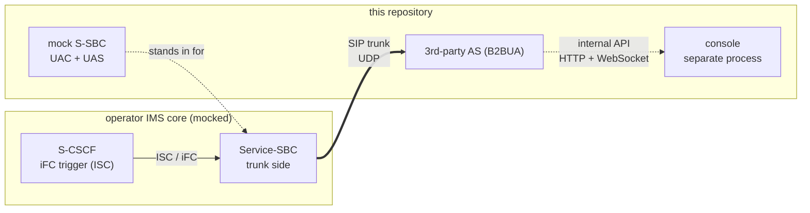
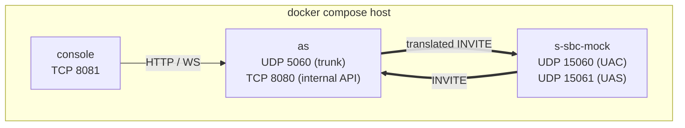
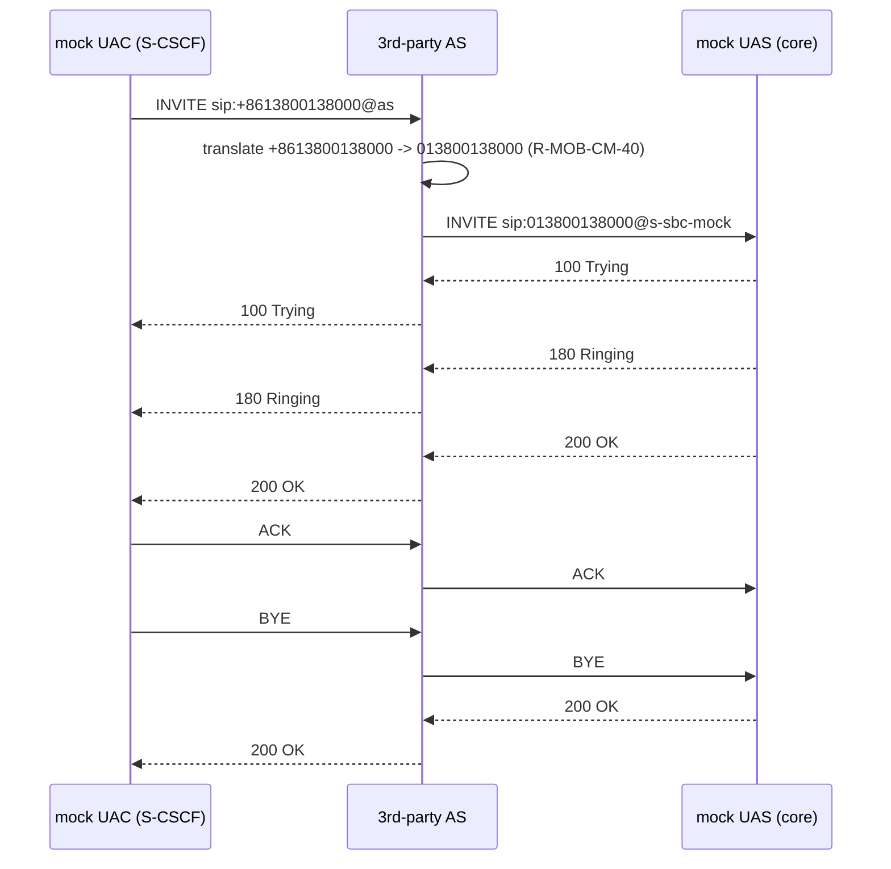

# High level design

## 1. Purpose and context

The system under design is a **third-party Application Server (AS)** that lives outside
the operator's IMS network and is reached over a SIP trunk from the operator's
Service-SBC (S-SBC). It performs number translation and intelligent routing for an
enterprise. It is a **B2BUA**: it terminates the incoming INVITE and originates a new
INVITE back towards the S-SBC. It is **signalling only** (ADR-0006).

The S-SBC, the S-CSCF and the core network behind them are **not** part of this system.
They are replaced by a local mock, and every peer address is configuration, so the same
code can be pointed at a real S-SBC by changing configuration only.

## 2. Deployment view

Three processes. The AS and the console are separate on purpose (ADR-0002): sippy's
`ED2.loop()` blocks its thread and must never share it with a web server.

| Service | Process | Ports | Purpose |
| --- | --- | --- | --- |
| `as` | `python -m as_app.main` | `5060/udp` trunk, `8080/tcp` internal API | The B2BUA under design |
| `s-sbc-mock` | `python -m s_sbc_mock.main` | `15060/udp` UAC side, `15061/udp` UAS side | Emulates the S-CSCF trigger and the core network |
| `console` | `python -m console.main` | `8081/tcp` | Operations UI, reaches the AS over the internal API |

Ports are configuration; see `docs/operations/deployment.md` for the full port matrix.

## 3. Interface view

| Interface | Direction | Protocol | Notes |
| --- | --- | --- | --- |
| SIP trunk | S-SBC → AS | SIP over UDP (RFC 3261) | Only interface that carries calls; source address verified against `ALLOWED_PEERS` |
| SIP trunk | AS → next hop | SIP over UDP | New INVITE originated by the B2BUA towards `SBC_PEER_*` |
| Internal API | console → AS | HTTP (REST) + WebSocket | `GET /healthz`, `/api/v1/metrics`, `/api/v1/rules`, `/api/v1/traces`, `WS /ws/events` |
| Rules file | operator → AS | YAML file | `config/routing_rules.yaml`, read-only on the console, hot reloaded (ADR-0004) |

## 4. Key message flows

### 4.1 Successful call

### 4.2 Error branches

| Case | Trigger | AS behaviour |
| --- | --- | --- |
| No matching rule | called number matches no enabled rule | `404 Not Found`, error code `AS-ROUTE-001` |
| Policy rejection | rule action `reject` (premium-rate blocklist) | `603 Decline`, error code `AS-ROUTE-002` |
| Caller abandons | `CANCEL` before answer | `487 Request Terminated` on the trunk, outbound leg torn down |
| Unknown peer | source address not in `ALLOWED_PEERS` | `403 Forbidden`, error code `AS-PEER-001` |

## 5. Quality attributes

| Attribute | Approach in this POC |
| --- | --- |
| Testability | Translation and routing are pure functions (`routing/engine.py`); three test layers with dynamically allocated UDP ports |
| Observability | Structured JSON log lines keyed by Call-ID, counters, per-Call-ID trace, operations console |
| Operability | Startup self-check and fail-fast; configuration from the environment; graceful shutdown |
| Changeability | Routing policy is data, not code (ADR-0004); switching mock ↔ real S-SBC is configuration only |
| Security (baseline) | Source address allowlist, no secrets committed, payload logging off by default. TLS and Digest are **not** implemented — see `docs/production-gaps.md` |
| Performance | Explicitly out of scope (REQ-NF-009): no throughput or latency target |

## 6. Constraints

- Python 3.10, sippy 2.4.2 pinned (`AGENT.md` section 6, ADR-0001).
- sippy's `ED2.loop()` blocks; no blocking operation inside sippy callbacks.
- UDP only (ADR-0003). No media (ADR-0006).
- Console without third-party front-end libraries and without a build step.
- The AS must never import from the mock (`AGENT.md` section 5).

## 7. Design decisions

| ADR | Decision |
| --- | --- |
| 0001 | Use sippy as the SIP stack and B2BUA framework |
| 0002 | Run the console as a separate process, talking over an internal API |
| 0003 | UDP only |
| 0004 | Declarative YAML routing rules with reload |
| 0005 | Mock the S-SBC on the same stack as the AS |
| 0006 | Signalling only, no media |
