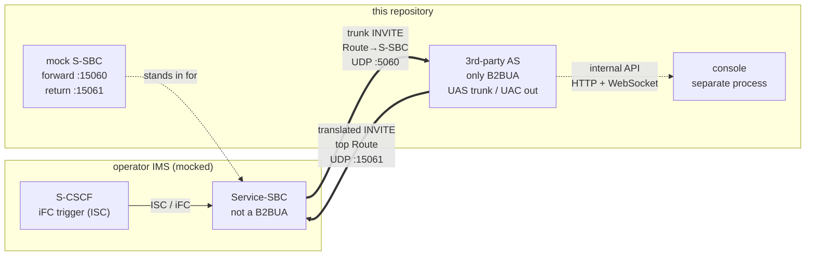
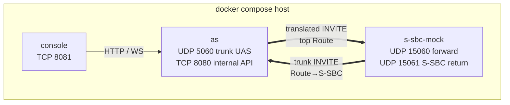
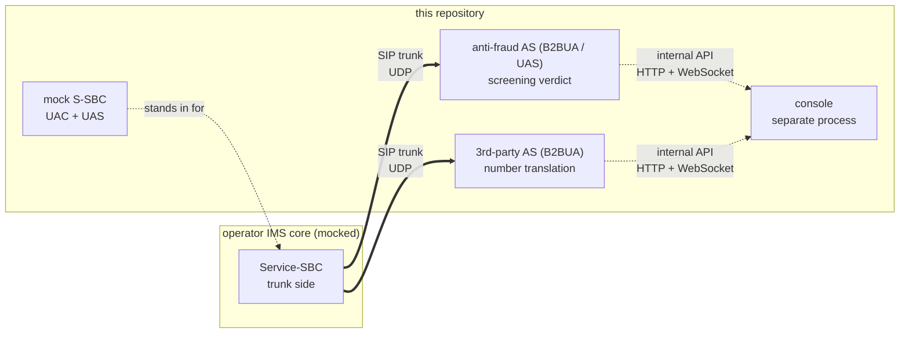
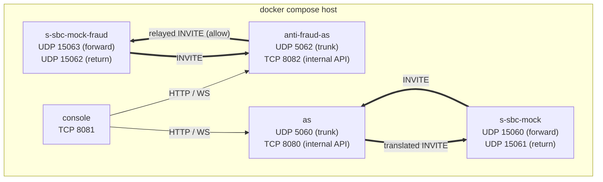
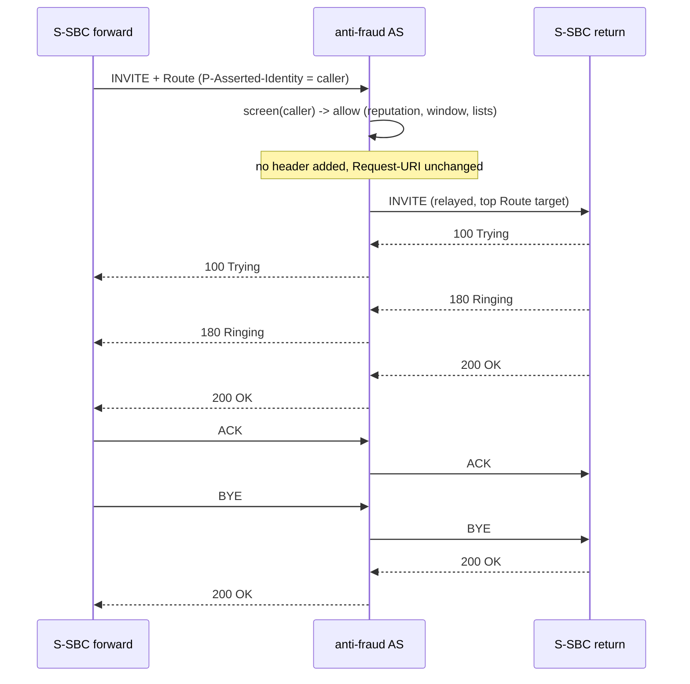
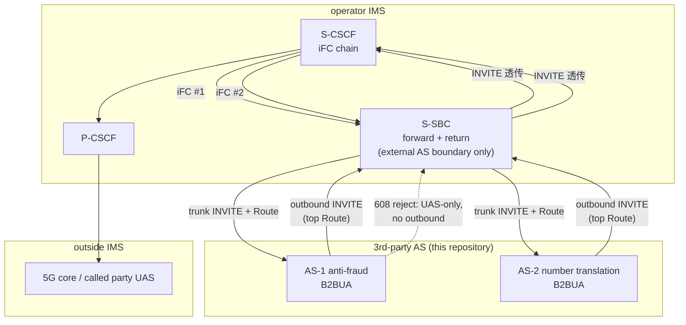
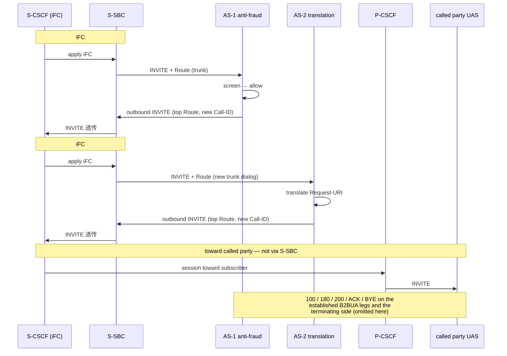
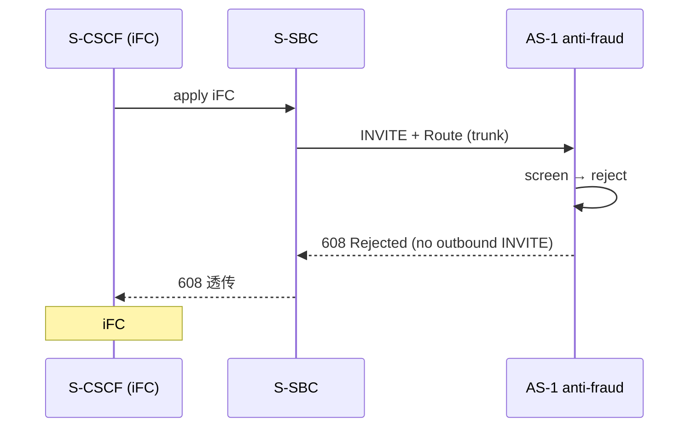
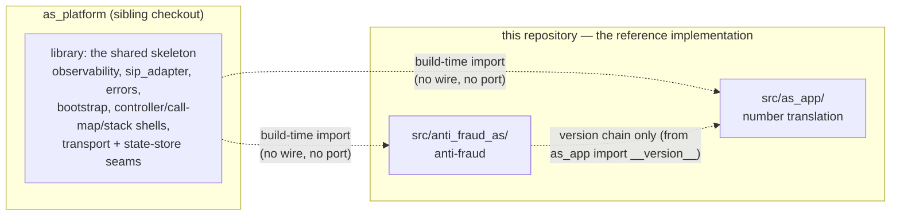

# High level design

## 1. Purpose and context

The system under design is a **third-party Application Server (AS)** that lives outside
the operator's IMS network and is reached over a SIP trunk from the operator's
Service-SBC (S-SBC). It performs number translation and intelligent routing for an
enterprise. It is a **B2BUA**: it terminates the incoming INVITE and originates a new
INVITE back towards the S-SBC. It is **signalling only** (ADR-0006).

The S-SBC, the S-CSCF and the core network behind them are **not** part of this system.
They are replaced by a local mock, and every peer address is configuration, so the same
code can be pointed at a real S-SBC by changing configuration only.



## 2. Deployment view

Three processes. The AS and the console are separate on purpose (ADR-0002): sippy's
`ED2.loop()` blocks its thread and must never share it with a web server.



| Service | Process | Ports | Purpose |
| --- | --- | --- | --- |
| `as` | `python -m as_app.main` | `5060/udp` trunk (UAS leg), `8080/tcp` internal API | The only B2BUA: UAS on the trunk, UAC on the outbound leg |
| `s-sbc-mock` | `python -m s_sbc_mock.main` | `15060/udp` forward, `15061/udp` S-SBC return | Stands in for the operator S-SBC (not the core); forwards to the AS and receives the translated INVITE back |
| `console` | `python -m console.main` | `8081/tcp` | Operations UI, reaches the AS over the internal API |

Ports are configuration; see `docs/operations/deployment.md` for the full port matrix.

## 3. Interface view

| Interface | Direction | Protocol | Notes |
| --- | --- | --- | --- |
| SIP trunk | S-SBC → AS | SIP over UDP (RFC 3261) | Only interface that carries calls; source address verified against `ALLOWED_PEERS` |
| SIP trunk | AS → S-SBC return | SIP over UDP | New INVITE originated by the B2BUA to the top `Route` the S-SBC inserted (catalogue names the hop; wire port from `Route`) |
| Internal API | console → AS | HTTP (REST) + WebSocket | `GET /healthz`, `/api/v1/metrics`, `/api/v1/rules`, `/api/v1/traces`, `WS /ws/events` |
| Rules file | operator → AS | YAML file | `config/routing_rules.yaml`, read-only on the console, hot reloaded (ADR-0004) |

## 4. Key message flows

### 4.1 Successful call

```mermaid
sequenceDiagram
    participant FWD as mock S-SBC forward (:15060)
    participant AS as 3rd-party AS (UAS then UAC)
    participant RET as mock S-SBC return (:15061)
    FWD->>AS: INVITE sip:+8613800138000@as<br/>Route: S-SBC;lr
    AS->>AS: translate +8613800138000 -> 013800138000 (R-MOB-CM-40)
    AS->>RET: INVITE sip:013800138000@S-SBC (top Route, new Call-ID)
    RET-->>AS: 100 Trying
    AS-->>FWD: 100 Trying
    RET-->>AS: 180 Ringing
    AS-->>FWD: 180 Ringing
    RET-->>AS: 200 OK
    AS-->>FWD: 200 OK
    FWD->>AS: ACK
    AS->>RET: ACK
    FWD->>AS: BYE
    AS->>RET: BYE
    RET-->>AS: 200 OK
    AS-->>FWD: 200 OK
```

### 4.2 Error branches

| Case | Trigger | AS behaviour |
| --- | --- | --- |
| No matching rule | called number matches no enabled rule | `404 Not Found`, error code `AS-ROUTE-001` |
| Policy rejection | rule action `reject` (premium-rate blocklist) | `603 Decline`, error code `AS-ROUTE-002` |
| Caller abandons | `CANCEL` before answer | `487 Request Terminated` on the trunk, outbound leg torn down |
| Unknown peer | source address not in `ALLOWED_PEERS` | `403 Forbidden`, error code `AS-PEER-001` |

## 5. Quality attributes

| Attribute | Approach in this POC |
| --- | --- |
| Testability | Translation and routing are pure functions (`routing/engine.py`); three test layers with dynamically allocated UDP ports |
| Observability | Structured JSON log lines keyed by Call-ID, counters, per-Call-ID trace, operations console |
| Operability | Startup self-check and fail-fast; configuration from the environment; graceful shutdown |
| Changeability | Routing policy is data, not code (ADR-0004); switching mock ↔ real S-SBC is configuration only |
| Security (baseline) | Source address allowlist, no secrets committed, payload logging off by default. TLS and Digest are **not** implemented — see `docs/production-gaps.md` |
| Performance | Explicitly out of scope (REQ-NF-009): no throughput or latency target |

## 6. Constraints

- Python 3.10, sippy 2.4.2 pinned (`AGENT.md` section 6, ADR-0001).
- sippy's `ED2.loop()` blocks; no blocking operation inside sippy callbacks.
- UDP only (ADR-0003). No media (ADR-0006).
- Console without third-party front-end libraries and without a build step.
- The AS must never import from the mock (`AGENT.md` section 5).

## 7. Design decisions

| ADR | Decision |
| --- | --- |
| 0001 | Use sippy as the SIP stack and B2BUA framework |
| 0002 | Run the console as a separate process, talking over an internal API |
| 0003 | UDP only — **superseded for the library's pluggable transport seam by ADR-0010**; the POC trunk itself is still UDP |
| 0004 | Declarative YAML routing rules with reload |
| 0005 | Mock the S-SBC on the same stack as the AS |
| 0006 | Signalling only, no media |
| 0007 | Anti-fraud AS: use case, `608 Rejected` semantics and cross-call state ownership |
| 0008 | Chained AS topology — **historical**: every B2BUA leg gets its own `Call-ID`; decision 1 (trunk-to-trunk via `FRAUD_SBC_PEER_*`) is **superseded by ADR-0014** |
| 0009 | Platform library extraction; consumed through a `path` source |
| 0010 | P11 verification: `TlsTransport`, `RedisStateStore`, capacity harness |
| 0011 | Vendored Chart.js for the console |
| 0012 | Load generator is an external process (SIP in, WebSocket out) |
| 0013 | Two generator controls coupled by Little's Law |
| 0014 | iFC-orchestrated chained topology (`src/ims_mock/`) — **the chain that ships** |
| 0015 | Live-load demo × P9b alignment (generator topology modes, mode-aware console) |
| 0016 | Call Trace sequence view + phased SIP API |

## 8. The second AS instance — anti-fraud (P8)

`docs/phase2-plan.md` D2 puts a second AS use case before any platform work, and D6 makes
it a **separate, independently runnable process**. This section adds that second instance to
the system context, the deployment view and the interface view. It extends the views above
rather than replacing them: the number-translation AS and its console are unchanged.

### 8.1 System context

The anti-fraud AS is a second B2BUA on the same trunk pattern, but it inspects the
**calling** party and returns a **verdict** instead of rewriting the called number
(`docs/phase2-plan.md` D4, ADR-0007). It is reached over a SIP trunk from the same
S-SBC/mock and relays the allowed call back to it.



The two AS instances are **independent**: neither imports the other, each has its own
configuration, data file, ports and lifecycle. The chained topology is P9's, not P8's; D6
builds it before the platform work precisely to expose the friction between the two
instances (section 9). **There is no AS-to-AS SIP hop in that chain**: each AS is triggered
by its own iFC from S-CSCF over the S-SBC trunk and returns its outbound INVITE to the S-SBC
return side, so the shape is
`S-CSCF(iFC#1) → S-SBC → AS-1 → S-SBC → S-CSCF(iFC#2) → S-SBC → AS-2 → S-SBC → S-CSCF → P-CSCF → UAS`,
never `SBC → anti-fraud AS → number-translation AS → core`.

### 8.2 Deployment view

**Five processes now**: the two AS instances, the two mocks and the console. The anti-fraud
AS is a separate process for the same reason as the number-translation AS (ADR-0002):
sippy's `ED2.loop()` blocks, so its internal API runs in its own process and on its own port,
and the two AS instances must not share a listen port (D6, and the port-collision trap in
`docs/phase2-plan.md` section 6). Each AS has its **own mock** so either instance can be
demonstrated on its own; P8 does not chain them (that is P9).



| Service | Process | Ports | Purpose |
| --- | --- | --- | --- |
| `as` | `python -m as_app.main` | `5060/udp` trunk, `8080/tcp` internal API | Number translation and routing (Phase 1) |
| `anti-fraud-as` | `python -m anti_fraud_as.main` | `5062/udp` trunk, `8082/tcp` internal API | Caller screening: allow or `608 Rejected` (P8) |
| `s-sbc-mock` | `python -m s_sbc_mock.main` | `15060/udp` forward, `15061/udp` return | Emulates the S-SBC boundary for `as` (inbound INVITE + Route; return leg toward IMS) |
| `s-sbc-mock-fraud` | `python -m s_sbc_mock.main` | `15063/udp` forward, `15062/udp` return | Same mock, dedicated to `anti-fraud-as` |
| `console` | `python -m console.main` | `8081/tcp` | Operations UI, reaches **either** AS over its internal API and reports which instance it is displaying |

Every port is configuration and **no default silently points at a real network**. The
distinct listen port (`5062`) is a deliberate default: without it, running both instances
locally collides on `5060`, which is the trap recorded in `docs/phase2-plan.md` section 6.
The full port matrix is in `docs/operations/deployment.md` section 2.

### 8.3 Interface view

| Interface | Direction | Protocol | Notes |
| --- | --- | --- | --- |
| SIP trunk (reject) | S-SBC → anti-fraud AS → S-SBC | SIP over UDP | The AS terminates the INVITE and answers it **from the UAS side only**: `608 Rejected`, no second leg, no `Call-Info` (ADR-0007). The answer is **unconditional** — it does not depend on the UAC's `Feature-Caps` declaration, which only bears on RFC 8688 section 3.4's announcement obligation and is recorded as `sip_608_declared` |
| SIP trunk (allow) | S-SBC → anti-fraud AS → S-SBC | SIP over UDP | The AS relays the INVITE as a B2BUA: the Request-URI and the SDP body are kept and the **pass-through header set** is copied, **no header is added**, and the outbound INVITE is sent to the **top `Route`** the S-SBC inserted (RFC 3261). `Feature-Caps` is **not** in that set, so the `sip.608` declaration does not cross the AS (ADR-0007 decision 6) |
| Calling identity | inside the INVITE | `P-Asserted-Identity` | The screening input: the AS inspects the *calling* party, not the called number (D4) |
| Internal API | console → anti-fraud AS | HTTP (REST) + WebSocket | `GET /healthz` (answers the stable **instance identity** the console renders), `/api/v1/metrics`, `/api/v1/screening`, `/api/v1/traces`, `WS /ws/events` |
| Screening data file | operator → anti-fraud AS | YAML file | `config/caller_screening.yaml`: block/allow lists, reputation seed, window parameters. Read-only; validated on load and hot reloaded like the routing rules (ADR-0004 pattern) |

The `608` reject path and the allow path are the two external outcomes, and both are
covered by the flows below.

### 8.4 Key message flows

**Allow path — verdict allow, then a relayed call.** The screening decision is taken before
the outbound leg exists; once the verdict is *allow*, the call is an ordinary B2BUA relay
with nothing added to the wire.



**Reject path — UAS-only answer, no second leg.** The AS terminates the INVITE and answers
it from the answering leg. No outbound `INVITE` is ever originated, so the S-SBC return side
of the mock sees nothing.

```text
S-SBC forward                       anti-fraud AS                    S-SBC return
    |                                    |                                 |
    |--- INVITE ------------------------>|                                 |
    |                                    | screen(caller) -> reject        |
    |                                    |   reason: block_list /          |
    |                                    |           rate_window /         |
    |                                    |           reputation            |
    |<-- 100 Trying ---------------------|                                 |
    |<-- 608 Rejected -------------------|   CCEventFail((608,"Rejected"))  |
    |                                    |   no Call-Info, no media         |
    |--- ACK --------------------------->|                                 |
    |                                    |                                 |
    |          (no INVITE is ever sent towards the return side)            |
```

The reject is emitted exactly as the two-leg path emits its `404`/`603`: a `CCEventFail`
carrying `(608, "Rejected", None)` on the answering leg. The observable difference is that
the originating leg (`uaO`) is **never created**, so the controller must tolerate a call
with a single leg for its whole lifetime (`docs/architecture/lld.md` section 9).

**The reject does not branch on the declaration.** RFC 8688 section 3.4 requires the `608`
to be forwarded as the final response to the INVITE and places the announcement duty on the
element that inserts `sip.608` (ADR-0007 decision 5). The presence or absence of
`Feature-Caps: *;+sip.608` therefore selects no status code: the AS always answers `608`,
and an absent declaration only means the announcement obligation is unmet. Because that
distinction has to be visible, every screened INVITE carries the declaration state
(`sip_608_declared`) in the trace and the structured log.

## 9. The chained topology (P9)

`docs/phase2-plan.md` D6 puts the two AS instances **in series** before the platform work.
The **intended** chain is not trunk-to-trunk between AS instances: **AS never talks to AS
directly**. Each hop is an iFC trigger from **S-CSCF**, delivered over the **S-SBC trunk** to
a 3rd-party AS; each allowed AS returns its outbound INVITE to the **top `Route`** on the
S-SBC **return** side inside the IMS; **S-CSCF** then runs the next iFC. Toward the called
party the session leaves the IMS through **P-CSCF** into the 5G core — **not** through the
S-SBC, which is only the operator boundary to external ASs.

> **Implemented (P9b, ADR-0014).** `make demo-chained`, `src/ims_mock/` and
> `tools/chained_helpers.py` implement the topology below. ADR-0008 decision 1 is historical;
> see `docs/architecture/adr/0014-chained-ifc-orchestrator.md`.

### 9.1 System context (logical)



**S-SBC scope.** The S-SBC sits **only** on the path between the IMS and external 3rd-party
ASs. It is **not** on the path to the called subscriber: that leg is **S-CSCF → P-CSCF → 5G
core** (out of IMS). Neither AS imports the other; the only coupling is **iFC order** in
S-CSCF and the shared **ICID** in `P-Charging-Vector` on the wire.

### 9.2 Allow path — signalling order

Each AS interaction is a **separate iFC trigger** with its own trunk INVITE. On the allow path
the AS originates an outbound INVITE toward the top `Route`; the S-SBC **return** side
**透传** that INVITE to **S-CSCF** (there is no separate “back to IMS” hop — the S-SBC is
already inside the IMS). Only after S-CSCF receives that INVITE does **iFC #2** fire and
deliver a **new** trunk INVITE to AS-2 through the S-SBC **forward** side.



```text
  S-CSCF          S-SBC           AS-1          S-CSCF          S-SBC           AS-2          S-CSCF        P-CSCF       5G/UAS
  (iFC#1)    (IMS, forward)  (external)      (iFC#2)    (IMS, forward)  (external)                    (out of IMS)
     |             |              |              |             |              |              |            |            |
     |-- trigger ->|              |              |             |              |              |            |            |
     |             |-- INVITE+Route>|              |             |              |              |            |            |
     |             |              | allow        |             |              |              |            |            |
     |             |<- INVITE(out)|              |             |              |              |            |            |
     |<- 透传 INVITE|              |              |             |              |              |            |            |
     |             |              |              |             |              |              |            |            |
     |-- trigger -------------------------------->|             |              |              |            |            |
     |             |              |              |-- trigger ->|              |              |            |            |
     |             |              |              |             |-- INVITE+Route>|              |            |            |
     |             |              |              |             |              | translate    |            |            |
     |             |              |              |             |<- INVITE(out)|              |            |            |
     |             |              |              |<- 透传 INVITE|              |              |            |            |
     |             |              |              |             |              |              |            |            |
     |-- toward called party (not via S-SBC) ------------------------------------------------------------------->| INVITE ->|
```

### 9.3 Reject path — AS-1 short-circuits the iFC chain

AS-1 answers `608 Rejected` on the trunk (UAS-only, no outbound INVITE). **iFC #2 never
runs**; AS-2 and the terminating side see no INVITE.



### 9.4 Interface view

| Interface | Direction | Protocol | Notes |
| --- | --- | --- | --- |
| iFC trigger #1 | S-CSCF → S-SBC → AS-1 | SIP over UDP | Trunk INVITE with `Route`; AS-1 screens **calling** party (section 8) |
| AS-1 allow (outbound) | AS-1 → S-SBC return → S-CSCF | SIP over UDP | Outbound INVITE to top `Route`; **INVITE 透传** to S-CSCF — not a direct AS-1 → AS-2 hop |
| iFC trigger #2 | S-CSCF → S-SBC → AS-2 | SIP over UDP | **New** trunk INVITE after iFC #1 completes; same `P-Charging-Vector` ICID |
| AS-2 allow (outbound) | AS-2 → S-SBC return → S-CSCF | SIP over UDP | Translated outbound INVITE to top `Route`; INVITE 透传 to S-CSCF |
| Toward called party | S-CSCF → P-CSCF → 5G core | SIP (IMS) | **Does not traverse S-SBC** — S-SBC is external-AS boundary only |
| Reject | S-SBC → AS-1 → S-SBC → S-CSCF | SIP over UDP | `608 Rejected`, UAS-only; chain stops (ADR-0007, REQ-F-027) |

**`Call-ID` per leg.** A full allow chain carries **four** dialog identities on the AS legs:
AS-1 trunk, AS-1 outbound, AS-2 trunk (new iFC trigger), AS-2 outbound — each B2BUA derives
its outbound value (`outbound_call_id()`, `docs/architecture/lld.md` section 2.3). Cross-AS
correlation on `Call-ID` remains impossible; the **ICID** in `P-Charging-Vector` is the
end-to-end key both instances forward verbatim (`PASSTHROUGH_HEADERS`).

### 9.5 Deployment view (target POC)

Both AS processes and the console are unchanged from sections 8.2 and 2. What the chain adds
is an **iFC orchestrator** in `src/ims_mock/` (alongside the existing S-SBC forward/return
sides): it applies iFC #1 and #2 in order, never wiring `FRAUD_SBC_PEER_*` to AS-2. A minimal
**P-CSCF relay** and **terminating UAS** complete the toward-called-party path (ADR-0014).

### 9.6 What the chain does not change

The chain is **demonstration, not architecture**: it adds no module between the two AS
binaries and is not the abstraction P10 extracts (ADR-0008 decision 7). The friction it
exposes — two different use-case controllers, distinct observability per instance, and the
need for an IMS-side orchestrator rather than a peer knob — is input to later platform and
mock work (`docs/phase2-plan.md` section 3 P9).

## 10. The platform library (P10)

`docs/phase2-plan.md` D8 splits the repository in two stages: stage one put the anti-fraud AS
**in this repository** (section 8), so the second use case could reuse the mock, the console,
the test scaffolding and the document set; stage two extracts the **skeleton shared by the two
AS instances** into a library in a new repository, after which this repository becomes the
library's **reference implementation and first user** (ADR-0009). This section adds the library
to the system context, the deployment view and the interface view. It extends the views above
rather than replacing them: the two AS instances, their console and their three demos are
unchanged (sections 8, 9).

### 10.1 System context

**The library is a build-time dependency, not a runtime component.** Nothing new is deployed:
the process topology of section 8.2 — the two AS instances, the two mocks and the console — is
unchanged, and the library adds **no process, no port and no listener**. It sits on the build
path only: `uv` resolves it when this repository's environment is created, and the extracted
code runs **inside** the two AS processes exactly where it ran before (ADR-0009 decisions 1
and 2).



**This repository is the library's reference implementation (REQ-F-029): the library is
developed against two real consumers, not against an imagined one.** The two consumers are
`src/as_app/` (number translation, the Phase 1 AS) and `src/anti_fraud_as/` (anti-fraud, the
P8 AS). A library induced from one use case would be shaped like it; the extraction has exactly
two samples, which is both the reason the seams exist and the limit of what they prove
(ADR-0009, *Gaps accepted*).

### 10.2 Deployment view

**What changes on a machine is the checkout, not the topology.** The library repository
`as_platform` must be checked out **beside** this one (`../as_platform`), and `AGENT.md`
section 10's guarantee *"clone → `uv sync` → `make demo`"* becomes **"clone both repositories
side by side → `uv sync` → `make demo`"** (REQ-F-032, ADR-0009 decision 6). There is **no new
environment variable, no new port and no new service**: the library is not deployed, and the
port matrices of sections 8.2 and 9.5 are untouched.

| Checkout | Path | Role |
| --- | --- | --- |
| this repository | the working tree | the library's **reference implementation** and first user |
| `as_platform` | `../as_platform` (sibling) | the library; consumed through a `path` source |

The sibling layout is not a convention: the `path` in `pyproject.toml` is resolved **relative
to the consuming `pyproject.toml`**, so `../as_platform` means a sibling of this repository's
root and a deeper nesting does not find it (ADR-0009, *Verified facts* (f)). A checkout with
only this repository does not resolve `as-platform` at all (*Verified facts* (a)).

### 10.3 Interface view

The library's public surface is grouped below; each group's reasoning is in ADR-0009 and is not
re-argued here. Everything in the table is imported **by this repository**, and the library
imports neither application (REQ-F-030).

| Surface | What it is | ADR-0009 |
| --- | --- | --- |
| error mechanism | the memberless `ErrorCode`, `SIP_PHRASES`, `sip_status_for`, `AsError`, and the `SkeletonErrorCode` family | decision 3 |
| observability | structured logging, counters/dispositions/peer status, per-Call-ID trace and console feed | decision 2 |
| sippy adapter | `PASSTHROUGH_HEADERS`, `B2BUA_CALL_ID_SUFFIX`, `outbound_call_id`, `build_request_uri`, `extract_called_number`, `is_allowed_peer`, `cancel_transaction_timers`, `TRANSACTION_TIMER_NAMES`, `CallLeg` | decision 2 |
| hop | the `NextHop` value object, in its own module (`hop.py`) so `sip_adapter` and `call_controller` can both import it without a cycle; `as_app.routing.rules` re-exports it | decision 2 |
| bootstrap plumbing | `ShutdownController`, `install_signal_handlers`, `check_port_available` | decision 2 |
| controller shell | `BaseCallController`, `BaseCallMap`, `PolicyDecision` | decision 4 |
| stack shell | `BaseAsStack` | decision 4 |
| internal-API shell | the app factory, `InternalApiServer` and the payload builders, generalised over a payload provider | decision 2 |
| transport seam | `Transport` / `UdpTransport` | decision 5 |
| state-store seam | `StateStore` / `InMemoryStateStore` | decision 5 |
| version | the distribution → `VERSION` chain | decision 2 |

**The direction rule the library must satisfy is one-way (REQ-F-030):** `as_platform` imports
**neither** `as_app` nor `anti_fraud_as`, so it carries the skeleton and not either use case.
The other direction changed with the extraction: `src/anti_fraud_as/**` now imports the
**library** (`as_platform`) directly for the skeleton, so the extraction replaced ADR-0007
decision 9's *mechanism* — direct import from `as_app` — while that decision's *substance*, a
second process and not a framework, still holds. The only `as_app` import left in that package
is the version chain (`from as_app import __version__`), and the assertable invariant
`src/as_app/**` ↛ `anti_fraud_as` (REQ-F-026, REQ-F-030) still holds.

### 10.4 Key message flows

**No message flow changes, and that is the point.** The extraction moves where the skeleton's
code lives, not what any process does with a message: the relay, the failover walk, the `608`
reject, the per-leg `Call-ID` derivation and the ICID pass-through of sections 4, 8.4 and 9.4
are the same code in the same processes on the same wire. The heading is kept for structural
symmetry with sections 8 and 9; its content is the absence of a flow delta (REQ-F-031).

### 10.5 What the extraction does not change

- **The SIP signalling on the trunk is byte-identical.** The same messages, headers,
  Request-URI, SDP body and pass-through header set cross every leg (ADR-0009 decision 2).
- **The `AS-*` codes, SIP statuses and reason phrases are unchanged.** `SIP_PHRASES` —
  including `608: "Rejected"` — moves once, so the phrase cannot drift between families
  (ADR-0009 decision 3).
- **The per-instance Call-ID-keyed trace and console feed are unchanged.** Each AS still keys
  its trace, log and console feed on the `Call-ID` it saw on its trunk leg (sections 9.3, 9.4).
- **The two AS instances remain independent processes.** No process boundary moves, and the
  extraction adds no import between them (section 8.1).
- **`make demo` / `make demo-fraud` / `make demo-chained` still place real calls.** The three
  documented entry points keep working from a clean checkout, with the second checkout in place
  (REQ-F-032).
- **The three test layers stay green** — unit, integration and e2e (REQ-F-031, `AGENT.md`
  section 11). The one bounded exception is recorded in ADR-0009 decision 3: it changes no
  assertion's expected value, and the single uniqueness/status-coverage test is **strengthened**
  in scope to cover all three error families.

**The extraction is a pure refactor with no wire-visible change.** It moves the skeleton both
AS instances already share into a library in a new repository; it changes where code lives, not
what the system does.

### 10.6 What it changes for a developer

- **Two repositories to clone.** A developer clones both checkouts side by side; a working tree
  with only this repository does not resolve the dependency (section 10.2).
- **A change to the library's API obliges this repository.** As the reference implementation,
  this repository follows the library in the same piece of work — it is the first user, not a
  consumer at a distance (ADR-0009, *Consequences*; D8).

### 10.7 Future direction: stack-agnostic SIP engine (not scheduled)

P10 moved the B2BUA relay shell into `as_platform`, but the shell still **implements** relay,
failover and timers with sippy types (`UA`, `CCEvent*`, `ED2.loop()`). App controllers hook
`decide()` only; they do not drive the relay. The remaining coupling is **`PolicyDecision.outbound_event:
CCEventTry`** and a few app-side sippy imports — not the routing or screening logic.

A proposed next seam — documented, not scheduled — is a **`B2buaEngine`** in `as_platform`:
stack-neutral call-leg events in, `OutboundInviteSpec` out of `decide()`, and a
`SippyAdapter` (then a second adapter) underneath. After a one-time app migration, **future
stack swaps would be platform-only**; mock and tools could keep sippy on the wire. See
**`docs/architecture/future/sip-engine-seam.md`**.

## 11. Call Load capability (P12)

P12 — Call Load. Demonstrates that the AS handles N concurrent SIP calls of mixed
types, mixed durations, and independent lifecycles — not just single-call functional
correctness. Phase 1/2 validated one call at a time; P12 is the first time we run N calls
in parallel and show them progressing independently on an operations dashboard.

### 12.1 System context

The call-load architecture adds **one new process** — the load generator — alongside the
two AS processes already shown in section 8. The generator is a **standalone Python process**
that talks to AS processes via SIP and observes via WebSocket event streams. It is
neither an AS component nor an `as_platform` consumer (ADR-0012).

```
┌──────────────┐    SIP INVITE (UDP 5060)    ┌──────────────────────┐
│              │ ──────────────────────────► │ translation AS        │
│ load         │                            │ (one process, own     │
│ generator    │   WebSocket /events         │  ED2 loop)            │
│ (one process)│ ─────────────────────────► └──────────────────────┘
│              │                                        
│              │   SIP INVITE (UDP 5062)   ┌──────────────────────┐
│              │ ────────────────────────► │ anti-fraud AS        │
│              │                           │ (one process, own    │
│              │                           │  ED2 loop)           │
│              │                           └──────────────────────┘
│              │
│              │   WebSocket /pool (generator-side events)
│              │ ───────────────────────────► console
└──────────────┘                              (one process, FastAPI)
```

The generator addresses **each AS process directly and independently** — there is no
`translation AS → anti-fraud AS` SIP hop. In `chained` mode the generator plays the
subscriber UAC and hands the INVITE to the S-CSCF iFC orchestrator in `src/ims_mock/`, which
triggers AS-1 and AS-2 in turn (ADR-0014); the two AS processes still never exchange SIP.

Each AS process handles **per-AS concurrent isolation**: multiple CallController instances
in the same process, each with its own `self.call_id`, its own dialog, its own timer.
The generator does **not** exercise cross-AS concurrency — that is P9's domain, already
proved. P12 exercises **within-AS** concurrency for the first time.

### 12.2 Interface view

Four interfaces, none modifying `as_platform`:

| # | Interface | Between | Protocol | Purpose |
|---|-----------|---------|----------|---------|
| 1 | SIP INVITE/UDP | generator → AS | SIP/UDP | Generator sends real INVITEs to AS's configured SIP listen port; AS sends real 200 OK, BYE, 608 Rejected |
| 2 | Per-call event stream | AS → console | WebSocket | Each AS emits `call_started`, `call_state_changed`, `call_ended`, `call_rejected_608` events on its existing internal API WebSocket (extended in-place, no library change) |
| 3 | REST control surface | console → generator | HTTP/FastAPI | `POST /load/start`, `POST /load/stop`, `PUT /load/config` (`target_concurrency`, `call_rate`, `enabled_call_types`), `GET /load/status` |
| 4 | Generator event feed | generator → console | WebSocket | Generator pushes `pool_status_update` (active/target concurrency, binding constraint) and generator-side per-call events |

### 12.3 Call model — the 10 call types

The generator sends INVITEs whose caller/called number combinations the AS's existing
rules and anti-fraud configuration route into the following 10 types. The generator
does **not** assert call types — it asserts the caller/called numbers it sends and
observes the AS's decision via the event stream.

**Translation AS types (T1–T6):**

| Type | Called number pattern | Expected result | Routing |
|------|----------------------|-----------------|---------|
| T1 | `+86...` E.164 | Convert to `0...`, relay | allow-listed caller |
| T2 | `0...` national | Keep format, relay | allow-listed caller |
| T3 | `00...` international | Convert to `+...`, relay | allow-listed caller |
| T4 | 4-digit short code | No matching rule → 404 | allow-listed caller |
| T5 | reachable next hop | 200 OK | allow-listed caller |
| T6 | unreachable next hop | 3 s timeout → AS fails | allow-listed caller |

**Anti-fraud AS types (F1–F4):**

| Type | Caller profile | Expected result |
|------|---------------|-----------------|
| F1 | allow-listed | relay → downstream AS |
| F2 | block-listed | 608 Rejected |
| F3 | high-rate window | 608 Rejected |
| F4 | missing P-Asserted-Identity | fail-open → relay |

The generator draws call types via weighted random selection with a per-type
**enable/disable toggle** (console-controlled, REQ-F-040). Toggles filter the
selection pool — disabled types are excluded.

### 12.4 Duration model — the 4 classes

Fixed weights (REQ-F-041):

| Class | Weight | Far-end behavior |
|-------|--------|-----------------|
| D1 Fast | 30% | Mock S-CSCF answers 200 OK in ~1 s, sends BYE after **2 s** |
| D2 Medium | 50% | Answers 200 OK in ~2 s, sends BYE after **8–15 s** (midpoint 11.5 s) |
| D3 Long | 15% | Answers 200 OK in ~2 s, sends BYE after **20–30 s** (midpoint 25 s) |
| D4 Timeout | 5% | **Never answers.** AS's 3 s no-answer timer tears down the call. |

The weight-derived average duration (used for Little's Law coupling) is:

```
avg_duration = 0.30 × 2.5 + 0.50 × 11.5 + 0.15 × 25 + 0.05 × 3 = 9.5 seconds
```

This is a **design constant**, not a runtime measurement (ADR-0013).

### 12.5 Two controls with Little's Law coupling

The generator exposes two interactive controls (ADR-0013, REQ-F-039):

| Control | Range | Mechanism | Binding when |
|---------|-------|-----------|-------------|
| **Target concurrency** | 1–50 | Closed-loop pool ceiling. Tick loop (every 500 ms) fills pool to this target. | Pool caps at target; rate throttle never reached |
| **Call rate** | 0.1–10 calls/sec | Open-loop refill throttle. Even if pool is below target, no more than `rate` calls per second are launched. | Pool stabilises at `rate × avg_duration`, below target |

**Binding constraint rule:**

```
if rate × 9.5 >= target_concurrency:
    binding = "concurrency"   # 池子上限
else:
    binding = "rate"          # Call Rate 限速
```

The binding constraint is exposed in `/load/status` and every `pool_status_update`
event. The console (P13) displays it so the reviewer understands the interaction.

### 12.6 Quality attributes

| Attribute | Source | Constraint |
|-----------|--------|------------|
| **AS library unchanged** | REQ-NF-027, D1 | P12 does not move anything into `as_platform`. Event stream emissions are AS-local internal_api extensions. |
| **Generator is external** | REQ-NF-029, ADR-0012 | Generator does not import AS code. Talks SIP + observes events. `make demo` stays self-contained. |
| **Concurrent isolation validated** | REQ-F-043, REQ-NF-030 | Tests launch ≥ 10 concurrent calls per AS process and assert each CallController completes independently, including P8a timer independence. |
| **D10 benchmark boundary preserved** | D-P3-3, REQ-NF-025 | Console real-time numbers are demo artefacts, not published claims. No numbers in README/CHANGELOG. |
| **Per-AS process model** | REQ-NF-028 | Each AS is its own process with its own sippy `ED2` loop. P9.5's shared-loop bottleneck does not apply. |
| **No new dependencies** | REQ-NF-014 precedent | Generator uses Python stdlib + FastAPI (already a dependency — console is FastAPI). No new third-party package. |

### 12.7 What P12 does NOT change

The call-load design intent ("demonstrate what exists, not invent what doesn't") means
P12 touches deliberately nothing that works:

- **No SIP signalling changes.** No new headers, no message rewriting, no B2BUA behaviour change.
- **No routing or translation rule changes.** Rules stay `config/rules.yaml`.
- **No anti-fraud verdict engine changes.** Per-caller reputation decay, call-rate window,
  block/allow lists — all unchanged.
- **No chained topology wiring changes.** The chain stays as P9b / ADR-0014 left it: two
  iFC-triggered trunk INVITEs driven by the `src/ims_mock/` orchestrator, with
  `*_SBC_PEER_*` only as the fallback peer for a trunk INVITE that carries no `Route`.
- **No sippy source modifications.** `AGENT.md section 6` forbids this.
- **No HLD/LLD changes to sections 1–10.** P12 is additive — delta at the tail, never rewrite.
- **No gap closure from the production gap register.** P12 closes zero registered gaps
  (phase3-plan.md §8).
- **Generator is not launched by `make demo`.** `make demo` stays self-contained. P12 generator
  is an **additional** process for interactive demos.

