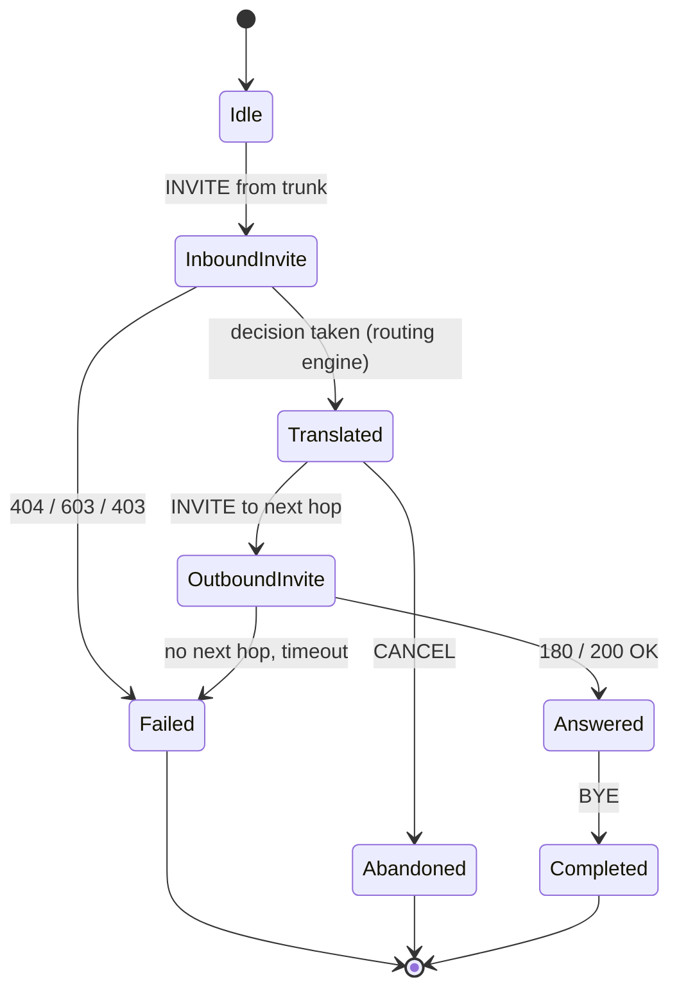

# Low level design

## 1. Module responsibilities

### 1.1 `src/as_app/`

| Module | Responsibility |
| --- | --- |
| `main.py` | Process entry point: settings, logging, signal handlers, self-check, rule set, then the sippy event loop. `AsStack` owns `SipConf` + `SipTransactionManager` + `ED2.loop()` and shuts the loop down from a loop-owned timer |
| `bootstrap.py` | `AsSettings` (pydantic-settings), port availability probe, `run_startup_self_check`, `ShutdownController`, signal handler installation |
| `call_controller.py` | Call Control Logic: `CallController` relays sippy events between the trunk leg (`uaA`) and the next-hop leg (`uaO`) and owns the translation seam; `TrunkCallMap` is the trunk entry point and enforces the peer allowlist; both record counters, trace and dispositions |
| `sip_adapter.py` | The only place (with `call_controller.py`) that touches sippy objects; plain-data view `TrunkMessage` / `CallLeg`, Request-URI helpers, peer allowlist, `PASSTHROUGH_HEADERS`, and `cancel_transaction_timers()` — the per-transaction timer cancellation the shutdown path runs |
| `errors.py` | `AsErrorCode` (identifier, SIP status, message) and `AsError` with structured log fields |
| `routing/rules.py` | Pydantic model of the rules file, YAML loading, validation, `RuleSet`, `RuleSetStore` with reload detection |
| `routing/engine.py` | Pure functions: number format classification, translation, rule matching, decision |
| `observability/logging.py` | Structured logging with the fixed field set |
| `observability/metrics.py` | Counters: calls, dispositions, error codes, rule hits, peer status |
| `observability/tracing.py` | Per-Call-ID trace recorder, bounded in memory |
| `internal_api.py` | Payload builders for the console API plus the FastAPI application factory (`create_internal_api_app`) served by uvicorn on a daemon thread: `/healthz`, `/api/v1/metrics`, `/api/v1/rules`, `/api/v1/traces`, `/api/v1/traces/{call_id}` and `WS /ws/events` |

The configuration model lives in `bootstrap.py` because parsing and validation are
startup concerns. Open item (carried forward from M0; still unresolved — the model did not
grow): if the settings model grows, move it into its own module and update `AGENT.md`
section 5 (a structural change).

### 1.2 `src/console/` and `src/s_sbc_mock/`

| Module | Responsibility |
| --- | --- |
| `console/main.py` | FastAPI application: health endpoint plus the operations console page (dark theme, live flow, rule highlight, statistics, SVG topology) served from a single inline HTML string |
| `s_sbc_mock/main.py` | Process entry point, `MockConfig`, wires UAC and UAS |
| `s_sbc_mock/uac.py` | UAC side: emulates the S-CSCF iFC trigger, places calls from `CallScenario` data |
| `s_sbc_mock/uas.py` | UAS side: emulates the core network, answers the INVITE originated by the AS |

`src/as_app` never imports from `src/s_sbc_mock`; only tests may.

## 2. Data structures

### 2.1 Routing rules (`config/routing_rules.yaml`)

```text
RoutingRulesDocument
├── version, name, description
├── next_hops: [NextHop]
│     NextHop = {name, address, port, transport=udp, priority, description}
└── rules: [RoutingRule]
      RoutingRule = {rule_id, priority, description, enabled, tags, match, action}
      match  = MatchCriteria  {called_prefixes[], called_numbers[], number_format}
      action = RouteAction    {kind=route, translate, next_hops[]}
             | RejectAction   {kind=reject, status=603, reason, error_code}
      translate = NumberTranslation {to_format, strip_prefix, prepend}
```

Evaluation: enabled rules are sorted by ascending `priority` (identifier as tie-break);
the first rule whose `match` block accepts the called number wins.

Number formats: `e164` (`+86…`), `national` (`0…`), `short_code` (`110`, `10086`, `6xxx`),
`international` (`00…`).

### 2.2 Decision

`RoutingDecision` (`routing/engine.py`) is a frozen dataclass:

| Field | Meaning |
| --- | --- |
| `disposition` | `route` · `reject` · `no_match` |
| `called_number` / `translated_number` | before and after translation |
| `rule_id` | rule that decided |
| `source_format` / `target_format` | detected and resulting number format |
| `next_hops` | next hops in selection order |
| `sip_status` / `error_code` / `reason` | what to report when the call is not routed |

### 2.3 Header and SDP pass-through

The B2BUA terminates the trunk INVITE and originates a new one, so the AS decides what
survives the boundary. `PASSTHROUGH_HEADERS` in `src/as_app/sip_adapter.py` is that
decision, written down:

| Header | Why it is passed through |
| --- | --- |
| `P-Asserted-Identity` | Asserted calling party on an IMS trunk (3GPP TS 24.229); the AS is not the asserting node |
| `P-Preferred-Identity` | User preference for the asserted identity |
| `Privacy` | Privacy request of the calling user |
| `P-Charging-Vector` | ICID that ties both legs to one charging record |
| `P-Charging-Function-Addresses` | Charging function addresses of the visiting network |
| `P-Visited-Network-ID` | Network the call was received in |
| `Subject` | Call description shown to the called user |
| `Organization` | Free-text originator description |
| `Priority` | Requested call priority |

Everything else is regenerated by the stack or owned by the AS: `Via`, `Route`,
`Record-Route`, `Contact`, `Max-Forwards` and `Content-Length` are hop by hop; `From`,
`To`, `Call-ID` and `CSeq` belong to the dialog and the second leg has its own;
`User-Agent` is the identity of the AS, and `Content-Type` follows the body.

The body is passed through untouched: the SDP offer that arrives on the trunk is the SDP
offer that leaves on the second leg. M1 asserts this on real traffic in
`tests/integration/test_signalling_path.py::test_headers_and_sdp_pass_through` and shows
it in `docs/specs/message-samples/`.

Two observed spelling caveats: sippy renders unknown header names with
`SipGenericHF.getCanName()`, which only capitalises the first letter, so
`P-Charging-Vector` leaves the AS as `P-charging-vector`. The value is unchanged.

## 3. State machines

### 3.1 Call (B2BUA)



**Known limitation of the trace.** The `ACK` of a `200 OK` is sent by the sippy
transaction layer and never raises a call control event, so it does not appear in the
Call-ID keyed trace even though it is on the wire. The message samples in
`docs/specs/message-samples/` (`08-out-ack-core.txt`, `10-in-ack-trunk.txt`) carry it. If a
future console view has to show it, feed the trace from `SipMessageRecorder` instead of
from the call control events.

### 3.2 Process lifecycle

```text
start -> load settings -> configure logging -> install signal handlers
      -> run_startup_self_check (config, rules, port)
          |-- invalid -> log AS-CFG-*/AS-RULE-* -> exit 1
      -> load rule set -> start sippy loop -> run
      -> SIGTERM/SIGINT -> request shutdown -> drain -> exit 0
```

Signal handlers only *request* shutdown; the loop decides when to stop, because
`ED2.loop()` cannot be interrupted from a handler.

**Teardown order matters.** `AsStack.stop()` cancels what the process itself armed before
it hands anything to sippy: the loop poll timers, then the per-call no-answer timers
(`TrunkCallMap.dispose()`), then every per-transaction timer still scheduled on the
transaction manager (`as_app.sip_adapter.cancel_transaction_timers()`), and only then
`SipTransactionManager.shutdown()`. sippy's own `shutdown()` releases the sockets and
cancels its cache-purge timer but **not** the timers the transactions own, and it drops the
tables they hang from — so anything left armed fires into a manager whose `global_config`
is already `None`. The cancellation therefore has to run first. See the resolved gap row
"Closing a transaction manager mid-retransmission" in `docs/production-gaps.md`.

### 3.3 Number translation seam

`CallController.apply_call_policy()` is the **only** place in the signalling path where an
inbound INVITE is modified before it leaves the AS:

```text
uaA (trunk leg) --CCEventTry--> CallController.recv_event
                                    |
                                    +-- apply_call_policy(event)   <-- the seam
                                    |
                                  uaO (next-hop leg)
```

`apply_call_policy()` calls `as_app.routing.engine.decide`, rewrites the called number in
the event data and rejects the call with the error the decision carries (`404` / `603`).
No other module may touch the called number, so the seam stays verifiable: there is exactly
one place in the signalling path that can change what is dialled.

## 4. Error model

| Code | SIP | Log message | Raised when |
| --- | --- | --- | --- |
| `AS-CFG-001` | 500 | required configuration value is missing | mandatory setting absent (for example an empty next hop address) |
| `AS-CFG-002` | 500 | configuration value failed validation | schema violation in `AsSettings` |
| `AS-CFG-003` | 500 | signalling port cannot be bound | UDP port already in use |
| `AS-CFG-004` | 500 | trunk peer configuration is not usable | `ALLOWED_PEERS` empty or unusable |
| `AS-RULE-001` | 500 | routing rules file cannot be read | missing or unreadable rules file |
| `AS-RULE-002` | 500 | routing rules file is not valid YAML | YAML syntax error |
| `AS-RULE-003` | 500 | routing rules violate the schema | schema violation, duplicate identifier, unknown next hop reference |
| `AS-RULE-004` | 500 | routing rule identifier is not unique | reserved for per-rule reporting |
| `AS-ROUTE-001` | 404 | no routing rule matched the called number | no enabled rule matches |
| `AS-ROUTE-002` | 603 | policy rejected the call | rule action `reject` |
| `AS-ROUTE-003` | 480 | no next hop is available for the route | next hop name cannot be resolved |
| `AS-ROUTE-004` | 500 | number translation produced no result | translation yields an empty number |
| `AS-PEER-001` | 403 | source address is not an allowed trunk peer | source not in `ALLOWED_PEERS` |
| `AS-PEER-002` | 503 | next hop peer did not answer | next hop unreachable or timed out |
| `AS-PEER-003` | 400 | request from the trunk could not be parsed | malformed Request-URI |
| `AS-INT-001` | 500 | unexpected internal failure | anything else |

## 5. Process model and threading

- The AS process runs sippy's `ED2.loop()` on the main thread. Nothing else may block it.
- Signal handlers only set a flag (`ShutdownController`).
- The console is a separate process; it never imports AS modules and reaches the AS over
  the internal API (ADR-0002).
- The internal API is served from the AS process in M3; it must not run inside the sippy
  thread — see ADR-0002 for the chosen approach.
- Counters and traces are guarded by locks, because sippy callbacks and the console feed
  run on different threads.
- `ED2` (the sippy event dispatcher) is a **process-wide singleton**. In production the AS
  and the mock are separate processes; in the tests they share one interpreter and
  therefore one loop, which `TrunkPair.run_until()` drives.
- `SipConf` is a process-wide singleton as well (`my_address`, `my_port`, `my_uaname`) and
  sippy reads it while it builds a `Via` and a default `Contact`. Each side therefore sets
  `ua.lContact` and `ua.local_ua` explicitly and pins `SipConf` around the messages it
  generates: `_as_sip_identity()` in `call_controller.py`, `_trunk_identity()` in
  `s_sbc_mock/uac.py`. Without this, a second sippy application in the same interpreter
  would put the wrong `Via` on the wire.
- A side that needs its own local UDP port needs its own `SipTransactionManager`; each
  manager must have `global_config['_sip_tm']` set right after construction, and
  `shutdown()` releases the socket again. **`shutdown()` is not a complete teardown on its
  own**: it cancels only the manager's own cache-purge timer, never the timers the
  transactions carry (`teA`…`teG`), and it drops the tables those timers hang from. Because
  `ED2` is the process-wide singleton above, a timer that survives it keeps firing — into a
  manager whose `global_config` is already `None`. Whoever stops a manager has to cancel the
  transaction timers first, which is what `as_app.sip_adapter.cancel_transaction_timers()`
  does for the AS (P8a).

## 6. Configuration reference

| Variable | Default | Meaning |
| --- | --- | --- |
| `SIP_LISTEN_ADDRESS` | `127.0.0.1` | Address the trunk is received on |
| `SIP_LISTEN_PORT` | `5060` | UDP port of the trunk |
| `SBC_PEER_ADDRESS` | `127.0.0.1` | Next hop for the outbound INVITE |
| `SBC_PEER_PORT` | `5061` | UDP port of the next hop (`.env.example` ships `15061` for the mock) |
| `ALLOWED_PEERS` | `127.0.0.1` | Comma separated source addresses accepted on the trunk |
| `RULES_FILE` | `config/routing_rules.yaml` | Routing rules file |
| `INTERNAL_API_ADDRESS` | `127.0.0.1` | Address the console reaches |
| `INTERNAL_API_PORT` | `8080` | Port of the internal API |
| `LOG_LEVEL` | `INFO` | `CRITICAL` · `ERROR` · `WARNING` · `INFO` · `DEBUG` |
| `LOG_STRUCTURED` | `true` | JSON log lines when true |
| `LOG_PAYLOADS` | `false` | Log SIP payloads (off by default) |
| `SHUTDOWN_GRACE_SECONDS` | `5` | Grace period for in-flight calls on shutdown |

## 7. Log field reference

Every line carries, in this order:

| Field | Example | Notes |
| --- | --- | --- |
| `timestamp` | `2026-09-15T23:31:39+0800` | ISO 8601 with offset |
| `level` | `info` | lower case |
| `module` | `call_controller` | emitting module |
| `call_id` | `probe-59745@example.invalid` | `-` when unknown; threads both legs |
| `direction` | `in` · `out` · `internal` | relative to the AS |
| `peer` | `127.0.0.1:15061` | `-` when unknown |
| `event` | `routing decision taken` | lower case English |

Additional fields are appended per event (for example `rule_id`, `disposition`,
`error_code`, `sip_status`, `method`). The field set is never changed silently.

## 8. Known trap: `observability/logging.py`

`src/as_app/observability/logging.py` shadows the standard library module name for any
import that is not package-absolute. Python 3 resolves `import logging` to the standard
library, so the code works, but two things must be respected:

1. Every import in `src/` and `tests/` is package-absolute (`import logging` inside
   `as_app.call_controller` is the standard library, as intended).
2. Never add `src/as_app/observability/` to `sys.path` and never run a script from inside
   that directory.

The file is deliberately **not** renamed (a rename is a structural change that would
touch `AGENT.md` section 5). Maintainer decision of 2026-09-16: the name stays. The two
rules above hold throughout the code: every import is package-absolute, and
`src/as_app/observability/` is never on `sys.path`.
