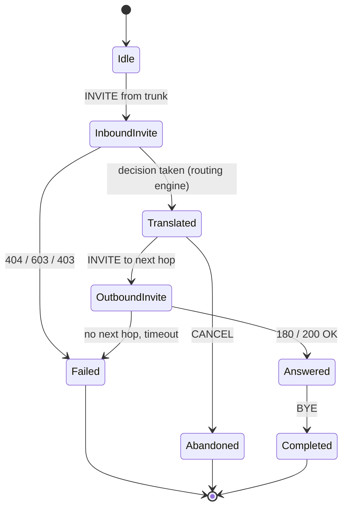

# Low level design

## 1. Module responsibilities

### 1.1 `src/as_app/`

| Module | Responsibility |
| --- | --- |
| `main.py` | Process entry point: settings, logging, signal handlers, self-check, rule set, then the sippy event loop. `AsStack` owns `SipConf` + `SipTransactionManager` + `ED2.loop()` and shuts the loop down from a loop-owned timer |
| `bootstrap.py` | `AsSettings` (pydantic-settings), port availability probe, `run_startup_self_check`, `ShutdownController`, signal handler installation |
| `call_controller.py` | Call Control Logic: `CallController` relays sippy events between the trunk leg (`uaA`) and the next-hop leg (`uaO`) and owns the translation seam; `TrunkCallMap` is the trunk entry point and enforces the peer allowlist; both record counters, trace and dispositions |
| `sip_adapter.py` | The only place (with `call_controller.py`) that touches sippy objects; plain-data view `CallLeg`, Request-URI helpers, peer allowlist, `PASSTHROUGH_HEADERS`, and `cancel_transaction_timers()` — the per-transaction timer cancellation the shutdown path runs |
| `errors.py` | `AsErrorCode` (identifier, SIP status, message) and `AsError` with structured log fields |
| `routing/rules.py` | Pydantic model of the rules file, YAML loading, validation, `RuleSet`, `RuleSetStore` with reload detection |
| `routing/engine.py` | Pure functions: number format classification, translation, rule matching, decision |
| `observability/logging.py` | Structured logging with the fixed field set |
| `observability/metrics.py` | Counters: calls, dispositions, error codes, rule hits, peer status |
| `observability/tracing.py` | Per-Call-ID trace recorder, bounded in memory |
| `internal_api.py` | Payload builders for the console API plus the FastAPI application factory (`create_internal_api_app`) served by uvicorn on a daemon thread: `/healthz`, `/api/v1/metrics`, `/api/v1/rules`, `/api/v1/traces`, `/api/v1/traces/{call_id}` and `WS /ws/events` |

The configuration model lives in `bootstrap.py` because parsing and validation are
startup concerns. Open item (carried forward from M0; still unresolved — the model did not
grow): if the settings model grows, move it into its own module and update `AGENT.md`
section 5 (a structural change).

### 1.2 `src/console/` and `src/s_sbc_mock/`

| Module | Responsibility |
| --- | --- |
| `console/main.py` | FastAPI application: health endpoint plus the operations console page (dark theme, live flow, rule highlight, statistics, SVG topology) served from a single inline HTML string |
| `s_sbc_mock/main.py` | Process entry point, `MockConfig`, wires UAC and UAS |
| `s_sbc_mock/uac.py` | UAC side: emulates the S-CSCF iFC trigger, places calls from `CallScenario` data |
| `s_sbc_mock/uas.py` | UAS side: emulates the core network, answers the INVITE originated by the AS |

`src/as_app` never imports from `src/s_sbc_mock`; only tests may.

## 2. Data structures

### 2.1 Routing rules (`config/routing_rules.yaml`)

```text
RoutingRulesDocument
├── version, name, description
├── next_hops: [NextHop]
│     NextHop = {name, address, port, transport=udp, priority, description}
└── rules: [RoutingRule]
      RoutingRule = {rule_id, priority, description, enabled, tags, match, action}
      match  = MatchCriteria  {called_prefixes[], called_numbers[], number_format}
      action = RouteAction    {kind=route, translate, next_hops[]}
             | RejectAction   {kind=reject, status=603, reason, error_code}
      translate = NumberTranslation {to_format, strip_prefix, prepend}
```

Evaluation: enabled rules are sorted by ascending `priority` (identifier as tie-break);
the first rule whose `match` block accepts the called number wins.

Number formats: `e164` (`+86…`), `national` (`0…`), `short_code` (`110`, `10086`, `6xxx`),
`international` (`00…`).

### 2.2 Decision

`RoutingDecision` (`routing/engine.py`) is a frozen dataclass:

| Field | Meaning |
| --- | --- |
| `disposition` | `route` · `reject` · `no_match` |
| `called_number` / `translated_number` | before and after translation |
| `rule_id` | rule that decided |
| `source_format` / `target_format` | detected and resulting number format |
| `next_hops` | next hops in selection order |
| `sip_status` / `error_code` / `reason` | what to report when the call is not routed |

### 2.3 Header and SDP pass-through

The B2BUA terminates the trunk INVITE and originates a new one, so the AS decides what
survives the boundary. `PASSTHROUGH_HEADERS` in `src/as_app/sip_adapter.py` is that
decision, written down:

| Header | Why it is passed through |
| --- | --- |
| `P-Asserted-Identity` | Asserted calling party on an IMS trunk (3GPP TS 24.229); the AS is not the asserting node |
| `P-Preferred-Identity` | User preference for the asserted identity |
| `Privacy` | Privacy request of the calling user |
| `P-Charging-Vector` | ICID that ties both legs to one charging record |
| `P-Charging-Function-Addresses` | Charging function addresses of the visiting network |
| `P-Visited-Network-ID` | Network the call was received in |
| `Subject` | Call description shown to the called user |
| `Organization` | Free-text originator description |
| `Priority` | Requested call priority |

Everything else is regenerated by the stack or owned by the AS: `Via`, `Route`,
`Record-Route`, `Contact`, `Max-Forwards` and `Content-Length` are hop by hop; `From`,
`To`, `CSeq` and **`Call-ID`** belong to the dialog, and the second leg has its own of each.
`Call-ID` is absent from `PASSTHROUGH_HEADERS`, and that is incidental rather than the reason
it changes: it does not cross as a copied header but inside the `CCEventTry` the controller
rebuilds, so it is the **controller**, not the header table, that decides the outbound value.
`User-Agent` is the identity of the AS, and `Content-Type` follows the body.

Because the value travels inside the call-control event, the second leg's `Call-ID` has to be
set explicitly: sippy copies a non-`None` `Call-ID` from the `CCEventTry` verbatim
(`sippy/UacStateIdle.py`) and only its own `CCB2BUA` rewrites it (`sippy/b2bua.py`), while
this project runs its own controller over a bare `sippy.UA`, not `CCB2BUA`. `apply_call_policy`
therefore derives a fresh `SipCallId` from the trunk one by appending sippy's own suffix
`-b2b_1` (`B2BUA_CALL_ID_SUFFIX` / `outbound_call_id()` in `src/as_app/sip_adapter.py`): route
`1` is the AS's single outbound leg, and every failover hop reuses the same value because the
translated event is built once and stored in `_pending_event`. The inbound `SipCallId` is never
mutated — it is the trunk leg's dialog identity. `CallController.call_id` stays the **trunk**
Call-ID and remains the log/trace correlation key across both legs; it is the wire Call-ID of
the outbound leg that differs. **The same derivation is required of every controller**: the
anti-fraud AS carried its own copy of the omission and derives it the same way (section 9.6,
ADR-0008 decision 2).

The body is passed through untouched: the SDP offer that arrives on the trunk is the SDP
offer that leaves on the second leg. M1 asserts this on real traffic in
`tests/integration/test_signalling_path.py::test_headers_and_sdp_pass_through` and shows
it in `docs/specs/message-samples/`.

Two observed spelling caveats: sippy renders unknown header names with
`SipGenericHF.getCanName()`, which only capitalises the first letter, so
`P-Charging-Vector` leaves the AS as `P-charging-vector`. The value is unchanged.

## 3. State machines

### 3.1 Call (B2BUA)



**Known limitation of the trace.** The `ACK` of a `200 OK` is sent by the sippy
transaction layer and never raises a call control event, so it does not appear in the
Call-ID keyed trace even though it is on the wire. The message samples in
`docs/specs/message-samples/` (`08-out-ack-core.txt`, `10-in-ack-trunk.txt`) carry it. If a
future console view has to show it, feed the trace from `SipMessageRecorder` instead of
from the call control events.

### 3.2 Process lifecycle

```text
start -> load settings -> configure logging -> install signal handlers
      -> run_startup_self_check (config, rules, port)
          |-- invalid -> log AS-CFG-*/AS-RULE-* -> exit 1
      -> load rule set -> start sippy loop -> run
      -> SIGTERM/SIGINT -> request shutdown -> drain -> exit 0
```

Signal handlers only *request* shutdown; the loop decides when to stop, because
`ED2.loop()` cannot be interrupted from a handler.

**Teardown order matters.** `AsStack.stop()` cancels what the process itself armed before
it hands anything to sippy: the loop poll timers, then the per-call no-answer timers
(`TrunkCallMap.dispose()`), then every per-transaction timer still scheduled on the
transaction manager (`as_app.sip_adapter.cancel_transaction_timers()`), and only then
`SipTransactionManager.shutdown()`. sippy's own `shutdown()` releases the sockets and
cancels its cache-purge timer but **not** the timers the transactions own, and it drops the
tables they hang from — so anything left armed fires into a manager whose `global_config`
is already `None`. The cancellation therefore has to run first. See the resolved gap row
"Closing a transaction manager mid-retransmission" in `docs/production-gaps.md`.

### 3.3 Number translation seam

`CallController.apply_call_policy()` is the **only** place in the signalling path where an
inbound INVITE is modified before it leaves the AS:

```text
uaA (trunk leg) --CCEventTry--> CallController.recv_event
                                    |
                                    +-- apply_call_policy(event)   <-- the seam
                                    |
                                  uaO (next-hop leg)
```

`apply_call_policy()` calls `as_app.routing.engine.decide`, rewrites the called number in
the event data and rejects the call with the error the decision carries (`404` / `603`).
No other module may touch the called number, so the seam stays verifiable: there is exactly
one place in the signalling path that can change what is dialled.

## 4. Error model

| Code | SIP | Log message | Raised when |
| --- | --- | --- | --- |
| `AS-CFG-001` | 500 | required configuration value is missing | mandatory setting absent (for example an empty next hop address) |
| `AS-CFG-002` | 500 | configuration value failed validation | schema violation in `AsSettings` |
| `AS-CFG-003` | 500 | signalling port cannot be bound | UDP port already in use |
| `AS-CFG-004` | 500 | trunk peer configuration is not usable | `ALLOWED_PEERS` empty or unusable |
| `AS-RULE-001` | 500 | routing rules file cannot be read | missing or unreadable rules file |
| `AS-RULE-002` | 500 | routing rules file is not valid YAML | YAML syntax error |
| `AS-RULE-003` | 500 | routing rules violate the schema | schema violation, duplicate identifier, unknown next hop reference |
| `AS-RULE-004` | 500 | routing rule identifier is not unique | reserved for per-rule reporting |
| `AS-ROUTE-001` | 404 | no routing rule matched the called number | no enabled rule matches |
| `AS-ROUTE-002` | 603 | policy rejected the call | rule action `reject` |
| `AS-ROUTE-003` | 480 | no next hop is available for the route | next hop name cannot be resolved |
| `AS-ROUTE-004` | 500 | number translation produced no result | translation yields an empty number |
| `AS-PEER-001` | 403 | source address is not an allowed trunk peer | source not in `ALLOWED_PEERS` |
| `AS-PEER-002` | 503 | next hop peer did not answer | next hop unreachable or timed out |
| `AS-PEER-003` | 400 | request from the trunk could not be parsed | malformed Request-URI |
| `AS-FRAUD-001` | 608 | calling party is on the block list | screening: the calling number matches a `block_list` entry (P8) |
| `AS-FRAUD-002` | 608 | calling party exceeded the call-rate window | screening: the per-caller window holds more than `window.max_calls` calls (P8) |
| `AS-FRAUD-003` | 608 | calling party reputation is below the threshold | screening: effective reputation `< reputation.reject_below` (P8) |
| `AS-FRAUD-004` | 500 | screening data file cannot be read | missing or unreadable `config/caller_screening.yaml` (P8) |
| `AS-FRAUD-005` | 500 | screening data file violates the schema | schema violation, duplicate or conflicting list entry, unusable window (P8) |
| `AS-FRAUD-006` | 500 | screening produced no verdict | the pure engine returned no usable verdict (internal fallback, P8) |
| `AS-INT-001` | 500 | unexpected internal failure | anything else |

`AS-FRAUD-*` is the anti-fraud AS's family, and REQ-F-023's intent still holds: a second
process must not grow a second error vocabulary. After the P10 extraction the split is by
family over one shared mechanism — the mechanism and the `SkeletonErrorCode` family are the
library's, `AsErrorCode` is `src/as_app/errors.py` and `FraudErrorCode` is
`src/anti_fraud_as/errors.py` (section 11.3, ADR-0009 decision 3). REQ-F-023's own text still
names `src/as_app/errors.py` and is deliberately not reworded; the location delta is recorded
in the SRS traceability note. Section 9.4 states the rows together with the `SIP_PHRASES`
entry that makes `608` carry the phrase `Rejected`, so the reject goes out with `608 Rejected`
rather than falling back to `Server Internal Error`.

## 5. Process model and threading

- The AS process runs sippy's `ED2.loop()` on the main thread. Nothing else may block it.
- Signal handlers only set a flag (`ShutdownController`).
- The console is a separate process; it never imports AS modules and reaches the AS over
  the internal API (ADR-0002).
- The internal API is served from the AS process in M3; it must not run inside the sippy
  thread — see ADR-0002 for the chosen approach.
- Counters and traces are guarded by locks, because sippy callbacks and the console feed
  run on different threads.
- `ED2` (the sippy event dispatcher) is a **process-wide singleton**. In production the AS
  and the mock are separate processes; in the tests they share one interpreter and
  therefore one loop, which `TrunkPair.run_until()` drives.
- `SipConf` is a process-wide singleton as well (`my_address`, `my_port`, `my_uaname`) and
  sippy reads it while it builds a `Via` and a default `Contact`. Each side therefore sets
  `ua.lContact` and `ua.local_ua` explicitly and pins `SipConf` around the messages it
  generates: `_as_sip_identity()` in `call_controller.py`, `_trunk_identity()` in
  `s_sbc_mock/uac.py`. Without this, a second sippy application in the same interpreter
  would put the wrong `Via` on the wire.
- A side that needs its own local UDP port needs its own `SipTransactionManager`; each
  manager must have `global_config['_sip_tm']` set right after construction, and
  `shutdown()` releases the socket again. **`shutdown()` is not a complete teardown on its
  own**: it cancels only the manager's own cache-purge timer, never the timers the
  transactions carry (`teA`…`teG`), and it drops the tables those timers hang from. Because
  `ED2` is the process-wide singleton above, a timer that survives it keeps firing — into a
  manager whose `global_config` is already `None`. Whoever stops a manager has to cancel the
  transaction timers first, which is what `as_app.sip_adapter.cancel_transaction_timers()`
  does for the AS (P8a).

## 6. Configuration reference

| Variable | Default | Meaning |
| --- | --- | --- |
| `SIP_LISTEN_ADDRESS` | `127.0.0.1` | Address the trunk is received on |
| `SIP_LISTEN_PORT` | `5060` | UDP port of the trunk |
| `SBC_PEER_ADDRESS` | `127.0.0.1` | Next hop for the outbound INVITE |
| `SBC_PEER_PORT` | `5061` | UDP port of the next hop (`.env.example` ships `15061` for the mock) |
| `ALLOWED_PEERS` | `127.0.0.1` | Comma separated source addresses accepted on the trunk |
| `RULES_FILE` | `config/routing_rules.yaml` | Routing rules file |
| `INTERNAL_API_ADDRESS` | `127.0.0.1` | Address the console reaches |
| `INTERNAL_API_PORT` | `8080` | Port of the internal API |
| `LOG_LEVEL` | `INFO` | `CRITICAL` · `ERROR` · `WARNING` · `INFO` · `DEBUG` |
| `LOG_STRUCTURED` | `true` | JSON log lines when true |
| `LOG_PAYLOADS` | `false` | Log SIP payloads (off by default) |
| `SHUTDOWN_GRACE_SECONDS` | `5` | Grace period for in-flight calls on shutdown |

## 7. Log field reference

Every line carries, in this order:

| Field | Example | Notes |
| --- | --- | --- |
| `timestamp` | `2026-09-15T23:31:39+0800` | ISO 8601 with offset |
| `level` | `info` | lower case |
| `module` | `call_controller` | emitting module |
| `call_id` | `probe-59745@example.invalid` | `-` when unknown; threads both legs |
| `direction` | `in` · `out` · `internal` | relative to the AS |
| `peer` | `127.0.0.1:15061` | `-` when unknown |
| `event` | `routing decision taken` | lower case English |

Additional fields are appended per event (for example `rule_id`, `disposition`,
`error_code`, `sip_status`, `method`). The field set is never changed silently.

## 8. Known trap: `observability/logging.py`

`src/as_app/observability/logging.py` shadows the standard library module name for any
import that is not package-absolute. Python 3 resolves `import logging` to the standard
library, so the code works, but two things must be respected:

1. Every import in `src/` and `tests/` is package-absolute (`import logging` inside
   `as_app.call_controller` is the standard library, as intended).
2. Never add `src/as_app/observability/` to `sys.path` and never run a script from inside
   that directory.

The file is deliberately **not** renamed (a rename is a structural change that would
touch `AGENT.md` section 5). Maintainer decision of 2026-09-16: the name stays. The two
rules above hold throughout the code: every import is package-absolute, and
`src/as_app/observability/` is never on `sys.path`.

## 9. The anti-fraud AS (P8)

The second AS instance of `docs/architecture/hld.md` section 8. It is a **second concrete
AS**, not a framework: it introduces no registry, no plugin protocol and no shared base
class (ADR-0007, `docs/phase2-plan.md` D4/D6/D9). This section is the low-level design for
the reject path (`608 Rejected`), the allow path, the process-level state, the declarative
data file and the second process.

### 9.1 Module responsibilities

`src/anti_fraud_as/` is a new package next to `src/as_app/`, `src/console/` and
`src/s_sbc_mock/`. Adding it is a structural change (`AGENT.md` section 5); the
implementation commit mirrors it into `AGENT.md`, `README.md` and `docs/README.md`
(section 9.10).

| Module | Responsibility |
| --- | --- |
| `main.py` | Process entry point and `FraudAsStack`: the second process's own `SipConf` identity pinning, own `SipTransactionManager`, own `ED2.loop()`, loop-owned shutdown and reload timers, and its own stop path (section 9.7) |
| `bootstrap.py` | `FraudAsSettings` (pydantic-settings) and `run_startup_self_check` — the same fail-fast contract as the first AS (`AGENT.md` section 4.3) |
| `call_controller.py` | `FraudCallController` (per call) and `FraudCallMap` (process entry point, peer allowlist): the verdict seam, the allow-path relay and the UAS-only reject |
| `screening.py` | The **pure** verdict: `screen()` over plain-data inputs and outputs. No sockets, no global state, no clock (REQ-NF-011) |
| `caller_state.py` | The **process-level** store (D9): the call-rate window and the reputation ledger. The only place a clock is read, and it is an injected `Callable[[], float]` |
| `screening_data.py` | The declarative data file: Pydantic model, load-time validation and `ScreeningDataStore` with size+mtime reload detection |
| `internal_api.py` | The anti-fraud AS's console payload builders and its API server, a thin facade over the library's shell (see the row below) |

**What is shared, imported from the library (`as_platform`).** P10 moved this shared surface
out of `as_app` into the library, so reuse is now by direct import from `as_platform` — the
modules below; `as_app` keeps a re-export facade at each path so the references in `tools/`
and `tests/` keep resolving (section 11.1 is the authoritative post-extraction module split).
No new abstraction was introduced.

| Shared from the library (`as_platform`) | Why it is not use-case specific |
| --- | --- |
| `errors` | the one authoritative `AS-*` model; REQ-F-023 adds `AS-FRAUD-*` to it |
| `observability/logging.py` | the fixed structured-log field set (`AGENT.md` section 4.3) |
| `observability/metrics.py` | counters, dispositions and peer status |
| `observability/tracing.py` | per-Call-ID trace, console feed and `SipMessageRecorder` |
| `sip_adapter` — `cancel_transaction_timers`, `is_allowed_peer`, `PASSTHROUGH_HEADERS`, `CallLeg` | B2BUA/trunk plumbing that describes the trunk, not the service |
| `sip_adapter.extract_called_number` | the SIP-URI **user-part** parser; it is used here on the `P-Asserted-Identity` URI, not on the called number (see below) |
| `bootstrap` — `ShutdownController`, `install_signal_handlers`, `check_port_available` | process plumbing: signals, cooperative shutdown, port probing |

**The screening input is the calling party, and that is a different primitive from the
first AS.** Number translation reads the called number from the Request-URI; this use case
reads the **calling** party from `P-Asserted-Identity` on the trunk INVITE (3GPP TS 24.229;
the asserting node is the network, not this AS). The extraction is specified exactly, so it
is not left to the implementer:

```python
# FraudCallController, on the captured trunk request (section 9.6):
if request.countHFs("p-asserted-identity") == 0:
    return None  # no identity -> fail-open, recorded
pai = request.getHFBody("p-asserted-identity")  # sippy SipPAssertedIdentity
return pai.address.url.username  # e.g. "+86216180001"
```

`getHFBody()` returns the parsed `SipPAssertedIdentity` (a `SipAddressHF`), whose
`.address.url.username` is the user part — the same attribute the mock UAS already reads as
`request.getRURI().username` (`src/s_sbc_mock/uas.py`). `countHFs()` guards the absent
header, because `getHFBody()` raises `IndexError` when the header is missing.

Two consequences worth stating, because both are friction P10 inherits:

- `sip_adapter.extract_called_number` parses a URI string with `^sips?:([^@;?]+)@`; it is
  reused here for its *URI-user-part* behaviour only, and its name is wrong for this caller.
  The mismatch is not fixed now (renaming it would touch the first AS), but it is recorded.
- `sip_adapter.TrunkMessage` already has a `calling_number` field, but it is **never
  populated and `TrunkMessage` is not used anywhere** in the codebase today; the controller
  reads the sippy request directly, as the first AS does. It was noted here rather than
  adopted; **P10 removed it** — the class and its `__all__` entry are deleted with the move
  into the library, not inherited (ADR-0009 decision 2, section 11.1).

**What deliberately stays use-case-specific** (not generalised, not shared):

| Part | Why generalising it now would be wrong |
| --- | --- |
| `screening.py` | the verdict algorithm *is* the use case; there is exactly one implementation, so an interface would be a guess |
| `caller_state.py` | cross-call state is introduced by this use case; a pluggable state store is P11, and `docs/phase2-plan.md` D9 forbids solving it early |
| `screening_data.py` | the schema is this use case's data; forcing a common schema with the routing rules would shape the platform like these two samples |
| `internal_api.py` | the app factory and server were **duplicated on purpose** under ADR-0007 decision 9 — `as_app.internal_api.create_internal_api_app` was bound to a `RuleSetStore` and to `/api/v1/rules`, so reusing it would have meant parameterising it into the very framework P8 must not build. **P10 collapsed the duplication**: the shell (the app factory, `InternalApiServer` and the payload builders) moved into the library, generalised over a payload provider, and both `internal_api.py` modules are now thin facades that supply their own payloads (section 11.1, ADR-0009 decision 2) |

### 9.2 The D9 ownership boundary

The boundary is drawn by **lifetime**, not by package:

| Scope | Object | Lives in |
| --- | --- | --- |
| **Process-level** (one per process, created in `main`) | `CallerStateStore`, `ScreeningDataStore`, `MetricsRegistry`, `TraceRecorder`, `FraudCallMap` | `FraudAsStack` |
| **Per-call** (one per INVITE, created by `FraudCallMap.recv_request`) | `FraudCallController` | the call map's `controllers` list |

`FraudCallController` holds **a reference to** the process-level `CallerStateStore`, exactly
as it holds references to the process-level metrics registry and trace recorder — but it
holds **no state of its own that outlives the call**. That is the whole point of D9: a rate
window stored on the controller would be created per call, always hold exactly one entry,
and fail silently while single-call unit tests still passed. The controller therefore sees
the store only through **already-computed plain values**:

```text
FraudCallMap.recv_request(request)     # process-level entry: peer allowlist, then
        │                              #   creates one controller for this INVITE
        ▼
FraudCallController                    # PER CALL: uaA, maybe uaO, the verdict
        │
        │  apply_call_policy()  <-- the single seam (section 9.6)
        ▼
CallerStateStore.observe(caller, now)  ->  CallerSignals        # process-level, injected clock
        │                                  (already-computed plain values, no state leak)
        ▼
screening.screen(signals, policy)      ->  ScreeningDecision    # pure function
```

**The seam is the per-call controller, not the call map.** `FraudCallMap.recv_request()`
does exactly two things — enforce the peer allowlist and create a `FraudCallController` —
mirroring `TrunkCallMap` of the first AS. The verdict is taken inside
`FraudCallController.apply_call_policy()`, and this section and section 9.6 state the same
thing; there is one authoritative answer, so an implementer cannot place `observe()` and
`screen()` on the call map by accident.

### 9.3 Data structures

**Call-rate window.** One bounded FIFO of monotonic timestamps per caller. The window is
not materialised on a timer: it is evaluated when a call arrives, which is the only moment
its answer is needed.

```text
CallRateWindow
├── window_seconds: float                       # configured (data file)
├── max_calls: int                              # configured threshold
└── _events: dict[caller -> deque[float]]       # monotonic timestamps, oldest first
      count_in_window(caller, now) -> int
          # drops every entry older than (now - window_seconds), then returns len()
      every deque is bounded to max_calls + 1   # more is not needed once the threshold is passed
```

**Reputation ledger.** Reputation decays **towards the configured default** with an
exponential half-life, so a bad burst fades instead of persisting forever.

```text
ReputationLedger
├── default_score: float
├── half_life_seconds: float
├── reject_penalty: float
└── _entries: dict[caller -> (score: float, updated_at: float)]
      effective_score(caller, now) =
          default_score + (score - default_score) * 0.5 ** ((now - updated_at) / half_life_seconds)
      penalise(caller, now) =
          score = effective_score(caller, now) - reject_penalty; updated_at = now
```

Both structures are pure arithmetic given `now`. They are guarded by one `threading.Lock`
in `CallerStateStore`, because sippy callbacks and the console feed run on different
threads — the same reason the metrics registry and trace recorder are lock-guarded
(section 5).

**The injected clock.** `CallerStateStore(clock: Callable[[], float] = time.monotonic)`
is the **only** place a clock is read; `screening.screen()` receives no clock at all, only
the numbers `effective_reputation` and `calls_in_window`. A unit test constructs the store
with a fake clock and the engine with fixed numbers, so the verdict is testable with no
socket and no waiting (REQ-NF-011, and the `routing/engine.py` precedent of REQ-NF-004).

The verdict itself is plain data:

| Type | Fields |
| --- | --- |
| `ScreeningSignals` | `calling_number`, `blocklisted: bool` + matched entry, `allowlisted: bool` + matched entry, `effective_reputation: float`, `calls_in_window: int`, `identity_present: bool` |
| `ScreeningPolicy` | `reject_below_reputation`, `reject_above_calls` (mirrors of the data-file thresholds, resolved at load) |
| `Verdict` | `allow` \| `reject` |
| `ScreeningDecision` | `verdict`, `reason` (lower-case English), `source`, `score`, `list_entry` (matched entry identifier, when one matched), `error_code` (`AS-FRAUD-001…003`, `None` on allow) |

`source` is a `ScreeningSource` enumeration with **five** values, and all five are
observable rather than incidental: `allow_list` (an operator exemption) and `none` (nothing
fired) are the two ways a call is *allowed*, while `block_list`, `rate_window` and
`reputation` are the three ways it is *rejected*. `list_entry` is set by the two list
signals only. Section 9.9 counts every value.

Decision order is deliberate and documented: **allow list first** (an operator exemption
always wins), then **block list**, then the **rate window**, then **reputation**. The first
signal that fires decides, and the decision names it, so the console and the trace can
explain *why* without re-running the engine.

### 9.4 Declarative data file: `config/caller_screening.yaml`

Data, not code, and reloadable without touching the code — the same shape as the routing
rules (ADR-0004) and the same reasoning: policy changes must be reviewable diffs.

```text
ScreeningDocument
├── version, name, description
├── window:     CallRateWindowConfig { seconds: float > 0, max_calls: int >= 1 }
├── reputation: ReputationConfig { half_life_seconds > 0, default_score: float,
│                                  reject_below: float, reject_penalty >= 0,
│                                  max_tracked_callers >= 1 }
├── block_list: [ScreenedNumber]
└── allow_list: [ScreenedNumber]
      ScreenedNumber = { number: str | prefix: str, reason: str, description: str | None }
```

**Validation on load** (`screening_data.load_screening_data`), reported as `AS-FRAUD-004`
(file cannot be read) or `AS-FRAUD-005` (schema), never as a bare exception:

- `version` is a supported version;
- `window.seconds > 0` and `window.max_calls >= 1`;
- `reputation.half_life_seconds > 0`, `max_tracked_callers >= 1`, `reject_penalty >= 0`;
- every list entry carries **exactly one** of `number` / `prefix`, non-empty;
- entries are unique within a list, and **a value may not appear in both lists** — an
  ambiguous entry is a configuration error, not a precedence puzzle;
- `block_list` and `allow_list` may both be empty (then only the window and reputation
  decide).

**Reload** mirrors `RuleSetStore`: `ScreeningDataStore.maybe_reload()` compares size and
mtime and swaps the document only when it parsed and validated; on failure the **previous
document stays active** and the error is logged (`AS-FRAUD-005`), so a broken edit cannot
break the call path (ADR-0004's fail-safe rule). Reload is **pull-based**, driven from a
loop-owned timer with `SCREENING_RELOAD_POLL_SECONDS = 1.0` — never from inside a sippy
callback, because file I/O on the call path would block the whole stack
(`docs/phase2-plan.md` section 6).

**No addresses in this file.** The next hop comes from the environment
(`FRAUD_SBC_PEER_*`), so — unlike `config/routing_rules.yaml` and
`config/routing_rules.compose.yaml` — the second AS has **no second copy of an address to
drift from**. That is a deliberate answer to the rule-file-drift trap recorded in
`docs/phase2-plan.md` section 6: the shortest way to avoid four synchronised copies is not
to create a copy at all.

### 9.5 Error model and the `608 Rejected` phrase

The rows are in the authoritative table of section 4; this is what makes them carry the
right phrase on the trunk:

```python
SIP_PHRASES: Final[dict[int, str]] = { ..., 608: "Rejected" }
```

`AsError.sip_phrase` resolves through `SIP_PHRASES`, and the `608: "Rejected"` entry is what
makes the reject read correctly: without it the phrase would fall back to `Server Internal
Error`. With it, the reject emits `CCEventFail((608, "Rejected", None))` on the answering
leg, which sippy renders as `SIP/2.0 608 Rejected` — verified on the wire
(`docs/architecture/adr/0007-anti-fraud-as-and-608-rejection.md`, *Verified facts*).

The `AS-FRAUD-001…003` rows map to `608`, so `machine reason` and `wire status` never
disagree; `AS-FRAUD-004/005` are configuration failures and map to `500` like the
`AS-RULE-00x` family; `AS-FRAUD-006` is the internal fallback when the pure engine returns
no verdict.

Nothing else in the stack will correct a wrong phrase: sippy puts the phrase it is given on
the wire **verbatim** (observed — `--phrase Decline` produced `SIP/2.0 608 Decline`,
`docs/architecture/adr/0007-anti-fraud-as-and-608-rejection.md`, *Verified facts*), so
`SIP_PHRASES[608]` is the only thing that makes the caller see `608 Rejected`. The design
instrument `tools/anti_fraud_probe.py` asserts the whole status line for exactly this reason.

### 9.6 The verdict seam and the one-leg relaxations

`FraudCallController.apply_call_policy()` is the **single seam** where the verdict is taken
for a call, in the same spirit as the translation seam of section 3.3: it calls
`CallerStateStore.observe(...)` then `screening.screen(...)`, records the decision, and
either hands the unchanged `CCEventTry` to the originating leg (allow) or raises the
`AsError` carrying `608` (reject).

**The one-leg relaxation (`CallController` two-leg assumption).** The Phase 1 controller
was written for a B2BUA that always has two legs. The reject path is **UAS behaviour, not
B2BUA** (`docs/phase2-plan.md` section 3, P8 "Known collisions"): it answers on the trunk
and originates nothing. The controller must therefore tolerate a call whose only leg is
`uaA`, **for the whole lifetime of the call** — not merely until the first `CCEventTry`.
Precisely, the shared shape must guarantee:

1. **`uaO` may stay `None` forever.** No code path may dereference `uaO` without a `None`
   check. Today `_relay_from_trunk` already tolerates `uaO is None` until the first
   `CCEventTry`; the relaxation states the general invariant.
2. **A reject must not require a `RoutingDecision`.** The Phase 1 reject path asserts
   `self._decision is not None` and derives the disposition from the decision. A screening
   reject has no routing decision at all, so the reject emission is factored into a
   **decision-free** part that takes the SIP status, the phrase and the `AsError` (which
   carries the `AS-FRAUD-*` code).
3. **The disposition is supplied, not derived.** The decision-free path records
   `CallDisposition.REJECTED` explicitly instead of asking a decision object.
4. **The trunk leg is the only leg to answer**, so a `CCEventFail` on `uaA` completes the
   call; `dispose()` and `FraudCallMap.dispose()` must not assume `uaO` exists (they
   already guard for `None`).

**How a reject is emitted on the trunk.** Exactly as the two-leg error branches already
emit theirs — a call-control failure on the answering leg, which sippy turns into the final
response:

```text
uaA.recvEvent(CCEventFail((error.sip_status, error.sip_phrase, None)))
   where error.sip_status == 608 and error.sip_phrase == SIP_PHRASES[608] == "Rejected"
```

No `Call-Info` header is added (RFC 8688 section 3.1/6, ADR-0007 decision 4), and no second
leg is created, so the reject adds **no** outbound transaction and no new retransmission
population.

**What the allow path actually copies.** The relayed INVITE keeps the Request-URI (the
called number is never rewritten) and the SDP body, and `PASSTHROUGH_HEADERS` are copied
exactly as the number-translation AS copies them; everything else is regenerated by the
stack or owned by the AS, and **no header is added** (ADR-0007 decision 6). The set is
therefore *the pass-through header set*, not "the headers": `Feature-Caps` is **not** in
`PASSTHROUGH_HEADERS`, so a UAC's `sip.608` declaration does not cross this AS. That is a
registered gap, and the wording here says exactly what is relayed instead of claiming the
message is unchanged in general.

**The allow path derives its own outbound `Call-ID`.** The relayed INVITE is not a copy of the
trunk message: the controller rebuilds the `CCEventTry` for the leg it originates, and the
dialog identity of that leg is **its own**, exactly as section 2.3 requires of every
controller. `FraudCallController._originate_allowed` therefore builds the event with
`outbound_call_id()` applied to the trunk `Call-ID` (`src/as_app/sip_adapter.py`), the same
single source of truth the number-translation controller uses, instead of handing element
`[0]` through unchanged. The trunk leg keeps the received value, and `FraudCallController`
continues to key its trace, log and metrics on the **trunk** `Call-ID`; it is the wire
`Call-ID` of the outbound leg that differs. The reject path is unaffected — it originates no
leg at all (section 9.6, above). **This was a defect until P9's implementation stage**: the
first version handed the trunk `Call-ID` through, which its own controller's `CCEventTry`
rebuild preserved, contradicting section 2.3 — the same omission the Phase 1 fix corrected in
the number-translation instance (ADR-0008 decision 2, `docs/phase2-plan.md` section 3 P9
finding (A)).

**The reject does not branch on `Feature-Caps`.** RFC 8688 section 3.4 requires the `608`
to be forwarded as the final response to the INVITE and places the announcement duty on the
element that inserts the `sip.608` capability token (ADR-0007 decision 5). The controller
therefore answers `608` **whether or not** the INVITE declared `sip.608`: the declaration
selects no status code, and there is no "608 if declared, something else if not" branch to
write. What the declaration does change is the section 3.4 **announcement obligation**,
which a signalling-only AS cannot meet. So that the distinction is not invisible, the
controller reads the declaration off the INVITE (`Feature-Caps` carrying the `+sip.608`
token, RFC 8688 section 3.3) and records it as **`sip_608_declared`** on every screened
INVITE — in the Call-ID keyed trace and in the structured log (section 9.8). A reviewer then
sees, per call, which ones the AS answered without being able to satisfy the announcement
duty.

**Missing calling identity.** `P-Asserted-Identity` is the screening input. When it is
absent, no `block_list` / `allow_list` / reputation input exists; the AS records
`verdict=allow`, `source=none`, `identity_present=false` and relays the call (**fail-open**),
because the POC has no attestation mechanism (STIR is out of scope) and rejecting on a
missing optional header would break legitimate traffic. It is an accepted gap
(`docs/architecture/adr/0007-anti-fraud-as-and-608-rejection.md`, *Gaps accepted*).

### 9.7 Process model of the second process

`python -m anti_fraud_as.main` is a **fourth process** (section 8.2 of the HLD). It is not
a thread of `as_app`: sippy's `ED2.loop()` blocks its thread and `AGENT.md` section 6
forbids sharing it with a web server.

- **Own `SipConf` identity pinning.** `SipConf` is a process-wide singleton sippy reads
  when it builds a `Via` or a default `Contact`. In production the two AS processes are
  separate and each writes it once at start; in the tests they share one interpreter, so
  the fraud AS pins its identity around each message it generates with its own
  `_fraud_sip_identity(global_config)` context manager, exactly as `_as_sip_identity` and
  `_trunk_identity` do (section 5). Without it, a second sippy application in one
  interpreter puts the wrong `Via` on the wire.
- **Own `SipTransactionManager`.** The second process binds its own UDP socket through its
  own manager, and sets `global_config['_sip_tm']` right after construction.
- **Own `ED2.loop()` on the main thread.** Nothing blocking may run inside a sippy
  callback; the data-file reload and the shutdown poll are loop-owned timers, not filesystem
  watches.
- **Own stop path that cancels the timers it armed (P8a lesson 5).** Order matters and
  mirrors `AsStack.stop()`:

  ```text
  SIGTERM/SIGINT -> flag
    -> loop-owned shutdown poll sees the flag -> ED2.breakLoop()
    -> FraudAsStack.stop():
         1. cancel the shutdown-poll timer
         2. cancel the screening-reload timer
         3. FraudCallMap.dispose()        # per-call controller timers
         4. cancel_transaction_timers(manager)   # the client transactions of allowed calls
         5. manager.shutdown()            # sippy's own teardown, last
         6. internal_api.stop()
  ```

  Step 4 is the P8a lesson applied to a second process: anything this process arms with
  `Timeout` outlives the object it was created for unless its owner cancels it, and sippy's
  `shutdown()` cancels only `cp_timer` while dropping the tables the transaction timers hang
  from — a surviving timer fires into a manager whose `global_config` is already `None`
  (`docs/production-gaps.md`, "Closing a transaction manager mid-retransmission").

- **Port-collision trap avoided.** Both AS instances bind a trunk UDP port; the first
  defaults to `SIP_LISTEN_PORT=5060`, so the second has its **own** default
  `FRAUD_SIP_LISTEN_PORT=5062` and its own internal-API port `8082`. The startup self-check
  binds the port before the loop starts and fails fast with `AS-CFG-003` if it is taken, so
  a misconfiguration aborts startup rather than stealing traffic.
- **Rule-file-drift trap avoided.** The screening data file carries no addresses
  (section 9.4), so there is no environment-specific copy to keep in step. The next hop is
  environment configuration only.
- **No new transaction on the reject path.** Rejected calls originate nothing, so they add
  no retransmission timers; only allowed calls create client transactions, which step 4
  above cancels on shutdown.

### 9.8 Configuration reference and new log fields

**Environment variables** (declared in `.env.example`, parsed by `FraudAsSettings`, no
default that silently points at a real network):

| Variable | Default | Meaning |
| --- | --- | --- |
| `FRAUD_SIP_LISTEN_ADDRESS` | `127.0.0.1` | Address the anti-fraud AS receives the trunk on |
| `FRAUD_SIP_LISTEN_PORT` | `5062` | UDP port of the anti-fraud trunk; distinct from the first AS's `5060` so both run locally (section 9.7) |
| `FRAUD_SBC_PEER_ADDRESS` | `127.0.0.1` | Next hop the *allowed* INVITE is relayed to (mock or real S-SBC) |
| `FRAUD_SBC_PEER_PORT` | `15061` | UDP port of that next hop |
| `FRAUD_ALLOWED_PEERS` | `127.0.0.1` | Comma separated source addresses accepted on the anti-fraud trunk |
| `FRAUD_SCREENING_FILE` | `config/caller_screening.yaml` | Declarative caller-screening data file (section 9.4) |
| `FRAUD_INTERNAL_API_ADDRESS` | `127.0.0.1` | Address the console reaches the anti-fraud AS on |
| `FRAUD_INTERNAL_API_PORT` | `8082` | Port of the anti-fraud internal API; distinct from the first AS's `8080` |
| `LOG_LEVEL` | `INFO` | Reused as-is: process-local behaviour, not instance identity |
| `LOG_STRUCTURED` | `true` | Reused as-is |
| `LOG_PAYLOADS` | `false` | Reused as-is; payload display stays a console feature |
| `SHUTDOWN_GRACE_SECONDS` | `5` | Reused as-is |

Instance-identifying knobs are **prefixed** (`FRAUD_*`) so that one `.env` cannot be read
by the wrong process and silently point a peer at the wrong port; the observability and
runtime knobs are shared because they describe the process, not the instance. Every default
is loopback.

**No new third-party dependency (REQ-NF-014).** The second AS is built **only** from the
Python 3.10 standard library and the dependencies the repository already pins
(`sippy==2.4.2` for the stack; `pydantic` / `pydantic-settings` for the settings model;
`pyyaml` for the screening data file; `fastapi` / `uvicorn` for the internal API). Nothing
is added to `pyproject.toml` or `uv.lock`: the screening engine is plain arithmetic, the
window and reputation stores are `collections`-based, the clock is `time.monotonic`, and the
configuration model reuses the `pydantic-settings` mechanism already present. The
implementation preserves this by importing no package that is not already a dependency, and
by keeping the `pyproject.toml` `[project.optional-dependencies]` and `uv.lock` unchanged;
the only `pyproject.toml` edit it makes is adding the new package to the wheel `packages`
list (section 9.10).

**New log fields.** Appended per event on top of the fixed field set of section 7 (that set
is never changed silently):

| Field | Example | Notes |
| --- | --- | --- |
| `verdict` | `allow` · `reject` | the screening outcome of the call |
| `screen_source` | `block_list` · `rate_window` · `reputation` · `none` | which signal decided |
| `screen_reason` | `calling party exceeded the call-rate window` | lower-case English |
| `reputation` | `12.5` | effective score at the decision instant |
| `calls_in_window` | `6` | calls of the caller inside the window, this one included |
| `list_entry` | `BL-0007` | identifier of the matched list entry, when one matched |
| `identity_present` | `true` · `false` | whether a calling identity was available at all; `false` is the recorded fail-open case (section 9.6) |
| `sip_608_declared` | `true` · `false` | whether the INVITE declared `sip.608`; `false` marks a call the AS rejected while RFC 8688 section 3.4's announcement obligation stayed unmet (sections 9.6, ADR-0007 decision 5) |

The matched list entry travels in the trace's `attributes` rather than in the
routing-named `TraceEvent.rule_id`; overloading a field named after routing would make the
console read differently for the two instances. The field-name mismatch is noted as friction
for P10, not fixed here.

### 9.9 Observability of the verdict (REQ-F-024)

The verdict, the deciding signal, the score and the matched list entry must be observable
without reading the code. Three surfaces carry them, and none of them is on the wire.

- **Counters.** `MetricsRegistry` is reused with one **minimal, generic** addition: a
  `record_counter(name)` method over a `counters: Counter[str]` field, surfaced in
  `MetricsSnapshot` and in the `/api/v1/metrics` payload as a new key. The anti-fraud AS
  records:
  - `verdict.allow` / `verdict.reject` — one per verdict;
  - `screen.<source>` — one per deciding signal, with **one counter for every
    `ScreeningSource` value**, `screen.allow_list` and `screen.none` included: those two are
    the ways a call is *allowed*, not error paths (section 9.3);
  - `reject.sip_608_undeclared` — a **screening-driven** rejection whose INVITE did not
    declare `sip.608`, i.e. the RFC 8688 section 3.4 announcement obligation was unmet. It is
    deliberately **not** incremented by the `next_hop is None` configuration failure, which
    is not a section 3.4 case.

  The number-translation AS never writes the bucket, so its payload only gains an empty key.
  This is a small additive change to an existing class — no interface, no registration, no
  base class, so it does not create the framework P8 must not build. Rejections are counted a
  second time, **by reason**, through the existing `record_error(AS-FRAUD-001…003)`, and a
  call's final outcome still goes through `record_call_disposition`, which records
  `CallDisposition.REJECTED` for a rejected call.
- **Trace.** The Call-ID keyed trace carries `verdict`, `screen_source`, `screen_reason`,
  `reputation`, `calls_in_window`, `list_entry`, `identity_present` and `sip_608_declared` as
  event attributes (section 9.8), so a rejected call explains itself in the console exactly
  as a routed call names its rule — including whether the RFC 8688 section 3.4 announcement
  obligation was met for that call.
- **Console.** `GET /api/v1/screening` exposes the block/allow lists and the window and
  reputation parameters, read-only; the console renders the verdict on the trace. The
  coverage delta is in section 9.10.

**Which instance is this?** Both AS processes are rendered by one console page, so the page
has to be able to say which of them it is displaying (`AGENT.md` section 16, and the console
delta of section 9.10). The AS answers that on `GET /healthz` with a **stable machine
identity** — `number-translation` for the first AS, `anti-fraud` for the second — which the
console renders in the page title, in the status bar and as the label of the AS node in the
topology view. The port is deliberately **not** used as the identity: it is configuration,
and the identity must not move when the port does.

The anti-fraud `/healthz` also answers **`rule_set_loaded`**, which is a **compatibility key
only**: the anti-fraud AS has no rule set, so the key is reported with the state of the
screening data so the one shared console page renders both instances without special-casing
which one it is looking at. The **honest** readiness key of this instance is
**`screening_data_loaded`**, and a consumer asking "is this instance ready" reads that one.
Both keys are documented here because the field set of an API is never changed silently.

`rule_hits` is deliberately **not** reused for list-entry matches: the field is named after
routing rules, and overloading it would make the same field read differently for the two
instances. That the counter surface needs a generic bucket at all is friction P10 inherits,
and it is recorded as such rather than fixed here.

### 9.10 Structural changes for the implementation commit

The implementation commit mirrors these into `AGENT.md`, `README.md` and `docs/README.md`
in the same commit (`AGENT.md` sections 12 and 13), and covers the console delta of
`AGENT.md` section 4.4 / section 16. **None of those files is edited at design stage.**

| Change | Files the implementation commit must update |
| --- | --- |
| New `src/anti_fraud_as/` package | `AGENT.md` section 5 layout, `README.md` repository tour, `docs/README.md` |
| New `config/caller_screening.yaml` data file | `AGENT.md` section 5 and section 8, `README.md`, `docs/README.md` |
| New `FRAUD_*` environment variables | `AGENT.md` section 8, `.env.example`, `README.md` quickstart, `docs/operations/deployment.md` port matrix |
| New run command `python -m anti_fraud_as.main` | `AGENT.md` section 10 (and a `Makefile` target), `README.md` quickstart, `docs/README.md` |
| New deploy service (`anti-fraud-as`) | `deploy/docker-compose.yml`, `docs/operations/deployment.md` |
| New package in the wheel build | `pyproject.toml` `[tool.hatch.build.targets.wheel] packages` |
| New `AS-FRAUD-*` error codes and `SIP_PHRASES[608]` | `docs/operations/troubleshooting.md` (keyed by `AS-*`), `docs/architecture/lld.md` section 4 (already extended) |
| New design artefact `docs/architecture/adr/0007-*.md` | the **ADR index range** in **`README.md`** and **`docs/README.md`**, which both read *"ADR-0001 … ADR-0006"* today, becomes *"ADR-0001 … ADR-0007"*, with the one-line description of ADR-0007 alongside the others |
| New tool `tools/anti_fraud_probe.py` | **`tools/README.md`** gains its row: what it proves (`608 Rejected` over real UDP via `CCEventFail((status, phrase, None))`), its usage line, and that it asserts code **and** phrase |
| New service lifecycle | **`docs/operations/runbook.md`** gains start / stop / reload / inspect for the anti-fraud service, alongside the existing AS entries (`AGENT.md` section 4.2) |
| README positioning sentence | **`README.md`'s first sentence** — the AS *"performs number translation and intelligent routing"* — stops being true once a second use case lands (`docs/phase2-plan.md` section 7 item 1). It must name both uses; it is the repository's front door and the one sentence a reviewer reads first |
| New gaps accepted | `docs/production-gaps.md` |
| New acceptance items `ACC-P8-*` and evidence | `docs/acceptance/criteria.md`, `docs/acceptance/report.md` |
| Item close (version and CHANGELOG) | `VERSION`, `CHANGELOG.md` — per `docs/phase2-plan.md` section 5.4, tagging remains the maintainer's step |

**Independent-demo wiring.** The HLD section 8.2 draws `MOCK → FRAUD`, so the design has to
say how the mock is pointed at the *second* AS rather than the first. It already can be: the
mock's target is `MockConfig.as_address` / `MockConfig.as_port` (`src/s_sbc_mock/main.py`,
default `127.0.0.1:5060`, exposed as `--as-address` / `--as-port`), so the implementation run
points it at the anti-fraud AS's `FRAUD_SIP_LISTEN_ADDRESS` / `FRAUD_SIP_LISTEN_PORT`
(`127.0.0.1:5062`) — a configuration change only, which is the `AGENT.md` section 8 rule.

- A **`Makefile` target** (for example `make demo-fraud`) runs the independent anti-fraud
  demo, mirroring `make demo`: start the anti-fraud AS, point the mock at `5062`, place one
  call that is allowed and one that is rejected, and print the verdict and the `608`.
- `deploy/docker-compose.yml` needs a **second mock instance** (or an override of the
  existing one's `as_*` environment) so the compose topology can drive either AS; the port
  matrix in `docs/operations/deployment.md` records which mock talks to which AS.
- **P8 demonstrates each AS independently.** The chained `SBC → AS-1 → AS-2 → core`
  topology is P9's; nothing here wires the two AS instances in series.

**Console coverage delta (`AGENT.md` section 4.4 / section 16).** The console must show the
second instance's flow, not just the first's:

- a **service selector** (or a second feed) so the reviewer can switch between the
  number-translation AS and the anti-fraud AS — each process keeps its own internal API;
- a **Screening data** panel, read-only like the rules panel (`GET /api/v1/screening`):
  block/allow lists and the window/reputation parameters;
- a **verdict** view on the call trace: `allow`/`reject`, the deciding signal, the
  reputation score, the calls in window and the matched list entry;
- statistics for verdicts by signal and reputation thresholds;
- the topology view showing which instance answered a call — a `reject` ends at the
  anti-fraud AS, an allow continues to the next hop.

Until that console work lands, the second instance's verdict is still observable through
`/healthz`, `/api/v1/metrics`, `/api/v1/traces` and the structured log, so the item is not
blocked on the UI.

## 10. The chained topology (P9)

The chain of `docs/architecture/hld.md` section 9, at module and process level. P9 adds **no
module**: it is the two existing instances connected trunk-to-trunk by configuration, and the
work of the item is a demo, its documentation and the friction it records (ADR-0008).

### 10.1 Module-level impact: none, and that is the finding

Neither AS imports the other, no code is shared to make the chain work, and **chaining itself
changes no module**: the two hops are already decided by configuration (ADR-0008 decision 1).
The one code change P9's implementation stage makes is the anti-fraud controller's outbound
`Call-ID` (section 9.6) — the defect fix that section 10.2's per-leg property requires. It is
not chaining code: it makes an existing controller obey section 2.3.

| Hop | Decided in code by | Set to |
| --- | --- | --- |
| AS-1 → AS-2 | `anti_fraud_as.main.FraudAsStack.start()` builds `global_config['nh_addr']` from `fraud_sbc_peer_*`, and `FraudCallController._originate_allowed` gives it to `uaO.nh_address` | AS-2's SIP listen address |
| AS-2 → core | `as_app.call_controller.CallController` resolves `decision.next_hops` against the rule set and passes the chosen hop to `uaO` | the core, via the routing catalogue |

The asymmetry is inherited, not introduced: AS-1 has one configured next hop for every
allowed call, while AS-2's next hop is a property of the **matched rule**, so the chain's tail
lives in `config/routing_rules.yaml` rather than in a peer knob. A demo on dynamic ports must
therefore rewrite the catalogue's next-hop ports — `tools/capture_call.py` already exports
`rewrite_next_hop_ports` for exactly this — and cannot wire the chain with environment
variables alone.

### 10.2 Each leg of the chain has its own dialog `Call-ID`

`REQ-NF-016` states that two B2BUAs in series produce different `Call-ID`s and that cross-AS
correlation is therefore unsolved. **That is the design, and it is what section 2.3 requires
of each controller.** With the S-CSCF leg's value written `X`, a chained call carries three
distinct values:

| Leg | `Call-ID` | Derived by |
| --- | --- | --- |
| S-CSCF → AS-1 trunk | `X` | the mock UAC |
| AS-1 → AS-2 (inter-AS) | `X-b2b_1` | `FraudCallController._originate_allowed` |
| AS-2 → core | `X-b2b_1-b2b_1` | `CallController.apply_call_policy` |

The mechanism is one stack behaviour that has to be worked around, plus a step each controller
must take (section 2.3; ADR-0008 decision 2):

```text
UasStateIdle.recvEvent      self.ua.cId = self.ua.uasResp.getHFBody('call-id')
                            CCEventTry((self.ua.cId, ...))      # [0] is the trunk Call-ID
        │
        ├── as_app.CallController.apply_call_policy
        │       CCEventTry((outbound_call_id(original[0]), original[1], translated, ...))
        │
        └── anti_fraud_as.FraudCallController._originate_allowed
                CCEventTry((outbound_call_id(event.getData()[0]), event.getData()[1], ...))
        │
UacStateIdle.recvEvent      if cId == None: self.ua.cId = SipCallId()
                            else:           self.ua.cId = cId.getCopy()   # copies what it is given
```

Consequences for the implementation, stated so they are not rediscovered:

- **A chained call is three independent per-instance traces.** Each instance keys its trace,
  its structured log and its console feed by the `Call-ID` **it** saw on its trunk leg, and
  those values differ, so there is no shared key and no correlation to demonstrate. This is
  the POC gap `REQ-NF-016` registers, and it is registered rather than hidden: the demo
  prints the distinct value each hop saw.
- **The end-to-end key is on the wire but unused.** The standard correlation key is
  `P-Charging-Vector`'s ICID, and both instances **do** forward it (`PASSTHROUGH_HEADERS`,
  section 2.3): `tools/chained_as_probe.py` measures the same ICID at the trunk, at AS-2 and
  at the core (`ICID preserved: True`). It does not make the two traces correlate, because
  **no observability surface is keyed on it** — the trace, the log, the metrics and the
  console all use the local `Call-ID` — and because the mock writes a **per-scenario**
  literal (`poc-{scenario.name}`, `MockUac._isc_headers`) rather than a per-call identity.
  Re-keying those surfaces on the ICID is P10's material (ADR-0008 decision 4).
- **The derivation is the controller's job, and was omitted twice.** `Call-ID` is not in
  `PASSTHROUGH_HEADERS`, but reading that table does not answer the question: the value
  crosses inside the `CCEventTry`, and the **controller** decides whether it survives. The
  first probe measured the omission (`distinct Call-IDs: 1`) and that measurement is what
  found the Phase 1 defect; the anti-fraud controller's own copy of it is what
  `tools/chained_as_probe.py` now reports as `Call-ID per leg: False` and what P9's
  implementation stage fixes.
- **The probe is the guard.** It asserts the strict property — each transition is exactly
  `outbound_call_id()` of the value the previous hop sent — so a controller that forgets the
  derivation, or a sippy upgrade that changes `UacStateIdle`, turns it red instead of silently
  preserving the trunk identity again.

### 10.3 Process model and the port matrix

**In production the chain is three processes** (plus the console): `anti_fraud_as.main`,
`as_app.main` and the mock. Each keeps its own `SipConf` identity pinning, its own
`SipTransactionManager` and its own `ED2.loop()` on its own main thread, exactly as sections 5
and 9.7 state; nothing about the chain relaxes that. The demo, like the other tools, runs both
stacks in **one interpreter** and therefore gives each stack its own `TraceRecorder` /
`MetricsRegistry`, because those default to process-wide singletons and a shared recorder
would mix the two instances' traces (ADR-0008, *Verified facts*).

The chain needs **no new port**. The listen ports already differ so both instances run on one
host (`docs/phase2-plan.md` section 6, "Port collision"), and the demo allocates its ports
dynamically:

| Process | Role in the chain | Default port |
| --- | --- | --- |
| `python -m anti_fraud_as.main` | AS-1, the trunk entry | `5062/udp` trunk, `8082/tcp` internal API |
| `python -m as_app.main` | AS-2, the middle hop | `5060/udp` trunk, `8080/tcp` internal API |
| `python -m s_sbc_mock.main` | S-CSCF trigger and core | `15060/udp` UAC, `15061/udp` UAS |
| `python -m console.main` | operations UI | `8081/tcp` |

The reject path adds **no** outbound transaction and therefore no new retransmission
population (ADR-0007); only the allowed path's two client transactions (one per AS) exist, and
each process cancels its own on shutdown (sections 3.2 and 9.7).

### 10.4 What the demo has to do (REQ-F-025…REQ-F-028, REQ-NF-017)

The run command is **`make demo-chained`**, backed by **`tools/demo_chained_call.py`** and
mirroring `make demo` / `make demo-fraud` (ADR-0008 decision 6). It is a first-class,
documented entry point runnable from a clean checkout, and it writes nothing.

- **Wiring.** It points AS-1's `fraud_sbc_peer_address` / `fraud_sbc_peer_port` at AS-2's
  listen address, and rewrites AS-2's **catalogue** next-hop ports to the core port with
  `capture_call.rewrite_next_hop_ports` — the two mechanisms of section 10.1, so the demo
  cannot be written as an environment-only change.
- **Ports.** All four ports are allocated dynamically (`capture_call.free_udp_port`), so the
  demo never collides with a running process and never touches `5060` by accident.
- **One allowed call.** It places a call from a caller the screening data allows and drives the
  full chain to `200 OK`, showing AS-1's verdict, AS-2's matched rule and the translated number
  the core received.
- **One rejected call.** It places a call from a blocked caller and shows `608 Rejected` at
  AS-1 with **zero** calls seen by AS-2 and **zero** INVITEs at the core — the short-circuit
  asserted as an absence, not merely as a status code.
- **The `Call-ID` per hop.** It prints the Call-ID the S-CSCF used, the Call-ID AS-2 saw and
  the Call-ID the core saw — **three different values** — so the *absent* correlation of
  section 10.2 is visible rather than papered over. It asserts that each transition is exactly
  `outbound_call_id()` of the previous one, which is `REQ-NF-016`'s premise made observable and
  is what turns `REQ-F-028`'s "observable per instance" into something a reviewer can read.
- **The ICID per hop.** It also prints the `P-Charging-Vector` ICID each hop saw and asserts
  they are equal, so a reviewer sees both halves of the correlation question: the dialog
  identity is regenerated per leg, while the standard end-to-end key is passed through and
  unused (section 10.2, ADR-0008 decision 4).
- **It is a guard.** It exits non-zero when any of those properties fails, like the probe and
  unlike a pure printout.

The design instrument `tools/chained_as_probe.py` already exercises the same four properties
and is the evidence for ADR-0008; the demo is the narrated, documented form of it
(`docs/demo-script.md` / `docs/demo-steps.md` gain the section at the item's close).

### 10.5 Structural changes for the implementation commit

The implementation commit mirrors these into `AGENT.md`, `README.md` and `docs/README.md` in
the same commit (`AGENT.md` sections 12 and 13). **None of those files is edited at design
stage**, and the ADR index range is updated in the implementation commit exactly as P8's was
(section 9.10).

| Change | Files the implementation commit must update |
| --- | --- |
| New run command `make demo-chained` | `AGENT.md` section 10 (the command list), `Makefile` (target), `README.md` quickstart, `docs/README.md` |
| New tool `tools/demo_chained_call.py` | `tools/README.md` (row plus the running block), which already carries `tools/chained_as_probe.py` |
| New design artefact `docs/architecture/adr/0008-*.md` | the **ADR index range** in **`README.md`** and **`docs/README.md`**, which both read *"ADR-0001 … ADR-0007"* today, becomes *"ADR-0001 … ADR-0008"*, with the one-line description of ADR-0008 alongside the others |
| New gaps accepted | `docs/production-gaps.md` (no iFC/ISC emulation; **no cross-AS trace correlation — `Call-ID` cannot correlate once every leg regenerates it, and although the ICID is passed through the whole chain it is a per-scenario literal that no observability surface is keyed on**; no shared state; catalogue coupling; no chain failure/ordering semantics) |
| Anti-fraud outbound `Call-ID` (section 9.6) | `src/anti_fraud_as/call_controller.py` — the defect fix, with its own unit/integration assertion; `CHANGELOG.md` under `[Unreleased] ### Fixed`, alongside the Phase 1 fix already recorded there |
| New acceptance items `ACC-P9-*` and evidence | `docs/acceptance/criteria.md`, `docs/acceptance/report.md` |
| Demo documentation | `docs/demo-script.md`, `docs/demo-steps.md` — the chained section, at the item's close |
| Item close (version and CHANGELOG) | `VERSION`, `CHANGELOG.md` — per `docs/phase2-plan.md` section 5.4, tagging remains the maintainer's step |

**The two "Corrected `Call-ID` premise" rows that used to stand here are withdrawn, and there
is nothing to put in their place.** They assigned P9's implementation commit to reword
`REQ-NF-016` / `REQ-F-028` and the plan's section 6 ("Chained Call-IDs") and section 3 P9
("Known issue") to a measured one-`Call-ID` behaviour. The maintainer ruled on 2026-09-19 that
the reuse of the inbound `Call-ID` is a **Phase 1 defect**, not accepted behaviour, so those
rows described a change to *intended* behaviour and **do not stand**: the requirement and plan
wording is correct as written and is not changed, and the **code** is what was brought into
line (`docs/phase2-plan.md` section 3, P9 decisions 3 and 4; ADR-0008 decision 3).

## 11. The platform library (P10)

The library of `docs/architecture/hld.md` section 10, at module level. P10 moves the skeleton
both AS instances duplicate into `src/as_platform/` in a new repository (`../as_platform`); this
repository becomes its **reference implementation**, and the two applications keep their use
cases and their public names. This section is the low-level design of the module split, the
controller seam, the error families, the two seams, the consumption mechanism and the staged
order — each citing ADR-0009 rather than re-arguing it.

### 11.1 Module responsibilities of `src/as_platform/`

The library is a package `as_platform` (distribution `as-platform`) in its own repository,
checked out beside this one. **It is a separate repository, not a uv workspace monorepo**
(REQ-NF-019): this repository consumes it through a `path` source (section 11.5), not by
workspace membership, so neither `pyproject.toml` declares the other a
`[tool.uv.workspace]` member and each keeps its own lockfile and gate. Its modules are the
parts section 9.1 calls use-case-agnostic, plus the shells the two applications currently
duplicate (ADR-0009 decision 2):

| Module | Responsibility |
| --- | --- |
| `observability/` | structured logging, counters/dispositions/peer status, per-Call-ID trace and console feed (moved from `as_app.observability`) |
| `sip_adapter` | `PASSTHROUGH_HEADERS`, `B2BUA_CALL_ID_SUFFIX`, `TRANSACTION_TIMER_NAMES`, `outbound_call_id`, `extract_called_number`, `is_allowed_peer`, `cancel_transaction_timers`, `build_request_uri`, `CallLeg` (moved from `as_app.sip_adapter`; `TrunkMessage` is **not** carried — deleted with the move, ADR-0009 decision 2) |
| `hop` | the `NextHop` value object, in its own module so `sip_adapter` and `call_controller` can both import it without a cycle; `as_app.routing.rules` re-exports it (section 11.1 below, ADR-0009 decision 2) |
| `errors` (mechanism) | the memberless `ErrorCode` base, `SIP_PHRASES`, `sip_status_for`, `AsError`, and the `SkeletonErrorCode` family (`AS-CFG-*`, `AS-PEER-*`, `AS-INT-*`) (section 11.3) |
| `bootstrap` (plumbing) | `ShutdownController`, `install_signal_handlers`, `check_port_available` (moved from `as_app.bootstrap`) |
| `version` | the distribution → `VERSION` chain (moved from `as_app.__init__`) |
| `internal_api` (shell) | the app factory, `InternalApiServer` and the payload builders, generalised over a payload provider instead of bound to a `RuleSetStore` |
| `call_controller` (shell) | `BaseCallController`, `BaseCallMap`, `PolicyDecision` (section 11.2) |
| `main` (shell) | `BaseAsStack` |
| `transport` | `Transport` / `UdpTransport` (section 11.4) |
| `state_store` | `StateStore` / `InMemoryStateStore` (section 11.4) |
| `py.typed` | the PEP 561 marker; load-bearing, not optional (ADR-0009 decision 1 and *Verified facts* (e)) |

**What deliberately stays use-case-specific in this repository** — and the reason per row, which
is section 9.1's table extended to the routing catalogue:

| Part | Why it stays here |
| --- | --- |
| `routing/` (`rules.py`, `engine.py`) | the routing catalogue and the translation engine *are* the number-translation use case's data and algorithm; `rules.py` keeps the document model, `RuleSet` and `RuleSetStore` (plus a re-export facade for `NextHop`, which itself moves into the library), and `engine.py` keeps the translation — a shared routing interface would shape the platform like one of the two samples (section 9.1's reasoning for `screening_data.py`, applied to the other use case) |
| `screening.py` | the verdict algorithm *is* the anti-fraud use case; there is exactly one implementation, so an interface would be a guess (section 9.1) |
| `caller_state.py` | cross-call state is introduced by that use case; a pluggable state store is P11, and D9 forbids solving it early (section 9.1, section 11.4) |
| `screening_data.py` | the schema is that use case's data; forcing a common schema with the routing rules would shape the platform like these two samples (section 9.1) |
| `as_app/errors.py` — the `AsErrorCode` family | the `AS-RULE-*` / `AS-ROUTE-*` codes are the translation vocabulary; the family lives in the package that owns it (section 11.3) |
| `anti_fraud_as/errors.py` — the `FraudErrorCode` family | the `AS-FRAUD-*` codes are the anti-fraud vocabulary (section 11.3) |
| entry points, settings, API routes | `AsStack` / `FraudAsStack`, `AsSettings` / `FraudAsSettings` and the routes are instance identity, not skeleton |

**Two surfaces keep a thin re-export facade in `as_app`.** `as_app.sip_adapter` and
`as_app.observability.*` are referenced **by path** in `tools/`, `tests/` and the frozen ADRs
and LLD; the implementation moves to the library and the modules stay as re-export facades, so
those references keep resolving and the three layers stay the unchanged anti-regression guard
(REQ-F-031, ADR-0009 decision 2). A facade adds no behaviour and no state, and it is permanent,
not a migration shim.

**`NextHop` moves too, and `as_app.routing.rules` re-exports it.** The base controller walks a
hop's `name` / `address` / `port`, `build_request_uri(number, hop)` is typed on `NextHop`, and
`PolicyDecision.next_hops` is an ordered `NextHop` list — so the moving skeleton needs the hop
value object, and keeping it in `routing/` would make the library import
`as_app.routing.rules` and fail REQ-F-030. It lives in the library's own `hop` module
(`as_platform/hop.py`); `src/as_app/routing/rules.py` imports and re-exports it so
`as_app.routing.rules.NextHop` stays importable and the routing YAML schema is unchanged — the
same facade pattern as `as_app.sip_adapter` and `as_app.observability.*`, and the third such
facade. A B2BUA always relays towards an ordered hop list, so the value object is skeleton;
the catalogue that *produces* the list (`rules.py`'s schema and `RuleSet`, `engine.py`'s
translation) stays. `NextHop.transport` stays `Literal["udp"]` in P10 (REQ-NF-020); P11 widens
it.

### 11.2 The controller seam and `PolicyDecision`

The base owns the relay mechanics both controllers duplicate; the application owns the decision.
The seam keeps the name `apply_call_policy`, because the LLD calls it "the single seam"
(section 9.6) and every call site uses that name (ADR-0009 decision 4):

```text
BaseCallController.apply_call_policy(event)   # library: relay, failover walk, timers, trace, log
        │
        │  self.decide(event)   <-- the only override; the application's single hook
        ▼
   PolicyDecision          (plain data, below — the base applies it without either vocabulary)
        │
        ├── CallController.decide()          (number translation)
        │       routing.engine.decide(...) -> RELAY
        │         outbound_event = the translated CCEventTry
        │         next_hops      = the matched rule's hops
        │         attributes     = rule_id
        │
        └── FraudCallController.decide()     (anti-fraud)
                CallerStateStore.observe(...) -> screening.screen(...)
                -> REJECT: error = FraudErrorCode, disposition = REJECTED,
                           attributes = screen_source / list_entry / sip_608_declared
                -> RELAY:  outbound_event = the unchanged CCEventTry,
                           next_hops = the single configured hop
```

`PolicyDecision` is plain data, so the base can apply a decision without knowing either use
case's vocabulary:

| Field | Meaning |
| --- | --- |
| `action` | `PolicyAction.RELAY` or `PolicyAction.REJECT` |
| `outbound_event` | relay path: the `CCEventTry` to originate (already rewritten, or the original for a pass-through) |
| `next_hops` | relay path: ordered `NextHop` list; empty means no failover |
| `error` | reject path: the `AsError` carrying the family code, its SIP status and its phrase |
| `disposition` | the `CallDisposition` to record, supplied rather than derived (section 9.6) |
| `attributes` | extra **trace** fields for this decision (for example `leg`, `error_code`, `rule_id`) |
| `reject_trace_summary` | reject path: the trace summary string — *"…relayed to the trunk leg"* for the translation AS, *"…answered on the trunk leg"* for the anti-fraud |
| `reject_log_message` | reject path: the log message — *"call rejected by routing policy"* vs *"call rejected by screening"* |
| `reject_log_fields` | reject path: the extra **log** fields beside `error.as_log_fields()` — the translation AS contributes `rule_id`; the anti-fraud contributes `screen_source`, `list_entry`, `sip_608_declared` |
| `relay_log_message` | relay path: the originate log message — *"invite originated towards the next hop"* vs *"invite relayed towards the next hop"* |
| `relay_log_fields` | relay path: the extra **log** fields — the anti-fraud contributes `verdict=ScreeningVerdict.ALLOW.value` |

**Those string fields exist so the two applications' current trace and log lines are
reproduced exactly, byte for byte — that is what REQ-F-031 requires.** This is the one place
the design has to carry per-application **strings**, and it is preferable to branching on
"which application am I" (which the design forbids): the base owns the *mechanism* — when to
emit, at which level, on which leg — and the application supplies the *vocabulary* as data,
exactly as it already supplies the error code and the disposition.

**The application owns the reject conversion** (ADR-0009 decision 4). `decide()` returns a
reject `PolicyDecision` for a failure it cannot relay and does **not** let an `AsError`
escape: the base applies the decision as data and cannot build the application's reject
vocabulary, so the conversion belongs beside the decision (`CallController.decide` turns the
routing engine's raises — `AS-ROUTE-004` / `500`, `AS-ROUTE-003` / `480` — into the reject
decision itself, in place of the pre-extraction `_reject_on_trunk` catch). A `RELAY` decision
always names at least one hop; an application with no hop to relay to rejects the call
itself.

**The peer-status key is an overridable point on the base.** The default renders
`name:address:port` (the translation AS's `_next_hop_peer`); the anti-fraud **overrides** it to
render `address:port`, with the `"-"` fallback when no hop is configured. The anti-fraud's
single hop therefore needs a `NextHop` whose `name` is **never rendered** — it is
`fraud_sbc_peer` (the `FRAUD_SBC_PEER_*` knob) — so its key is unchanged.

**The base stores the serving hop as a `NextHop`, while `uaO` still receives the
`(address, port)` tuple.** `build_request_uri` and the default peer key need the value object;
the outbound `UA` is constructed with `(hop.address, hop.port)`, so `UA(..., nh_address=...)`
is unchanged and the anti-fraud's tuple form is preserved at the sippy boundary.

**The base owns the failover walk; the anti-fraud's single hop is a one-element list.**
`CallController._relay_from_next_hop` walks a failover list while the anti-fraud controller has
no failover path; the base implements the failover version, and the anti-fraud's `next_hops`
being a one-element list reproduces its current behaviour exactly. There is therefore **no
branch on "which application am I"** anywhere in the base (ADR-0009 decision 4).

**`BaseCallMap` and `BaseAsStack` carry the process shell.** `BaseCallMap` enforces the peer
allowlist and creates one controller per INVITE (section 9.2); `BaseAsStack` owns `SipConf`
identity pinning, the `SipTransactionManager`, the `ED2` loop, the loop-owned shutdown/reload
timers and the stop ordering of section 9.7. The `Base` prefix avoids shadowing the
applications' public `AsStack` / `FraudAsStack`, which `tools/` and `tests/` import by name.

**The one-leg relaxations of section 9.6 become base invariants.** The four guarantees section
9.6 states for the anti-fraud reject — `uaO` may stay `None` for a call's whole lifetime, a
reject needs no `RoutingDecision`, the disposition is supplied, and `dispose()` guards `None` —
move into the base as stated invariants, because the number-translation AS already tolerates
them on its error branches. They are no longer an anti-fraud special case (ADR-0009 decision 4).

### 11.3 The error model families

Python forbids subclassing an `Enum` that has members, so a single `AsErrorCode` cannot be
extended by the library and the applications. The library therefore owns the **memberless** base
and the mechanism, and each family is a subclass in the package that owns the vocabulary
(ADR-0009 decision 3):

| Family | Enum | Home | Codes |
| --- | --- | --- | --- |
| skeleton | `SkeletonErrorCode(ErrorCode)` | `as_platform` | `AS-CFG-*`, `AS-PEER-*`, `AS-INT-*` |
| number translation | `AsErrorCode(ErrorCode)` | `src/as_app/errors.py` | `AS-RULE-*`, `AS-ROUTE-*` |
| anti-fraud | `FraudErrorCode(ErrorCode)` | `src/anti_fraud_as/errors.py` | `AS-FRAUD-*` |

**The base carries no members** — `ErrorCode(Enum)` with `__init__(code, sip_status, message)`
and no values — because a member would make it non-subclassable; `SIP_PHRASES`, `sip_status_for`
and `AsError` (typed on `ErrorCode`, so it carries any family) live beside it. The code rows
themselves are in the authoritative table of section 4, and the `608 Rejected` phrase and its
resolution are in section 9.5; neither is repeated here. **Every code, SIP status and log
message stays byte-identical**, so REQ-F-031's "the same `AS-*` error codes" holds and no wire
behaviour moves. `SIP_PHRASES` moves once, so the phrase cannot drift between families.

**`REQ-F-023`'s text is unchanged.** The row names a location (`src/as_app/errors.py`) that the
split moves; a stage may not reword a frozen requirement, so the delta is recorded in the SRS
traceability note, as P8a records the `REQ-F-011` delta (ADR-0009 decision 3). `AGENT.md`
section 4.3 is a structural document and is updated in the implementation commit (section 11.6).

**The bounded test edit, stated precisely.** The extraction's anti-regression promise is that
this repository's suite does not change (REQ-F-031). One class of unit test is a **bounded
exception**: the permitted class of test change is **"repoint a read, an iteration or a type
annotation of a moved enum member at the family enum that now owns it"**. No assertion's
expected value changes; no test is deleted, weakened or added. The single assertion whose
*scope* changes is the uniqueness/status-coverage test, which is **strengthened** to cover all
three families. The sites are known, not hypothetical, and are enumerated in ADR-0009
decision 3; the implementation stage repoints every site whose member genuinely moved and
reports the complete list in the acceptance evidence. REQ-F-031's promise is that the layers
**stay green**, which holds — it is not a promise that no test file's read, iteration or
annotation ever changes (ADR-0009 decision 3).

### 11.4 The two pluggable seams

P10 defines the boundaries and stops there (REQ-NF-020, D9, D10). The library exposes two
interfaces and ships exactly one implementation of each (ADR-0009 decision 5):

| Seam | Interface | Abstracts | P10 implementation | P11 second implementation |
| --- | --- | --- | --- | --- |
| transport | `Transport` | the socket the stack binds and sends on | `UdpTransport` (the existing behaviour) | TLS |
| state store | `StateStore` | where cross-call state is kept | `InMemoryStateStore` | Redis |

**No second implementation is written, no external service is added and no load harness is
built.** The in-memory cross-call state (REQ-NF-012) remains the only store, and `make demo`
keeps running fully offline with no container. Two implementations do not exist yet, so there
is no registry, no plugin protocol and no factory that selects one — that would be the framework
`AGENT.md` section 12 forbids; P11 adds the second class and, only then, the selection. The
capacity harness is a P11 capability and is **not** a seam: it is a capability, not a swappable
dimension.

**The state-store seam does not move the anti-fraud's ownership boundary.** `CallerStateStore` —
the call-rate window and the reputation ledger — stays in `src/anti_fraud_as/` and stays
**process-level, never in the per-call controller** (D9, section 9.2); the seam is the storage
**beneath** it. Putting the window itself behind the seam, or on the controller, is the silent
failure D9 names. The transport seam is used by the stack's socket binding, not by the
controller.

### 11.5 Consumption and the `path` source

This repository consumes the library through a `path` source with `editable = true` (ADR-0009
decision 6):

```toml
[project]
dependencies = ["as-platform", ...]

[tool.uv.sources]
as-platform = { path = "../as_platform", editable = true }
```

The measured consequences (ADR-0009 *Verified facts*, (a)–(g)) are operational facts an
implementer needs, quoted rather than re-derived:

- **`editable = true` is mandatory.** The default for a `path` source is a **copy**, not a link:
  with no `editable` key, or with `editable = false`, `direct_url.json` records
  `{"dir_info":{"editable":false}}` and `site-packages` holds a copy. During the staged
  extraction a step edits the library and immediately runs this repository's gate against it, so
  only `editable = true` — which produces the `_editable_impl_as_platform.pth` link — makes the
  library edits visible; a plain `uv sync` will not rebuild a copied install.
- **A version constraint in `dependencies` is silently ignored.** `dependencies =
  ["as-platform>=99.0"]` against a `0.4.0` checkout installed `0.4.0` and exited `0`. The pin is
  not a guard; nor is the lock (below).
- **The source is mandatory.** A dependency key with no `[tool.uv.sources]` entry does not
  resolve at all: `uv sync` fails with *"Because as-platform was not found in the package
  registry and your project depends on as-platform, we can conclude that your project's
  requirements are unsatisfiable."* That is the error a **single-repository clone** produces
  (`docs/architecture/hld.md` section 10.2).
- **With a `path` source the lockfile cannot constrain the library's version either.** `uv sync
  --locked` refuses when the library's version changed (*"The lockfile at `uv.lock` needs to be
  updated, but `--locked` was provided"*), but `uv sync --frozen` accepted the same skew,
  installed the new version silently and left the lock recording the old one. A `path`
  dependency has no version to resolve against, so **the lock is not what catches a library
  move**: `.github/workflows/ci.yml`'s comment that each job runs `uv sync --frozen`, "which
  fails when …", is true for **registry** dependencies and **not** for this path dependency.
  What catches a skew is a **gate**, not a lock — the library's own `ruff` / `mypy` / `pytest`
  gate (REQ-NF-021) plus this repository's gates running against the sibling checkout — so a
  skew shows up as a gate failure. The residual (no versioned consumption, so nothing enforces
  the compatibility matrix at install time) is an **accepted gap**, entered in
  `docs/production-gaps.md` in the implementation commit (ADR-0009 decision 6).
- **The library must ship `py.typed`.** Without it `mypy` reports `import-untyped` and this
  repository's `make lint` fails (*Verified facts* (e)); it is part of the library's definition
  of done, not a later addition.

The `path` is resolved relative to the consuming `pyproject.toml`, so `../as_platform` means a
sibling of this repository's root — the layout REQ-F-032 names (*Verified facts* (f)).

### 11.6 Structural changes for the implementation commit

The implementation commit mirrors these into `AGENT.md`, `README.md` and `docs/README.md` in
the same commit (`AGENT.md` sections 12 and 13). **None of those files is edited at design
stage**, and the ADR index range is updated in the implementation commit exactly as P8's and
P9's were (sections 9.10, 10.5).

| Change | Files the implementation commit must update |
| --- | --- |
| New library package `as_platform` (modules of section 11.1) | the **new repository**: `src/as_platform/**`, `pyproject.toml`, `VERSION`, `README.md`, `LICENSE`, `CHANGELOG.md`, a `Makefile` gate, CI, and `py.typed` |
| Library-standard documents (REQ-NF-019, D8) | the **new repository**: API reference, integration guide, compatibility matrix |
| Library's own suite and gate (REQ-NF-021) | the **new repository**: `tests/**` and the `ruff` / `mypy` / `pytest` configuration and CI workflow |
| Consumption mechanism (section 11.5) | this repository's `pyproject.toml` — `[project].dependencies` **and** `[tool.uv.sources]` — and the regenerated `uv.lock` |
| CI resolves the path source | `.github/workflows/ci.yml` — **every one of the five jobs needs a second checkout** of the library repository into `../as_platform` before `uv sync --frozen`, because a runner-side sync resolves the path source and a single checkout fails (*Verified facts* (a)). The existing lock-verification comment ("`uv sync --frozen` … fails when …") is true for **registry** dependencies and does **not** protect the path dependency, so the second checkout is mandatory, not an optimisation (section 11.5, ADR-0009 decision 6) |
| `Makefile` gate targets | **unchanged** — every target already depends on `sync` (`$(UV) sync`), which resolves the path source once the sibling checkout exists; no target is added, because the library carries its own gate (ADR-0009 decision 8) |
| Moved modules become facades | `src/as_app/sip_adapter.py`, `src/as_app/observability/*` (re-export only, permanent) |
| Both controllers rewired to `decide()` | `src/as_app/call_controller.py`, `src/anti_fraud_as/call_controller.py` (subclasses; the public `AsStack` / `FraudAsStack` names are preserved) |
| Error families split (section 11.3) | `src/as_app/errors.py` (`AsErrorCode` plus facade re-exports), `src/anti_fraud_as/errors.py` (`FraudErrorCode`) |
| `TrunkMessage` deleted with the move (ADR-0009 decision 2) | `src/as_app/sip_adapter.py` — the class and its `__all__` entry removed; section 9.1's friction note updated in the design stage |
| Clean-checkout guarantee restated (REQ-F-032) | `AGENT.md` section 10, `README.md`, `docs/README.md` (the repository tour names the second checkout) |
| Error model's location (ADR-0009 decision 3) | `AGENT.md` section 4.3 — names the library mechanism and the three families (`AGENT.md` section 13) |
| New design artefact `docs/architecture/adr/0009-*.md` | the **ADR index range** in `README.md` and `docs/README.md`, which both read *"ADR-0001 … ADR-0008"* today, becomes *"ADR-0001 … ADR-0009"*, with the one-line description of ADR-0009 alongside the others |
| New gaps accepted | `docs/production-gaps.md` (no versioned consumption; the interface induced from two instances; no second transport / store / harness; no mock or console in the library; the `extract_called_number` naming debt; the library gate not in this repository's CI; the probe's stand-in scope) |
| New acceptance items `ACC-P10-*` and evidence | `docs/acceptance/criteria.md`, `docs/acceptance/report.md` |
| Item close (version and CHANGELOG) | `VERSION`, `CHANGELOG.md` — per `docs/phase2-plan.md` section 5.4, tagging remains the maintainer's step |

### 11.7 The staged sequence

ADR-0009 decision 7 orders the extraction by dependency, not by size; each step leaves
`make lint` clean and all three layers green (REQ-F-033, D7, `AGENT.md` section 10). A step that
would leave the repository broken is not a valid step, and no step is allowed to be "temporarily
red". This is the executable order:

| # | Step | Moves | Must stay green |
| --- | --- | --- | --- |
| 1 | Create the library repository and add the `path` dependency (section 11.5). **No code moves.** | nothing | `make lint`; the dependency resolves and is unused |
| 2 | Move the leaf modules with the `as_app` facades. | `observability/`, the `errors` mechanism plus `SkeletonErrorCode`, `sip_adapter` (with `TrunkMessage` deleted) | all three layers; the facades keep every by-path reference resolving |
| 3 | Move the version chain and the bootstrap plumbing. | `version`; `ShutdownController` / `install_signal_handlers` / `check_port_available`, generalised | all three layers |
| 4 | Move the controller shell and rewire both controllers to `decide()`. | `BaseCallController` + `PolicyDecision` + `BaseCallMap`; `CallController` and `FraudCallController` become subclasses | all three layers **plus** `tools/chained_as_probe.py` — the largest step, and the only one that can change behaviour |
| 5 | Move and generalise `internal_api` (a payload provider instead of a bound store), then move the stack shell (`BaseAsStack`). | the app factory, `InternalApiServer`, the payload builders, `BaseAsStack` (the stack shell, now `as_platform/main.py`) | all three layers; both applications keep their routes and payload shapes |
| 6 | Add the two seams, one implementation each (section 11.4). | new `Transport` / `UdpTransport`, `StateStore` / `InMemoryStateStore` | all three layers; no behaviour change |
| 7 | Give the library its own suite, gate, independence assertion and documents (REQ-NF-021). | the library's `tests/`, gate and documents | this repository's three layers; the library is independently verifiable |

The leaf modules have no dependency on the controller; the controller shell depends on `errors`,
`sip_adapter` and `observability`; the stack depends on the controller and `internal_api`; the
seams are last because they are new code and cannot be validated by the existing suite until it
is green again.

