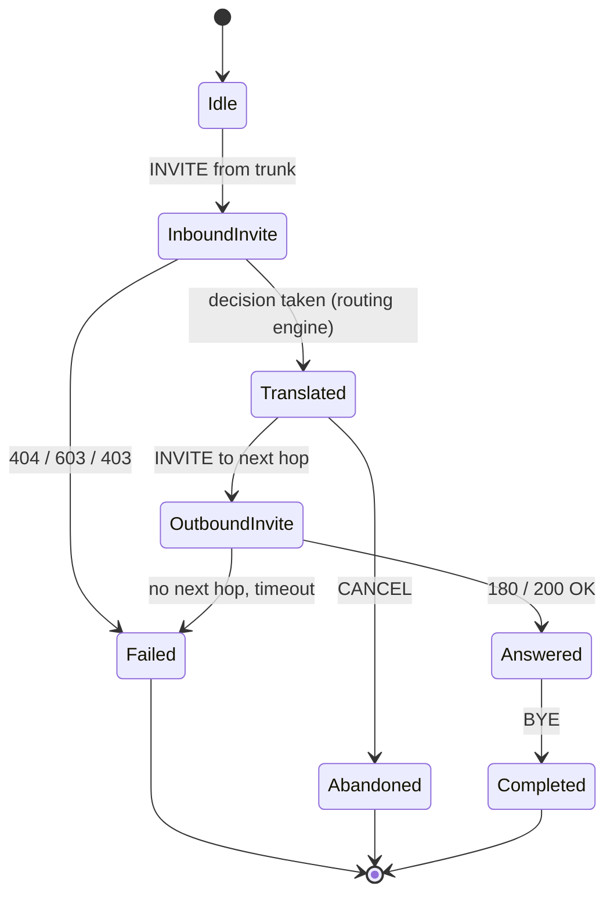

# Low level design

## 1. Module responsibilities

### 1.1 `src/as_app/`

| Module | Responsibility |
| --- | --- |
| `main.py` | Process entry point: settings, logging, signal handlers, self-check, rule set, then the sippy event loop. `AsStack` owns `SipConf` + `SipTransactionManager` + `ED2.loop()` and shuts the loop down from a loop-owned timer |
| `bootstrap.py` | `AsSettings` (pydantic-settings), port availability probe, `run_startup_self_check`, `ShutdownController`, signal handler installation |
| `call_controller.py` | Call Control Logic: `CallController` relays sippy events between the trunk leg (`uaA`) and the next-hop leg (`uaO`) and owns the translation seam; `TrunkCallMap` is the trunk entry point and enforces the peer allowlist; both record counters, trace and dispositions |
| `sip_adapter.py` | The only place (with `call_controller.py`) that touches sippy objects; plain-data view `TrunkMessage` / `CallLeg`, Request-URI helpers, peer allowlist, `PASSTHROUGH_HEADERS`, and `cancel_transaction_timers()` — the per-transaction timer cancellation the shutdown path runs |
| `errors.py` | `AsErrorCode` (identifier, SIP status, message) and `AsError` with structured log fields |
| `routing/rules.py` | Pydantic model of the rules file, YAML loading, validation, `RuleSet`, `RuleSetStore` with reload detection |
| `routing/engine.py` | Pure functions: number format classification, translation, rule matching, decision |
| `observability/logging.py` | Structured logging with the fixed field set |
| `observability/metrics.py` | Counters: calls, dispositions, error codes, rule hits, peer status |
| `observability/tracing.py` | Per-Call-ID trace recorder, bounded in memory |
| `internal_api.py` | Payload builders for the console API plus the FastAPI application factory (`create_internal_api_app`) served by uvicorn on a daemon thread: `/healthz`, `/api/v1/metrics`, `/api/v1/rules`, `/api/v1/traces`, `/api/v1/traces/{call_id}` and `WS /ws/events` |

The configuration model lives in `bootstrap.py` because parsing and validation are
startup concerns. Open item (carried forward from M0; still unresolved — the model did not
grow): if the settings model grows, move it into its own module and update `AGENT.md`
section 5 (a structural change).

### 1.2 `src/console/` and `src/s_sbc_mock/`

| Module | Responsibility |
| --- | --- |
| `console/main.py` | FastAPI application: health endpoint plus the operations console page (dark theme, live flow, rule highlight, statistics, SVG topology) served from a single inline HTML string |
| `s_sbc_mock/main.py` | Process entry point, `MockConfig`, wires UAC and UAS |
| `s_sbc_mock/uac.py` | UAC side: emulates the S-CSCF iFC trigger, places calls from `CallScenario` data |
| `s_sbc_mock/uas.py` | UAS side: emulates the core network, answers the INVITE originated by the AS |

`src/as_app` never imports from `src/s_sbc_mock`; only tests may.

## 2. Data structures

### 2.1 Routing rules (`config/routing_rules.yaml`)

```text
RoutingRulesDocument
├── version, name, description
├── next_hops: [NextHop]
│     NextHop = {name, address, port, transport=udp, priority, description}
└── rules: [RoutingRule]
      RoutingRule = {rule_id, priority, description, enabled, tags, match, action}
      match  = MatchCriteria  {called_prefixes[], called_numbers[], number_format}
      action = RouteAction    {kind=route, translate, next_hops[]}
             | RejectAction   {kind=reject, status=603, reason, error_code}
      translate = NumberTranslation {to_format, strip_prefix, prepend}
```

Evaluation: enabled rules are sorted by ascending `priority` (identifier as tie-break);
the first rule whose `match` block accepts the called number wins.

Number formats: `e164` (`+86…`), `national` (`0…`), `short_code` (`110`, `10086`, `6xxx`),
`international` (`00…`).

### 2.2 Decision

`RoutingDecision` (`routing/engine.py`) is a frozen dataclass:

| Field | Meaning |
| --- | --- |
| `disposition` | `route` · `reject` · `no_match` |
| `called_number` / `translated_number` | before and after translation |
| `rule_id` | rule that decided |
| `source_format` / `target_format` | detected and resulting number format |
| `next_hops` | next hops in selection order |
| `sip_status` / `error_code` / `reason` | what to report when the call is not routed |

### 2.3 Header and SDP pass-through

The B2BUA terminates the trunk INVITE and originates a new one, so the AS decides what
survives the boundary. `PASSTHROUGH_HEADERS` in `src/as_app/sip_adapter.py` is that
decision, written down:

| Header | Why it is passed through |
| --- | --- |
| `P-Asserted-Identity` | Asserted calling party on an IMS trunk (3GPP TS 24.229); the AS is not the asserting node |
| `P-Preferred-Identity` | User preference for the asserted identity |
| `Privacy` | Privacy request of the calling user |
| `P-Charging-Vector` | ICID that ties both legs to one charging record |
| `P-Charging-Function-Addresses` | Charging function addresses of the visiting network |
| `P-Visited-Network-ID` | Network the call was received in |
| `Subject` | Call description shown to the called user |
| `Organization` | Free-text originator description |
| `Priority` | Requested call priority |

Everything else is regenerated by the stack or owned by the AS: `Via`, `Route`,
`Record-Route`, `Contact`, `Max-Forwards` and `Content-Length` are hop by hop; `From`,
`To`, `Call-ID` and `CSeq` belong to the dialog and the second leg has its own;
`User-Agent` is the identity of the AS, and `Content-Type` follows the body.

The body is passed through untouched: the SDP offer that arrives on the trunk is the SDP
offer that leaves on the second leg. M1 asserts this on real traffic in
`tests/integration/test_signalling_path.py::test_headers_and_sdp_pass_through` and shows
it in `docs/specs/message-samples/`.

Two observed spelling caveats: sippy renders unknown header names with
`SipGenericHF.getCanName()`, which only capitalises the first letter, so
`P-Charging-Vector` leaves the AS as `P-charging-vector`. The value is unchanged.

## 3. State machines

### 3.1 Call (B2BUA)



**Known limitation of the trace.** The `ACK` of a `200 OK` is sent by the sippy
transaction layer and never raises a call control event, so it does not appear in the
Call-ID keyed trace even though it is on the wire. The message samples in
`docs/specs/message-samples/` (`08-out-ack-core.txt`, `10-in-ack-trunk.txt`) carry it. If a
future console view has to show it, feed the trace from `SipMessageRecorder` instead of
from the call control events.

### 3.2 Process lifecycle

```text
start -> load settings -> configure logging -> install signal handlers
      -> run_startup_self_check (config, rules, port)
          |-- invalid -> log AS-CFG-*/AS-RULE-* -> exit 1
      -> load rule set -> start sippy loop -> run
      -> SIGTERM/SIGINT -> request shutdown -> drain -> exit 0
```

Signal handlers only *request* shutdown; the loop decides when to stop, because
`ED2.loop()` cannot be interrupted from a handler.

**Teardown order matters.** `AsStack.stop()` cancels what the process itself armed before
it hands anything to sippy: the loop poll timers, then the per-call no-answer timers
(`TrunkCallMap.dispose()`), then every per-transaction timer still scheduled on the
transaction manager (`as_app.sip_adapter.cancel_transaction_timers()`), and only then
`SipTransactionManager.shutdown()`. sippy's own `shutdown()` releases the sockets and
cancels its cache-purge timer but **not** the timers the transactions own, and it drops the
tables they hang from — so anything left armed fires into a manager whose `global_config`
is already `None`. The cancellation therefore has to run first. See the resolved gap row
"Closing a transaction manager mid-retransmission" in `docs/production-gaps.md`.

### 3.3 Number translation seam

`CallController.apply_call_policy()` is the **only** place in the signalling path where an
inbound INVITE is modified before it leaves the AS:

```text
uaA (trunk leg) --CCEventTry--> CallController.recv_event
                                    |
                                    +-- apply_call_policy(event)   <-- the seam
                                    |
                                  uaO (next-hop leg)
```

`apply_call_policy()` calls `as_app.routing.engine.decide`, rewrites the called number in
the event data and rejects the call with the error the decision carries (`404` / `603`).
No other module may touch the called number, so the seam stays verifiable: there is exactly
one place in the signalling path that can change what is dialled.

## 4. Error model

| Code | SIP | Log message | Raised when |
| --- | --- | --- | --- |
| `AS-CFG-001` | 500 | required configuration value is missing | mandatory setting absent (for example an empty next hop address) |
| `AS-CFG-002` | 500 | configuration value failed validation | schema violation in `AsSettings` |
| `AS-CFG-003` | 500 | signalling port cannot be bound | UDP port already in use |
| `AS-CFG-004` | 500 | trunk peer configuration is not usable | `ALLOWED_PEERS` empty or unusable |
| `AS-RULE-001` | 500 | routing rules file cannot be read | missing or unreadable rules file |
| `AS-RULE-002` | 500 | routing rules file is not valid YAML | YAML syntax error |
| `AS-RULE-003` | 500 | routing rules violate the schema | schema violation, duplicate identifier, unknown next hop reference |
| `AS-RULE-004` | 500 | routing rule identifier is not unique | reserved for per-rule reporting |
| `AS-ROUTE-001` | 404 | no routing rule matched the called number | no enabled rule matches |
| `AS-ROUTE-002` | 603 | policy rejected the call | rule action `reject` |
| `AS-ROUTE-003` | 480 | no next hop is available for the route | next hop name cannot be resolved |
| `AS-ROUTE-004` | 500 | number translation produced no result | translation yields an empty number |
| `AS-PEER-001` | 403 | source address is not an allowed trunk peer | source not in `ALLOWED_PEERS` |
| `AS-PEER-002` | 503 | next hop peer did not answer | next hop unreachable or timed out |
| `AS-PEER-003` | 400 | request from the trunk could not be parsed | malformed Request-URI |
| `AS-FRAUD-001` | 608 | calling party is on the block list | screening: the calling number matches a `block_list` entry (P8) |
| `AS-FRAUD-002` | 608 | calling party exceeded the call-rate window | screening: the per-caller window holds more than `window.max_calls` calls (P8) |
| `AS-FRAUD-003` | 608 | calling party reputation is below the threshold | screening: effective reputation `< reputation.reject_below` (P8) |
| `AS-FRAUD-004` | 500 | screening data file cannot be read | missing or unreadable `config/caller_screening.yaml` (P8) |
| `AS-FRAUD-005` | 500 | screening data file violates the schema | schema violation, duplicate or conflicting list entry, unusable window (P8) |
| `AS-FRAUD-006` | 500 | screening produced no verdict | the pure engine returned no usable verdict (internal fallback, P8) |
| `AS-INT-001` | 500 | unexpected internal failure | anything else |

`AS-FRAUD-*` is the anti-fraud AS's family and lives in the **same** authoritative model
(`src/as_app/errors.py`), as REQ-F-023 requires: a second process must not grow a second
error vocabulary. Section 9.4 states the rows together with the `SIP_PHRASES` change that
makes `608` carry the phrase `Rejected`; `SIP_PHRASES` currently has no `608` entry, so
without it `AsError.sip_phrase` would fall back to `Server Internal Error` and the reject
would go out with the wrong phrase.

## 5. Process model and threading

- The AS process runs sippy's `ED2.loop()` on the main thread. Nothing else may block it.
- Signal handlers only set a flag (`ShutdownController`).
- The console is a separate process; it never imports AS modules and reaches the AS over
  the internal API (ADR-0002).
- The internal API is served from the AS process in M3; it must not run inside the sippy
  thread — see ADR-0002 for the chosen approach.
- Counters and traces are guarded by locks, because sippy callbacks and the console feed
  run on different threads.
- `ED2` (the sippy event dispatcher) is a **process-wide singleton**. In production the AS
  and the mock are separate processes; in the tests they share one interpreter and
  therefore one loop, which `TrunkPair.run_until()` drives.
- `SipConf` is a process-wide singleton as well (`my_address`, `my_port`, `my_uaname`) and
  sippy reads it while it builds a `Via` and a default `Contact`. Each side therefore sets
  `ua.lContact` and `ua.local_ua` explicitly and pins `SipConf` around the messages it
  generates: `_as_sip_identity()` in `call_controller.py`, `_trunk_identity()` in
  `s_sbc_mock/uac.py`. Without this, a second sippy application in the same interpreter
  would put the wrong `Via` on the wire.
- A side that needs its own local UDP port needs its own `SipTransactionManager`; each
  manager must have `global_config['_sip_tm']` set right after construction, and
  `shutdown()` releases the socket again. **`shutdown()` is not a complete teardown on its
  own**: it cancels only the manager's own cache-purge timer, never the timers the
  transactions carry (`teA`…`teG`), and it drops the tables those timers hang from. Because
  `ED2` is the process-wide singleton above, a timer that survives it keeps firing — into a
  manager whose `global_config` is already `None`. Whoever stops a manager has to cancel the
  transaction timers first, which is what `as_app.sip_adapter.cancel_transaction_timers()`
  does for the AS (P8a).

## 6. Configuration reference

| Variable | Default | Meaning |
| --- | --- | --- |
| `SIP_LISTEN_ADDRESS` | `127.0.0.1` | Address the trunk is received on |
| `SIP_LISTEN_PORT` | `5060` | UDP port of the trunk |
| `SBC_PEER_ADDRESS` | `127.0.0.1` | Next hop for the outbound INVITE |
| `SBC_PEER_PORT` | `5061` | UDP port of the next hop (`.env.example` ships `15061` for the mock) |
| `ALLOWED_PEERS` | `127.0.0.1` | Comma separated source addresses accepted on the trunk |
| `RULES_FILE` | `config/routing_rules.yaml` | Routing rules file |
| `INTERNAL_API_ADDRESS` | `127.0.0.1` | Address the console reaches |
| `INTERNAL_API_PORT` | `8080` | Port of the internal API |
| `LOG_LEVEL` | `INFO` | `CRITICAL` · `ERROR` · `WARNING` · `INFO` · `DEBUG` |
| `LOG_STRUCTURED` | `true` | JSON log lines when true |
| `LOG_PAYLOADS` | `false` | Log SIP payloads (off by default) |
| `SHUTDOWN_GRACE_SECONDS` | `5` | Grace period for in-flight calls on shutdown |

## 7. Log field reference

Every line carries, in this order:

| Field | Example | Notes |
| --- | --- | --- |
| `timestamp` | `2026-09-15T23:31:39+0800` | ISO 8601 with offset |
| `level` | `info` | lower case |
| `module` | `call_controller` | emitting module |
| `call_id` | `probe-59745@example.invalid` | `-` when unknown; threads both legs |
| `direction` | `in` · `out` · `internal` | relative to the AS |
| `peer` | `127.0.0.1:15061` | `-` when unknown |
| `event` | `routing decision taken` | lower case English |

Additional fields are appended per event (for example `rule_id`, `disposition`,
`error_code`, `sip_status`, `method`). The field set is never changed silently.

## 8. Known trap: `observability/logging.py`

`src/as_app/observability/logging.py` shadows the standard library module name for any
import that is not package-absolute. Python 3 resolves `import logging` to the standard
library, so the code works, but two things must be respected:

1. Every import in `src/` and `tests/` is package-absolute (`import logging` inside
   `as_app.call_controller` is the standard library, as intended).
2. Never add `src/as_app/observability/` to `sys.path` and never run a script from inside
   that directory.

The file is deliberately **not** renamed (a rename is a structural change that would
touch `AGENT.md` section 5). Maintainer decision of 2026-09-16: the name stays. The two
rules above hold throughout the code: every import is package-absolute, and
`src/as_app/observability/` is never on `sys.path`.

## 9. The anti-fraud AS (P8)

The second AS instance of `docs/architecture/hld.md` section 8. It is a **second concrete
AS**, not a framework: it introduces no registry, no plugin protocol and no shared base
class (ADR-0007, `docs/phase2-plan.md` D4/D6/D9). This section is the low-level design for
the reject path (`608 Rejected`), the allow path, the process-level state, the declarative
data file and the second process.

### 9.1 Module responsibilities

`src/anti_fraud_as/` is a new package next to `src/as_app/`, `src/console/` and
`src/s_sbc_mock/`. Adding it is a structural change (`AGENT.md` section 5); the
implementation commit mirrors it into `AGENT.md`, `README.md` and `docs/README.md`
(section 9.8).

| Module | Responsibility |
| --- | --- |
| `main.py` | Process entry point and `FraudAsStack`: the second process's own `SipConf` identity pinning, own `SipTransactionManager`, own `ED2.loop()`, loop-owned shutdown and reload timers, and its own stop path (section 9.6) |
| `bootstrap.py` | `FraudAsSettings` (pydantic-settings) and `run_startup_self_check` — the same fail-fast contract as the first AS (`AGENT.md` section 4.3) |
| `call_controller.py` | `FraudCallController` (per call) and `FraudCallMap` (process entry point, peer allowlist): the verdict seam, the allow-path relay and the UAS-only reject |
| `screening.py` | The **pure** verdict: `screen()` over plain-data inputs and outputs. No sockets, no global state, no clock (REQ-NF-011) |
| `caller_state.py` | The **process-level** store (D9): the call-rate window and the reputation ledger. The only place a clock is read, and it is an injected `Callable[[], float]` |
| `screening_data.py` | The declarative data file: Pydantic model, load-time validation and `ScreeningDataStore` with size+mtime reload detection |
| `internal_api.py` | The anti-fraud AS's console payload builders and its own API server (see the duplication note below) |

**What is shared, imported from `as_app`.** Reuse is by direct import of modules that
already exist and are not number-translation specific. No new abstraction is introduced.

| Shared from `as_app` | Why it is not use-case specific |
| --- | --- |
| `errors` | the one authoritative `AS-*` model; REQ-F-023 adds `AS-FRAUD-*` to it |
| `observability/logging.py` | the fixed structured-log field set (`AGENT.md` section 4.3) |
| `observability/metrics.py` | counters, dispositions and peer status |
| `observability/tracing.py` | per-Call-ID trace, console feed and `SipMessageRecorder` |
| `sip_adapter` — `cancel_transaction_timers`, `is_allowed_peer`, `extract_called_number`, `PASSTHROUGH_HEADERS`, `CallLeg`, `TrunkMessage` | B2BUA/trunk plumbing that describes the trunk, not the service |
| `bootstrap` — `ShutdownController`, `install_signal_handlers`, `check_port_available` | process plumbing: signals, cooperative shutdown, port probing |

**What deliberately stays use-case-specific** (not generalised, not shared):

| Part | Why generalising it now would be wrong |
| --- | --- |
| `screening.py` | the verdict algorithm *is* the use case; there is exactly one implementation, so an interface would be a guess |
| `caller_state.py` | cross-call state is introduced by this use case; a pluggable state store is P11, and `docs/phase2-plan.md` D9 forbids solving it early |
| `screening_data.py` | the schema is this use case's data; forcing a common schema with the routing rules would shape the platform like these two samples |
| `internal_api.py` | the app factory and server are **duplicated on purpose**: `as_app.internal_api.create_internal_api_app` is bound to a `RuleSetStore` and to `/api/v1/rules`, so reusing it would mean parameterising it into the very framework P8 must not build. The duplication is friction for P10 and is recorded as such |

### 9.2 The D9 ownership boundary

The boundary is drawn by **lifetime**, not by package:

| Scope | Object | Lives in |
| --- | --- | --- |
| **Process-level** (one per process, created in `main`) | `CallerStateStore`, `ScreeningDataStore`, `MetricsRegistry`, `TraceRecorder`, `FraudCallMap` | `FraudAsStack` |
| **Per-call** (one per INVITE, created by `FraudCallMap.recv_request`) | `FraudCallController` | the call map's `controllers` list |

`FraudCallController` holds **a reference to** the process-level `CallerStateStore`, exactly
as it holds references to the process-level metrics registry and trace recorder — but it
holds **no state of its own that outlives the call**. That is the whole point of D9: a rate
window stored on the controller would be created per call, always hold exactly one entry,
and fail silently while single-call unit tests still passed. The controller therefore sees
the store only through **already-computed plain values**:

```text
FraudCallMap.recv_request(request)
        │  (process-level, created once)
        ▼
CallerStateStore.observe(caller, now)  ->  CallerSignals        # plain data, no state leak
        │
        ▼
screening.screen(signals, policy)      ->  ScreeningDecision    # pure function
        │
        ▼
FraudCallController                     # per call: uaA, maybe uaO, the verdict
```

### 9.3 Data structures

**Call-rate window.** One bounded FIFO of monotonic timestamps per caller. The window is
not materialised on a timer: it is evaluated when a call arrives, which is the only moment
its answer is needed.

```text
CallRateWindow
├── window_seconds: float                       # configured (data file)
├── max_calls: int                              # configured threshold
└── _events: dict[caller -> deque[float]]       # monotonic timestamps, oldest first
      count_in_window(caller, now) -> int
          # drops every entry older than (now - window_seconds), then returns len()
      every deque is bounded to max_calls + 1   # more is not needed once the threshold is passed
```

**Reputation ledger.** Reputation decays **towards the configured default** with an
exponential half-life, so a bad burst fades instead of persisting forever.

```text
ReputationLedger
├── default_score: float
├── half_life_seconds: float
├── reject_penalty: float
└── _entries: dict[caller -> (score: float, updated_at: float)]
      effective_score(caller, now) =
          default_score + (score - default_score) * 0.5 ** ((now - updated_at) / half_life_seconds)
      penalise(caller, now) =
          score = effective_score(caller, now) - reject_penalty; updated_at = now
```

Both structures are pure arithmetic given `now`. They are guarded by one `threading.Lock`
in `CallerStateStore`, because sippy callbacks and the console feed run on different
threads — the same reason the metrics registry and trace recorder are lock-guarded
(section 5).

**The injected clock.** `CallerStateStore(clock: Callable[[], float] = time.monotonic)`
is the **only** place a clock is read; `screening.screen()` receives no clock at all, only
the numbers `effective_reputation` and `calls_in_window`. A unit test constructs the store
with a fake clock and the engine with fixed numbers, so the verdict is testable with no
socket and no waiting (REQ-NF-011, and the `routing/engine.py` precedent of REQ-NF-004).

The verdict itself is plain data:

| Type | Fields |
| --- | --- |
| `ScreeningSignals` | `calling_number`, `blocklisted: bool` + matched entry, `allowlisted: bool` + matched entry, `effective_reputation: float`, `calls_in_window: int`, `identity_present: bool` |
| `ScreeningPolicy` | `reject_below_reputation`, `reject_above_calls` (mirrors of the data-file thresholds, resolved at load) |
| `Verdict` | `allow` \| `reject` |
| `ScreeningDecision` | `verdict`, `reason` (lower-case English), `source` (`block_list` \| `rate_window` \| `reputation` \| `none`), `score`, `error_code` (`AS-FRAUD-001…003`, `None` on allow) |

Decision order is deliberate and documented: **allow list first** (an operator exemption
always wins), then **block list**, then the **rate window**, then **reputation**. The first
signal that fires decides, and the decision names it, so the console and the trace can
explain *why* without re-running the engine.

### 9.4 Declarative data file: `config/caller_screening.yaml`

Data, not code, and reloadable without touching the code — the same shape as the routing
rules (ADR-0004) and the same reasoning: policy changes must be reviewable diffs.

```text
ScreeningDocument
├── version, name, description
├── window:     CallRateWindowConfig { seconds: float > 0, max_calls: int >= 1 }
├── reputation: ReputationConfig { half_life_seconds > 0, default_score: float,
│                                  reject_below: float, reject_penalty >= 0,
│                                  max_tracked_callers >= 1 }
├── block_list: [ScreenedNumber]
└── allow_list: [ScreenedNumber]
      ScreenedNumber = { number: str | prefix: str, reason: str, description: str | None }
```

**Validation on load** (`screening_data.load_screening_data`), reported as `AS-FRAUD-004`
(file cannot be read) or `AS-FRAUD-005` (schema), never as a bare exception:

- `version` is a supported version;
- `window.seconds > 0` and `window.max_calls >= 1`;
- `reputation.half_life_seconds > 0`, `max_tracked_callers >= 1`, `reject_penalty >= 0`;
- every list entry carries **exactly one** of `number` / `prefix`, non-empty;
- entries are unique within a list, and **a value may not appear in both lists** — an
  ambiguous entry is a configuration error, not a precedence puzzle;
- `block_list` and `allow_list` may both be empty (then only the window and reputation
  decide).

**Reload** mirrors `RuleSetStore`: `ScreeningDataStore.maybe_reload()` compares size and
mtime and swaps the document only when it parsed and validated; on failure the **previous
document stays active** and the error is logged (`AS-FRAUD-005`), so a broken edit cannot
break the call path (ADR-0004's fail-safe rule). Reload is **pull-based**, driven from a
loop-owned timer with `SCREENING_RELOAD_POLL_SECONDS = 1.0` — never from inside a sippy
callback, because file I/O on the call path would block the whole stack
(`docs/phase2-plan.md` section 6).

**No addresses in this file.** The next hop comes from the environment
(`FRAUD_SBC_PEER_*`), so — unlike `config/routing_rules.yaml` and
`config/routing_rules.compose.yaml` — the second AS has **no second copy of an address to
drift from**. That is a deliberate answer to the rule-file-drift trap recorded in
`docs/phase2-plan.md` section 6: the shortest way to avoid four synchronised copies is not
to create a copy at all.

### 9.5 Error model and the `608 Rejected` phrase

The rows are in the authoritative table of section 4; this is what makes them carry the
right phrase on the trunk:

```python
SIP_PHRASES: Final[dict[int, str]] = { ..., 608: "Rejected" }
```

`AsError.sip_phrase` resolves through `SIP_PHRASES`, and `608` is **not** in that map today,
so without this entry the reject would go out with the fallback phrase `Server Internal
Error`. With it, the reject emits `CCEventFail((608, "Rejected", None))` on the answering
leg, which sippy renders as `SIP/2.0 608 Rejected` — verified on the wire
(`docs/architecture/adr/0007-anti-fraud-as-and-608-rejection.md`, *Verified facts* 5.1).

The `AS-FRAUD-001…003` rows map to `608`, so `machine reason` and `wire status` never
disagree; `AS-FRAUD-004/005` are configuration failures and map to `500` like the
`AS-RULE-00x` family; `AS-FRAUD-006` is the internal fallback when the pure engine returns
no verdict.

### 9.6 The verdict seam and the one-leg relaxations

`FraudCallController.apply_call_policy()` is the **single seam** where the verdict is taken
for a call, in the same spirit as the translation seam of section 3.3: it calls
`CallerStateStore.observe(...)` then `screening.screen(...)`, records the decision, and
either hands the unchanged `CCEventTry` to the originating leg (allow) or raises the
`AsError` carrying `608` (reject).

**The one-leg relaxation (`CallController` two-leg assumption).** The Phase 1 controller
was written for a B2BUA that always has two legs. The reject path is **UAS behaviour, not
B2BUA** (`docs/phase2-plan.md` section 3, P8 "Known collisions"): it answers on the trunk
and originates nothing. The controller must therefore tolerate a call whose only leg is
`uaA`, **for the whole lifetime of the call** — not merely until the first `CCEventTry`.
Precisely, the shared shape must guarantee:

1. **`uaO` may stay `None` forever.** No code path may dereference `uaO` without a `None`
   check. Today `_relay_from_trunk` already tolerates `uaO is None` until the first
   `CCEventTry`; the relaxation states the general invariant.
2. **A reject must not require a `RoutingDecision`.** The Phase 1 reject path asserts
   `self._decision is not None` and derives the disposition from the decision. A screening
   reject has no routing decision at all, so the reject emission is factored into a
   **decision-free** part that takes the SIP status, the phrase and the `AsError` (which
   carries the `AS-FRAUD-*` code).
3. **The disposition is supplied, not derived.** The decision-free path records
   `CallDisposition.REJECTED` explicitly instead of asking a decision object.
4. **The trunk leg is the only leg to answer**, so a `CCEventFail` on `uaA` completes the
   call; `dispose()` and `FraudCallMap.dispose()` must not assume `uaO` exists (they
   already guard for `None`).

**How a reject is emitted on the trunk.** Exactly as the two-leg error branches already
emit theirs — a call-control failure on the answering leg, which sippy turns into the final
response:

```text
uaA.recvEvent(CCEventFail((error.sip_status, error.sip_phrase, None)))
   where error.sip_status == 608 and error.sip_phrase == SIP_PHRASES[608] == "Rejected"
```

No `Call-Info` header is added (RFC 8688 section 3.1/6, ADR-0007 decision 4), and no second
leg is created, so the reject adds **no** outbound transaction and no new retransmission
population. On the **allow** path the controller relays the INVITE with the Request-URI and
headers **unchanged** — `PASSTHROUGH_HEADERS` are copied as in the first AS, and **no
header is added** (ADR-0007 decision 6).

**Missing calling identity.** `P-Asserted-Identity` is the screening input. When it is
absent, no `block_list` / `allow_list` / reputation input exists; the AS records
`verdict=allow`, `source=none`, `identity_present=false` and relays the call (**fail-open**),
because the POC has no attestation mechanism (STIR is out of scope) and rejecting on a
missing optional header would break legitimate traffic. It is an accepted gap
(`docs/architecture/adr/0007-anti-fraud-as-and-608-rejection.md`, *Gaps accepted*).

### 9.7 Process model of the second process

`python -m anti_fraud_as.main` is a **fourth process** (section 8.2 of the HLD). It is not
a thread of `as_app`: sippy's `ED2.loop()` blocks its thread and `AGENT.md` section 6
forbids sharing it with a web server.

- **Own `SipConf` identity pinning.** `SipConf` is a process-wide singleton sippy reads
  when it builds a `Via` or a default `Contact`. In production the two AS processes are
  separate and each writes it once at start; in the tests they share one interpreter, so
  the fraud AS pins its identity around each message it generates with its own
  `_fraud_sip_identity(global_config)` context manager, exactly as `_as_sip_identity` and
  `_trunk_identity` do (section 5). Without it, a second sippy application in one
  interpreter puts the wrong `Via` on the wire.
- **Own `SipTransactionManager`.** The second process binds its own UDP socket through its
  own manager, and sets `global_config['_sip_tm']` right after construction.
- **Own `ED2.loop()` on the main thread.** Nothing blocking may run inside a sippy
  callback; the data-file reload and the shutdown poll are loop-owned timers, not filesystem
  watches.
- **Own stop path that cancels the timers it armed (P8a lesson 5).** Order matters and
  mirrors `AsStack.stop()`:

  ```text
  SIGTERM/SIGINT -> flag
    -> loop-owned shutdown poll sees the flag -> ED2.breakLoop()
    -> FraudAsStack.stop():
         1. cancel the shutdown-poll timer
         2. cancel the screening-reload timer
         3. FraudCallMap.dispose()        # per-call controller timers
         4. cancel_transaction_timers(manager)   # the client transactions of allowed calls
         5. manager.shutdown()            # sippy's own teardown, last
         6. internal_api.stop()
  ```

  Step 4 is the P8a lesson applied to a second process: anything this process arms with
  `Timeout` outlives the object it was created for unless its owner cancels it, and sippy's
  `shutdown()` cancels only `cp_timer` while dropping the tables the transaction timers hang
  from — a surviving timer fires into a manager whose `global_config` is already `None`
  (`docs/production-gaps.md`, "Closing a transaction manager mid-retransmission").

- **Port-collision trap avoided.** Both AS instances bind a trunk UDP port; the first
  defaults to `SIP_LISTEN_PORT=5060`, so the second has its **own** default
  `FRAUD_SIP_LISTEN_PORT=5062` and its own internal-API port `8082`. The startup self-check
  binds the port before the loop starts and fails fast with `AS-CFG-003` if it is taken, so
  a misconfiguration aborts startup rather than stealing traffic.
- **Rule-file-drift trap avoided.** The screening data file carries no addresses
  (section 9.4), so there is no environment-specific copy to keep in step. The next hop is
  environment configuration only.
- **No new transaction on the reject path.** Rejected calls originate nothing, so they add
  no retransmission timers; only allowed calls create client transactions, which step 4
  above cancels on shutdown.

### 9.8 Configuration reference and new log fields

**Environment variables** (declared in `.env.example`, parsed by `FraudAsSettings`, no
default that silently points at a real network):

| Variable | Default | Meaning |
| --- | --- | --- |
| `FRAUD_SIP_LISTEN_ADDRESS` | `127.0.0.1` | Address the anti-fraud AS receives the trunk on |
| `FRAUD_SIP_LISTEN_PORT` | `5062` | UDP port of the anti-fraud trunk; distinct from the first AS's `5060` so both run locally (section 9.7) |
| `FRAUD_SBC_PEER_ADDRESS` | `127.0.0.1` | Next hop the *allowed* INVITE is relayed to (mock or real S-SBC) |
| `FRAUD_SBC_PEER_PORT` | `15061` | UDP port of that next hop |
| `FRAUD_ALLOWED_PEERS` | `127.0.0.1` | Comma separated source addresses accepted on the anti-fraud trunk |
| `FRAUD_SCREENING_FILE` | `config/caller_screening.yaml` | Declarative caller-screening data file (section 9.4) |
| `FRAUD_INTERNAL_API_ADDRESS` | `127.0.0.1` | Address the console reaches the anti-fraud AS on |
| `FRAUD_INTERNAL_API_PORT` | `8082` | Port of the anti-fraud internal API; distinct from the first AS's `8080` |
| `LOG_LEVEL` | `INFO` | Reused as-is: process-local behaviour, not instance identity |
| `LOG_STRUCTURED` | `true` | Reused as-is |
| `LOG_PAYLOADS` | `false` | Reused as-is; payload display stays a console feature |
| `SHUTDOWN_GRACE_SECONDS` | `5` | Reused as-is |

Instance-identifying knobs are **prefixed** (`FRAUD_*`) so that one `.env` cannot be read
by the wrong process and silently point a peer at the wrong port; the observability and
runtime knobs are shared because they describe the process, not the instance. Every default
is loopback.

**New log fields.** Appended per event on top of the fixed field set of section 7 (that set
is never changed silently):

| Field | Example | Notes |
| --- | --- | --- |
| `verdict` | `allow` · `reject` | the screening outcome of the call |
| `screen_source` | `block_list` · `rate_window` · `reputation` · `none` | which signal decided |
| `screen_reason` | `calling party exceeded the call-rate window` | lower-case English |
| `reputation` | `12.5` | effective score at the decision instant |
| `calls_in_window` | `6` | calls of the caller inside the window, this one included |
| `list_entry` | `BL-0007` | identifier of the matched list entry, when one matched |

The matched list entry travels in the trace's `attributes` rather than in the
routing-named `TraceEvent.rule_id`; overloading a field named after routing would make the
console read differently for the two instances. The field-name mismatch is noted as friction
for P10, not fixed here.

### 9.9 Structural changes for the implementation commit

The implementation commit mirrors these into `AGENT.md`, `README.md` and `docs/README.md`
in the same commit (`AGENT.md` sections 12 and 13), and covers the console delta of
`AGENT.md` section 4.4 / section 16. **None of those files is edited at design stage.**

| Change | Files the implementation commit must update |
| --- | --- |
| New `src/anti_fraud_as/` package | `AGENT.md` section 5 layout, `README.md` repository tour, `docs/README.md` |
| New `config/caller_screening.yaml` data file | `AGENT.md` section 5 and section 8, `README.md`, `docs/README.md` |
| New `FRAUD_*` environment variables | `AGENT.md` section 8, `.env.example`, `README.md` quickstart, `docs/operations/deployment.md` port matrix |
| New run command `python -m anti_fraud_as.main` | `AGENT.md` section 10 (and a `Makefile` target), `README.md` quickstart, `docs/README.md` |
| New deploy service (`anti-fraud-as`) | `deploy/docker-compose.yml`, `docs/operations/deployment.md` |
| New package in the wheel build | `pyproject.toml` `[tool.hatch.build.targets.wheel] packages` |
| New `AS-FRAUD-*` error codes and `SIP_PHRASES[608]` | `docs/operations/troubleshooting.md` (keyed by `AS-*`), `docs/architecture/lld.md` section 4 (already extended) |
| New gaps accepted | `docs/production-gaps.md` |
| New acceptance items `ACC-P8-*` and evidence | `docs/acceptance/criteria.md`, `docs/acceptance/report.md` |
| Item close (version and CHANGELOG) | `VERSION`, `CHANGELOG.md` — per `docs/phase2-plan.md` section 5.4, tagging remains the maintainer's step |

**Console coverage delta (`AGENT.md` section 4.4 / section 16).** The console must show the
second instance's flow, not just the first's:

- a **service selector** (or a second feed) so the reviewer can switch between the
  number-translation AS and the anti-fraud AS — each process keeps its own internal API;
- a **Screening data** panel, read-only like the rules panel (`GET /api/v1/screening`):
  block/allow lists and the window/reputation parameters;
- a **verdict** view on the call trace: `allow`/`reject`, the deciding signal, the
  reputation score, the calls in window and the matched list entry;
- statistics for verdicts by signal and reputation thresholds;
- the topology view showing which instance answered a call — a `reject` ends at the
  anti-fraud AS, an allow continues to the next hop.

Until that console work lands, the second instance's verdict is still observable through
`/healthz`, `/api/v1/metrics`, `/api/v1/traces` and the structured log, so the item is not
blocked on the UI.

