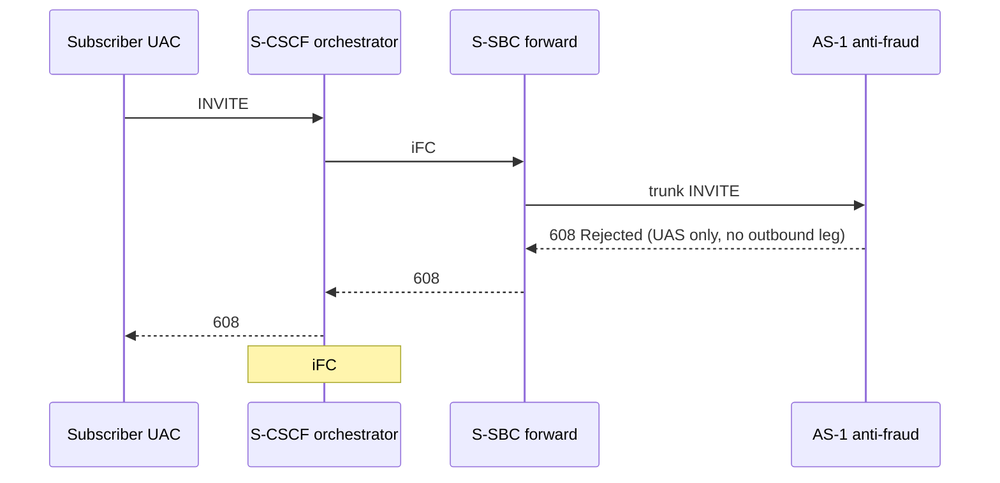

# Chained topology rework plan — iFC-orchestrated AS chain (P9 correction)

- **Status:** implemented (P9b, 2026-09-23)
- **Date:** 2026-09-23
- **Owner:** project maintainer
- **Related:** `docs/architecture/hld.md` section 9 · `docs/architecture/adr/0008-chained-as-topology.md`
  (superseded by **ADR-0014**, drafted in P9b-0) · `docs/phase2-plan.md` section 3 (P9) ·
  `AGENT.md` §14 rule 3 · `docs/requirements/functional-and-nonfunctional.md`
  (REQ-F-025…REQ-F-028, REQ-NF-016…REQ-NF-018)

---

## 1. Purpose and scope of this document

Phase 2 item **P9** delivered a chained demo (`make demo-chained`), integration tests, a
probe (`tools/chained_as_probe.py`) and **ADR-0008**. That work wired the two AS instances
**trunk-to-trunk**: AS-1's `FRAUD_SBC_PEER_*` pointed at AS-2's listen address. That
shortcut contradicts the IMS model this repository claims to demonstrate.

After the Phase 1 topology correction (standalone AS outbound leg uses the trunk INVITE's
**top `Route`** back through the S-SBC, not an arbitrary core port) and the matching
anti-fraud AS allow-path fix, the **intended** chained topology is documented in
`docs/architecture/hld.md` section 9. **This document is the single detailed source for
reworking the implementation to match that section.** `docs/roadmap.md` and `docs/README.md`
link here; they do **not** duplicate the content.

**What this plan covers:**

- Why the current P9 wiring is wrong and what replaces it.
- Strategic decisions D1–D8 (iFC trigger timing, S-SBC scope, Call-ID model, UAC split).
- End-to-end sequences, wiring matrix, and 透传 callback contract (section 3).
- New mock components (`src/ims_mock/`).
- The work sequence, file list, acceptance criteria and risks.

**What this plan does not cover:**

- Changes to the two AS binaries beyond what standalone mode already does (Route-based
  outbound on the allow path).
- Phase 3 load generator / console dashboard (see `docs/phase3-plan.md`).
- Full iFC / ISC emulation to production fidelity — the POC uses a deliberate simplification
  recorded in section 8.

**Handover rule.** A conversation that implements this plan should read `AGENT.md`,
`docs/README.md`, **this document**, `docs/architecture/hld.md` section 9, and the affected
acceptance rows — then start. Conversation context is not a handover artefact
(`AGENT.md` §15).

---

## 2. Strategic decisions

### D1 — AS instances never communicate directly

**Decision.** There is **no** SIP path `AS-1 → AS-2`. Every AS is reached only when
**S-CSCF** applies an **iFC** entry and the operator **S-SBC** delivers a **trunk INVITE**
(with `Route`) to that AS. Each allowed AS returns an outbound INVITE to the **top `Route`**
on the S-SBC **return** side; the S-SBC **透传** that INVITE to **S-CSCF** inside the IMS.

**Rationale.** 3rd-party ASs sit outside the operator IMS. In production they are triggered
over the S-SBC trunk, not over a private peer wire between AS processes. The obsolete P9
model taught reviewers the wrong shape and made `FRAUD_SBC_PEER_* → AS-2` look like a
legitimate chaining knob.

**Consequence.** `FRAUD_SBC_PEER_*` is **not** a chaining mechanism. It remains the
**fallback** next hop when the trunk INVITE carries no `Route` (same as standalone). Chain
order is configured in the **iFC orchestrator**, not in AS peer environment variables.

### D2 — S-SBC is only the external-AS boundary

**Decision.** The S-SBC appears **only** on paths between the IMS and external 3rd-party
ASs (forward trunk in, return outbound back). Toward the **called party**, signalling is
**S-CSCF → P-CSCF → 5G core / called-party UAS** — **not** through the S-SBC.

**Rationale.** Maintainer ruling (2026-09-23): conflating the S-SBC with the terminating
path was a documentation and design error. The S-SBC is the service-side session border for
trunking to external ASs, not a general IMS egress.

**Consequence.** The mock **terminating UAS** is **not** hung off the S-SBC return port. It is
reached through a minimal **P-CSCF relay** (or equivalent) after S-CSCF has both AS
results on the allow path.

### D3 — iFC #2 fires when AS-1's outbound INVITE reaches S-CSCF

**Decision.** After iFC #1, when AS-1 **allows**, its outbound INVITE arrives at the S-SBC
return side and is **透传** to S-CSCF as an **INVITE** (not modelled as a separate “back to
IMS” hop). **Immediately then**, S-CSCF applies **iFC #2** and sends a **new** trunk INVITE
through the S-SBC forward side to AS-2.

**Rationale.** Matches `docs/architecture/hld.md` section 9.2 and the maintainer's sequence
diagram review. It is a POC simplification: real IMS iFC may key on different session
events; this plan records the simplification explicitly (section 8).

**Rejected alternatives:**

| Alternative | Why not for this POC |
| --- | --- |
| Trigger iFC #2 only after AS-1's full dialog releases (BYE) | Misleading delay; harder to demo “chain in one call setup”. |
| Trigger both ASs from one initial INVITE without waiting for AS-1 outbound | Does not match “AS returns through S-SBC, then next iFC” narrative. |

### D4 — Four dialog `Call-ID` values on the allow path

**Decision.** A full allow chain carries **four** AS-leg `Call-ID` values:

| Leg | Producer | Typical shape |
| --- | --- | --- |
| S-SBC → AS-1 trunk | mock / orchestrator | `X` |
| AS-1 outbound → S-SBC return | AS-1 (`outbound_call_id`) | `X-b2b_1` |
| S-SBC → AS-2 trunk (iFC #2) | orchestrator (new trigger) | `Z` (≠ `X`) |
| AS-2 outbound → S-SBC return | AS-2 (`outbound_call_id`) | `Z-b2b_1` |

**Rationale.** ADR-0008 counted **three** values because it assumed AS-1's outbound leg
landed directly on AS-2's trunk (one fewer dialog). With iFC re-trigger, AS-2's trunk
`Call-ID` is **new**.

**Consequence.** `REQ-F-028`, `tools/chained_as_probe.py` and demo transcript assertions
must be updated. Cross-AS correlation on `Call-ID` remains impossible; **ICID** in
`P-Charging-Vector` is still the end-to-end key (unchanged).

**Probe scope.** Assertions cover the **four AS-leg** values above. A fifth `Call-ID` on
the terminating UAS leg (P-CSCF → UAS) is **out of scope** for `chained_as_probe` unless a
test explicitly targets the terminating side; document that boundary in P9b-0.

### D5 — AS code stays as-is; the mock grows

**Decision.** No new imports between `as_app` and `anti_fraud_as`. Both AS instances keep
using `parse_top_route_target()` on the allow path (`as_platform.route_header`). All chain
wiring moves into **`src/ims_mock/`** plus extensions to **`src/s_sbc_mock/`** where the
S-SBC must forward return-side INVITEs to the orchestrator.

**Rationale.** `AGENT.md` §12: the AS binaries are already correct for standalone; the defect
is entirely in how the POC **simulates the operator network**.

### D6 — ADR-0014 supersedes ADR-0008 decision 1

**Decision.** ADR-0008 decision 1 (AS-1 → AS-2 via `FRAUD_SBC_PEER_*`) is **withdrawn**.
**ADR-0014** (new file in P9b-0) records the iFC-orchestrated model, D1–D8 and section 8
simplifications. ADR-0008 stays in the tree with a header note pointing at ADR-0014 — it is
**historical evidence** of the obsolete P9 wiring, not edited in place.

### D7 — Subscriber UAC and orchestrator roles are split

**Decision.**

| Role | Owner | Responsibility |
| --- | --- | --- |
| **Subscriber UAC** | Existing `TrunkUac` (or thin wrapper) | Places the **initial** subscriber INVITE into the IMS; owns the **caller-side** dialog through 200/ACK/BYE. |
| **S-CSCF / iFC orchestrator** | `ims_mock/orchestrator.py` | Applies iFC #1 and #2; drives **S-SBC forward** trunk INVITE+Route to AS-1 then AS-2. **Does not** reuse the subscriber UAC transaction for iFC #2. |
| **S-SBC forward API** | Extension to `s_sbc_mock` | Sends orchestrator-triggered trunk INVITEs (new Call-ID per trigger). |

**Rationale.** iFC #2 requires a **new** trunk INVITE with Call-ID `Z ≠ X` (D4). Reusing the
initial `TrunkUac` transaction for both AS hops was the trunk-to-trunk mistake in another
form.

### D8 — AS-1 B2BUA legs stay up while AS-2 runs

**Decision.** After AS-1 allow, **both** AS-1 legs (trunk UAS and outbound UAC) remain until
the subscriber dialog releases. iFC #2 does **not** wait for BYE on AS-1. Responses from the
terminating side are relayed back through AS-2 → AS-1 → subscriber UAC in the usual B2BUA
order once the far-end dialog exists.

**Rationale.** Matches D3 (iFC #2 on outbound INVITE 透传, not on teardown). The POC must
state this explicitly so implementers do not tear down AS-1 before AS-2 completes.

**P10 input (replaces ADR-0008 friction narrative).** The friction P10 inherits is no longer
“peer knob vs routing catalogue” — it is **“the POC needs an IMS-side orchestrator mock;
neither AS knows about the chain.”** Record that in ADR-0011 and `docs/phase2-plan.md` P9
pointer (P9b-5).

---

## 3. Target architecture (summary)

Full diagrams live in `docs/architecture/hld.md` section 9. Logical components:

```text
  [Caller UAC] ──► S-CSCF/iFC orchestrator ──► S-SBC forward ──► AS-1 (anti-fraud)
                        ▲                           │
                        │    outbound INVITE        │
                        └──── S-SBC return ◄────────┘
                        │
                        ├── iFC #2 ──► S-SBC forward ──► AS-2 (translation)
                        │                    │
                        │    outbound INVITE │
                        └──── S-SBC return ◄─┘
                        │
                        └──► P-CSCF relay ──► terminating UAS (5G / called party)
```

**Reject at AS-1:** `608` on trunk, no outbound INVITE → iFC #2 does not run → AS-2 and
terminating UAS see **zero** INVITEs.

### 3.1 End-to-end allow sequence (P9b-0 reference)

This is the **minimum** dialog-completion spec implementers must satisfy before P9b-3.

```mermaid
sequenceDiagram
    participant UAC as Subscriber UAC
    participant ORC as S-CSCF orchestrator
    participant FWD as S-SBC forward
    participant RET as S-SBC return
    participant AS1 as AS-1 anti-fraud
    participant AS2 as AS-2 translation
    participant PCF as P-CSCF relay
    participant UAS as Terminating UAS

    UAC->>ORC: INVITE (Call-ID X₀)
    ORC->>FWD: iFC #1 trunk INVITE + Route (Call-ID X)
    FWD->>AS1: trunk INVITE (Call-ID X)
    AS1->>RET: allow outbound INVITE via top Route (Call-ID X-b2b_1)
    RET->>ORC: 透传 outbound INVITE (Call-ID X-b2b_1)
    ORC->>FWD: iFC #2 trunk INVITE + Route (Call-ID Z)
    FWD->>AS2: trunk INVITE (Call-ID Z)
    AS2->>RET: allow outbound INVITE via top Route (Call-ID Z-b2b_1)
    RET->>ORC: 透传 outbound INVITE (Call-ID Z-b2b_1)
    ORC->>PCF: toward called party (new leg)
    PCF->>UAS: INVITE
    UAS-->>PCF: 180 Ringing
    PCF-->>ORC: 180
    Note over ORC,AS1: Relay 180 through AS-2 then AS-1 to UAC
    UAS-->>PCF: 200 OK
    PCF-->>ORC: 200 OK
    ORC-->>AS2: 200 OK (inbound trunk UAS)
    AS2-->>RET: 200 OK (outbound UAC)
    RET-->>ORC: 透传 200 OK
    ORC-->>AS1: 200 OK (inbound trunk UAS)
    AS1-->>RET: 200 OK (outbound UAC)
    RET-->>ORC: 透传 200 OK
    ORC-->>UAC: 200 OK
    UAC->>ORC: ACK
    Note over UAC,UAS: BYE in reverse order; AS-1 legs release with subscriber dialog (D8)
```

**Notes:**

- `X₀` is the subscriber UAC Call-ID; probe assertions use **AS-leg** IDs `X`, `X-b2b_1`,
  `Z`, `Z-b2b_1` only (D4).
- AS-1 inbound trunk UAS and outbound UAC **stay active** from AS-1 allow through BYE (D8).
- Terminating path is **orchestrator → P-CSCF → UAS**, never S-SBC return (D2).

### 3.2 Reject at AS-1 — 608 透传



### 3.3 Mock wiring matrix (loopback defaults)

Ports follow existing bootstrap conventions unless a test overrides them. **No** env var may
point one AS's `*_SBC_PEER_*` at another AS's listen port for chaining.

| Component | Env / config | Points to | Notes |
| --- | --- | --- | --- |
| AS-1 listen | `FRAUD_SIP_LISTEN_PORT` | — | e.g. `5062` |
| AS-2 listen | `SIP_LISTEN_PORT` | — | e.g. `5060` |
| S-SBC forward (trunk in) | `CORE_UAC` / trunk listen | AS via orchestrator Route | Orchestrator sets `Route: <sip:as@host:port>` per iFC |
| S-SBC return | `CORE_SIP` / return listen | `127.0.0.1:CORE_SIP` in Route on trunk INVITE | AS outbound targets top Route |
| AS-1 fallback peer | `FRAUD_SBC_PEER_ADDRESS` / `FRAUD_SBC_PEER_PORT` | S-SBC **return** (`CORE_SIP`) | Fallback only when trunk has no Route |
| AS-2 fallback peer | `SBC_PEER_ADDRESS` / `SBC_PEER_PORT` | S-SBC **return** (`CORE_SIP`) | Same |
| iFC chain order | `ims_mock/chain_config` (code) | `[("anti-fraud", host, port), ("translation", host, port)]` | **Not** env-driven in POC |
| Terminating UAS | `terminating_uas` listen | P-CSCF relay target | **Not** on S-SBC return |
| Orchestrator callback | in-process hook | `on_return_invite(msg)` | See section 3.4 |

**Obsolete wiring to remove:** `FRAUD_SBC_PEER_PORT="$AS_TRANS_SIP"` in
`scripts/phase3-demo.sh` (lines 125–126 today) — AS-1 peer must be S-SBC return, not AS-2.

### 3.4 透传 callback contract (S-SBC return → orchestrator)

Implement as an **in-process callback** from `s_sbc_mock` return UAS (preferred; see
section 9). UDP hairpin is optional only if a test requires wire-level fidelity.

```python
# Contract sketch — final names in P9b-0 ADR / lld.md §10


class ReturnPassthroughCallback(Protocol):
    def on_return_request(self, msg: SipMessage, leg: str) -> None:
        """INVITE (and later in-dialog requests) from AS outbound UAC."""

    def on_return_response(self, msg: SipMessage, leg: str) -> None:
        """Provisional/final responses on the return leg (200, 180, …)."""


# Orchestrator implements the protocol and:
# 1. on_return_request(INVITE) after AS-1 → fire iFC #2 (D3)
# 2. on_return_request(INVITE) after AS-2 → hand off to pcscf_relay (D2)
# 3. on_return_response → relay toward subscriber UAC through AS stack in reverse order
```

**Leg label:** `leg` identifies which AS return produced the message (`"as1"` / `"as2"`) so
the orchestrator can route responses without guessing from Call-ID alone.

---

## 4. Work sequence

Numbering continues the post-M4 **P** series as a **correction** to P9, not a new Phase 4.
Suggested id: **P9b** (chained topology rework).

### P9b-0 — Design stage (no code under `src/` yet)

| Deliverable | Notes |
| --- | --- |
| **ADR-0011** (new) | Records D1–D8, section 3.1–3.4, section 8; ADR-0008 header → “superseded by 0011”. |
| **`ims_mock` interface sketch** | Orchestrator states (below), `ReturnPassthroughCallback`, `chain_config` schema. |
| **REQ / ACC migration** | Section 4.1 table applied to `functional-and-nonfunctional.md` and `criteria.md`. |
| **Sequence sign-off** | Section 3.1–3.2 accepted as the dialog-completion spec (200/ACK/BYE path). |
| **`phase2-plan.md` P9 pointer** | One line: implementation superseded by this document. |

**Orchestrator states (unit-test targets):**

```text
  IDLE
    → on subscriber INVITE → IFC1_PENDING
  IFC1_PENDING
    → trunk to AS-1 sent → AS1_AWAIT_OUTBOUND
  AS1_AWAIT_OUTBOUND
    → 透传 INVITE from AS-1 → IFC2_PENDING
    → 608 from AS-1 → REJECTED (terminal)
  IFC2_PENDING
    → trunk to AS-2 sent → AS2_AWAIT_OUTBOUND
  AS2_AWAIT_OUTBOUND
    → 透传 INVITE from AS-2 → TERMINATING
  TERMINATING
    → P-CSCF / UAS dialog complete → ACTIVE
  ACTIVE
    → BYE → teardown all legs (D8)
```

**Review gate:** read-only review per `docs/phase2-plan.md` section 5.2 before implementation.

#### 4.1 REQ and ACC migration map

| ID | Current (obsolete P9) | P9b target | ACC |
| --- | --- | --- | --- |
| REQ-F-025 | Peer chain `SBC → AS-1 → AS-2 → core` | iFC chain: `SBC → AS-1 → S-CSCF → SBC → AS-2 → P-CSCF → UAS`; full dialog | ACC-P9b-001 |
| REQ-F-026 | AS-1 next hop = AS-2 listen | Chain order in `chain_config`; `*_SBC_PEER_*` = S-SBC return fallback only | ACC-P9b-001 |
| REQ-F-027 | 608 short-circuit | Unchanged semantics; 608 **透传** to subscriber UAC (section 3.2) | ACC-P9b-004 |
| REQ-F-028 | Two Call-IDs visible | **Four** AS-leg Call-IDs visible; ICID unchanged | ACC-P9b-003 |
| REQ-NF-016 | Two Call-IDs (cross-AS gap) | Four AS-leg Call-IDs; gap still explicit | ACC-P9b-003 |
| REQ-NF-017 | `make demo-chained`, no new ports | Unchanged command; wiring via orchestrator, not new env vars | ACC-P9b-005 |
| REQ-NF-018 | P10 friction = peer knobs | P10 friction = **orchestrator mock required** (D8 note) | ACC-P9b-005 |
| ACC-P9-001…005 | Peer wiring evidence | **Retired** or marked superseded when ACC-P9b-* pass | — |

Add new rows only if a gap remains after the table; prefer revising existing REQ-F-025…028
wording over inventing REQ-F-029 for the same behaviour.

### P9b-1 — `src/ims_mock/` orchestrator (unit-tested first)

| Module | Responsibility |
| --- | --- |
| `ims_mock/chain_config.py` | Ordered iFC list: `[("anti-fraud", host, port), ("translation", host, port)]`. |
| `ims_mock/orchestrator.py` | S-CSCF state machine: iFC index, session context (ICID, SDP, numbers), trigger forward INVITEs. |
| `ims_mock/pcscf_relay.py` | Minimal toward-called-party relay after AS-2 outbound reaches S-CSCF. |
| `ims_mock/terminating_uas.py` | Called-party UAS (reuse the mock `ReturnUas`). |

**Unit tests** (no sockets): state transitions, 608 short-circuit, iFC order, “no second
trigger after reject”.

### P9b-2 — `s_sbc_mock` extensions

| Change | Responsibility |
| --- | --- |
| Return-side hook | Implement section 3.4: `on_return_request` / `on_return_response` (**透传**). |
| Forward-side API | `send_trunk_invite(route_target, sdp, icid, …)` for orchestrator iFC #1 and #2 (D7). |
| Subscriber UAC | `TrunkUac` places **only** the initial subscriber INVITE into the orchestrator; it does **not** trigger iFC #2. |
| 608 path | Return/proxy path delivers AS-1 `608` to orchestrator → subscriber UAC (section 3.2). |

**Integration smoke:** AS-1 only + orchestrator + S-SBC — allow path returns INVITE to
orchestrator; **nothing** sent to AS-2's UDP port.

### P9b-3 — Demo and probe

| File | Action |
| --- | --- |
| `tools/chained_helpers.py` (new, optional) | Shared stack bootstrap for demo, probe, and `chained_pair_factory` — avoid three copies of orchestrator wiring. |
| `tools/demo_chained_call.py` | Rewrite wiring; remove `fraud_sbc_peer_port=as2_port`; use section 3.3 matrix. |
| `tools/chained_as_probe.py` | Four AS-leg `Call-ID` checks + ICID equality; full allow dialog (200/ACK/BYE). |
| `Makefile` | `demo-chained` unchanged at the target level. |

**Exit:** `make demo-chained` exits 0 on allow + 608 reject from a clean checkout.

### P9b-4 — Test harness migration

| File | Action |
| --- | --- |
| `tests/conftest.py` | `chained_pair_factory` → orchestrator; drop peer-to-peer wiring. |
| `tests/integration/test_chained_topology.py` | Assert separate trunk INVITEs per AS; reject absence on AS-2. |
| `tests/integration/test_concurrent_load.py` | Chained concurrency cases. |
| `tests/e2e/test_chained_call_flows.py` | End-to-end paths. |

### P9b-5 — Documentation and ops

| File | Action |
| --- | --- |
| `docs/architecture/hld.md` §9 | Remove POC-gap note when done. |
| `docs/architecture/lld.md` §10 | Mock module table, wiring, deployment. |
| `docs/architecture/adr/0011-*.md` | New ADR (P9b-0). ADR-0008 header → superseded by 0011. |
| `README.md`, `docs/demo-script.md` §5b, `AGENT.md` | Chained description. |
| `scripts/phase3-demo.sh` | Peer port fix landed in P9b-5; **full orchestrator wiring** deferred to **P14** (`docs/phase3-p9b-alignment-plan.md`). |
| `deploy/docker-compose.yml` | Remove misleading `FRAUD_SBC_PEER_* → AS-2` comments/env semantics. |
| `docs/production-gaps.md` | Register “full iFC/ISC fidelity” if not already present. |

### P9b-6 — Acceptance

Run `ACC-P9b-*` (and updated `ACC-P9-*` where still applicable). Record evidence in
`docs/acceptance/report.md` per `AGENT.md` §4.8.

---

## 5. What does not change

| Component | Reason |
| --- | --- |
| `anti_fraud_as/call_controller.py` allow path | Already uses top `Route` via `_originate_towards`. |
| `as_app/call_controller.py` | Same. |
| `FRAUD_SBC_PEER_*` / `SBC_PEER_*` knobs | Fallback when no `Route`; defaults point at S-SBC return, not at another AS. |
| `as_platform` library API | No new platform abstraction required for this correction. |
| Standalone `make demo` / `make demo-fraud` | Unaffected except shared mock helpers. |

---

## 6. Files expected to touch (checklist)

**New:**

- `src/ims_mock/__init__.py`
- `src/ims_mock/orchestrator.py`
- `src/ims_mock/chain_config.py`
- `src/ims_mock/pcscf_relay.py`
- `src/ims_mock/terminating_uas.py`
- `tests/unit/test_ims_orchestrator.py` (and integration tests as needed)

**Modified:**

- `src/s_sbc_mock/uas.py`, `src/s_sbc_mock/uac.py`, `src/s_sbc_mock/main.py`
- `tools/demo_chained_call.py`, `tools/chained_as_probe.py`
- `tests/conftest.py`, `tests/integration/test_chained_topology.py`,
  `tests/integration/test_concurrent_load.py`, `tests/e2e/test_chained_call_flows.py`
- `docs/architecture/hld.md`, `docs/architecture/lld.md`, `docs/architecture/adr/0011-*.md`
  (new), ADR-0008 header note
- `tools/chained_helpers.py` (if extracted in P9b-3)
- `docs/requirements/functional-and-nonfunctional.md`, `docs/acceptance/criteria.md`
- `README.md`, `docs/demo-script.md`, `scripts/phase3-demo.sh` (if applicable)

**Obsolete behaviour (delete or guard):**

- Any test asserting AS-1 wire destination is AS-2's `host:port`.
- Demo lines: `AS-1 next hop = AS-2 listen address`.

---

## 7. Acceptance criteria (draft)

| ID | Criterion | Verification (draft) |
| --- | --- | --- |
| ACC-P9b-001 | Allow path traverses **both** AS instances with **no** UDP datagram sent from AS-1 to AS-2's listen port | Integration test: port monitor on AS-2 during AS-1-only phase |
| ACC-P9b-002 | Each AS receives its **own** trunk INVITE from S-SBC forward (two triggers) | Message recorder: two distinct inbound trunk INVITEs on AS-1 and AS-2 |
| ACC-P9b-003 | Four distinct AS-leg `Call-ID` values; ICID identical on every hop | `chained_as_probe` / demo assertions |
| ACC-P9b-004 | `608` at AS-1: AS-2 and terminating UAS receive **no** INVITE | Existing reject tests, updated wiring |
| ACC-P9b-005 | `make demo-chained` passes from clean checkout | Manual / CI when chained job exists |
| ACC-P9b-006 | Standalone `make demo` and `make demo-fraud` still pass | Regression gate |
| ACC-P9b-007 | Allow path completes **200 OK → ACK → BYE** through both AS instances and terminating UAS | E2E / `chained_as_probe` dialog phase |
| ACC-P9b-008 | Concurrent chained calls (if `test_concurrent_load` covers chain): N independent ICIDs, no cross-talk | Integration load test; **defer** if flaky after serial chain lands |

**Stop / teardown order (all P9b tests and demos):** cancel orchestrator timers → stop AS-2 →
AS-1 → S-SBC → P-CSCF/UAS → subscriber UAC; assert no armed transaction timers (P8a).

---

## 8. POC simplifications (explicit)

| Real IMS | This POC |
| --- | --- |
| iFC evaluated on multiple session events and subscription data | Fixed ordered list of two external AS URLs in `chain_config` |
| S-CSCF ↔ S-SBC ↔ AS may traverse multiple physical hops | Loopback UDP; orchestrator callbacks may be in-process hooks instead of extra UDP hairpins |
| P-CSCF policy, registration, bearer | `pcscf_relay` forwards toward `terminating_uas` |
| AS return may affect session state before next iFC | iFC #2 fires on **outbound INVITE 透传** to orchestrator (D3) |
| AS-1 may release when AS-2 starts | AS-1 legs stay up until subscriber BYE (D8) |

Each simplification is **display debt**, not a claim of production equivalence. Register in
`docs/production-gaps.md` where not already covered by “no iFC emulation”.

---

## 9. Risks and mitigations

| Risk | Mitigation |
| --- | --- |
| Return-side **INVITE 透传** is awkward in sippy | Prefer orchestrator **in-process callback** (section 3.4); avoid extra UDP loop unless a test requires wire fidelity |
| Incomplete response relay (180/200 through two B2BUAs) | Implement in orchestrator + return callback before P9b-3; cover in ACC-P9b-007 |
| `phase3-demo.sh` still teaches wrong peer wiring | P9b-5 mandatory fix (section 3.3) |
| `ED2` singleton: orchestrator + two AS + mock share one loop | Same as today; stop paths must cancel all timers (P8a lesson) |
| Phase 3 ten-call chained load test flakes | Land serial chain first; then concurrency; extend timeouts if needed |
| Documentation drift vs `phase2-plan.md` P9 section | Add pointer at top of P9 in `phase2-plan.md`: “implementation superseded by `docs/chained-topology-plan.md`” |
| Large diff touches many tests | Land P9b-1 + P9b-2 with unit/smoke tests before demo migration |

---

## 10. Branch and execution model

- Work on the current integration branch (`phase3` or a dedicated `feat/chained-ifc-mock`
  branch cut from it) per maintainer preference.
- **Design stage (P9b-0) before code** — `AGENT.md` §14 rule 3 applies to the new mock
  module structure.
- Do not merge until `make demo-chained`, chained integration/e2e tests, and standalone
  demos are green.
- ADR revision and `docs/acceptance/report.md` evidence are part of the same delivery, not
  a follow-up.

---

## 11. Entry state for implementers

**Read first:**

1. `AGENT.md`
2. `docs/architecture/hld.md` section 9 (target diagrams)
3. **This document**
4. `src/s_sbc_mock/` and `tools/demo_chained_call.py` (current obsolete wiring)

**Do not:**

- Point `FRAUD_SBC_PEER_*` at AS-2 for chaining.
- Hang the terminating UAS off the S-SBC return port.
- Assume three `Call-ID` values for a full allow chain.

**First coding milestone:** P9b-0 ADR-0014 + section 3.1 signed off → `ims_mock` orchestrator
unit tests green + P9b-2 smoke proving AS-1 outbound INVITE reaches the orchestrator and
does not open a dialog to AS-2's port.
