# 第三方 IMS AS 系统 — 整体架构（由 POC 扩展）

> 本文是 `3rtparty_AS_POC` + `as_platform` 两个仓库通读之后、经逐条决策确认形成的**新项目整体架构**。
> 每个架构决策都带结论依据；未裁决的条目集中在第 12 章「未决清单与风险登记」，不掩盖。
> 约定：✅ = 本次已确认；⏳ = 延后版本；❓ = 未决（open）。

---

## 0. 决策账本（一页速览）

| # | 决策点 | 结论 |
|---|---|---|
| 1 | 目标形态 | 产品化第三方 AS 系统，单租户 on-prem 交付 |
| 2 | 运行时模型 | 每用例一进程 + 状态外置 Redis，AS 无状态多副本 |
| 3 | 仓库组织 | 单 monorepo + uv workspace |
| 4 | 用户与场景 | 运营商侧（业务配置人员 + 平台 SRE）；**不做 CDR** |
| 5 | 模块划分 | 分层 + 横切重组（原 13 项一项不丢） |
| 6 | 部署形态 | Kubernetes + Helm（compose 仅作 dev 环境） |
| 7 | Redundancy | 站点内 N+1 零单点 + 跨站点 1+1 温备 |
| 8 | SIP 栈 | 双栈并行：sippy 保生产 + `go-b2bua` 试点 |
| 9 | Go 侧边界 | 镜像移植 + 语言无关契约 + 跨实现契约测试对拍 |
| 10 | IMS 位置 | 网外部署、iFC 触发、S-SBC 透明桥接 → **单一 ISC 语义** |
| 11 | 媒体 | 不碰媒体，保留 seam 与触发条件 |
| 12 | 可观测性 | OTel 三信号（后端中立）+ 呼叫轨迹产品化查询独立通道 |
| 13 | 配置治理 | PostgreSQL + 变更单状态机 + 接口抽象 |
| 14 | 数据面 | Redis（会话/速率/信誉）+ PG（规则版本/变更单/审计/用户） |
| 15 | 扩缩容 | 容量规划打底 + 自定义指标 HPA + 缩容保护控制器 |
| 16 | 测试平台 | testbed 三层；v1 不作交付物 |
| 17 | 研发模式 | 分层 TDD + ADR 制度化 + 四层 CI 门禁 |
| 18 | 安全边界 | 白名单 + 端到端 TLS + 鉴权审计；**不参与 LI** |

---

## 1. 系统在 IMS 网络中的地位

### 1.1 关键认知修正

第三方 AS **仍然由 S-CSCF 按 iFC 触发**（3GPP TS 24.229）。S-SBC 的引入正是为此，它承担**透明桥接**：

- 对 **S-CSCF 侧**：第三方 AS 被视作**网内 AS**，S-CSCF 无感，消息由 S-CSCF 送出网；
- 对 **AS 侧**：从 S-SBC 来的消息就"是" S-CSCF 来的，AS 也无感、认为自己仍在 IMS 网内。

**架构推论（重要简化）**：AS 只需要实现**一种**接入语义 —— **ISC（被 S-CSCF 触发）**。不需要"网内/网外双模适配器"，trunk 只是承载层而非第二种业务语义。S-SBC 是**运营商侧网元，不属于我方交付物**，但在 testbed 中必须有仿真器。

### 1.2 位置与信任边界

```mermaid
flowchart LR
    subgraph IMS["运营商 IMS 核心网 · 信任域"]
        UE["UE / 终端"]
        PCSCF["P-CSCF"]
        SCSCF["S-CSCF<br/>按 iFC 触发"]
        HSS["HSS<br/>iFC 签约数据"]
    end

    subgraph EDGE["运营商边界 · 非交付"]
        SSBC["S-SBC<br/>透明桥接 / 拓扑隐藏"]
    end

    subgraph EXT["网外 · 第三方托管域"]
        AS["第三方 AS<br/>★ 本项目交付边界"]
    end

    UE --> PCSCF --> SCSCF
    HSS -. "iFC 签约" .-> SCSCF
    SCSCF -->| "ISC 触发<br/>AS 对 S-CSCF 呈现为网内 AS" | SSBC
    SSBC ==>| "SIP trunk<br/>UDP 5060 / TLS" | AS
    AS -.->| "回送<br/>AS 认为对端就是 S-CSCF" | SSBC

    style AS fill:#e8f0fe,stroke:#1a73e8,stroke-width:2px
    style SSBC fill:#fff4e5,stroke:#e8a33d
    style EXT fill:#fafafa,stroke:#999
```

### 1.3 与 POC 现状的对应关系

| 项 | POC 现状 | 新项目 |
|---|---|---|
| 上游 | `s_sbc_mock`（前向 :15060 / 返回 :15061） | 运营商 S-SBC（生产）/ testbed 仿真器（研发） |
| iFC 链 | `ims_mock`（P-CSCF + S-CSCF#1/#2，ADR-0014） | 运营商网元 / testbed 仿真器 |
| 承载 | SIP over UDP（RFC 3261） | SIP over UDP **或 TLS** |
| 媒体 | 无 RTP，SDP 原样透传 | 保持：不碰媒体（见 §9） |
| 号码翻译 AS | `as_app`（双腿 B2BUA） | 产品化，多副本 |
| 反诈 AS | `anti_fraud_as`（单腿，608 Rejected / RFC 8688） | 产品化，多副本 |

---

## 2. 总体架构图

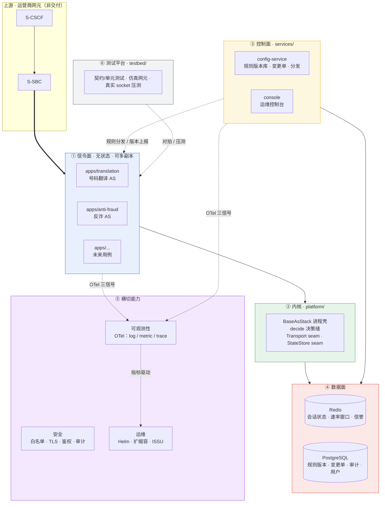

**分层职责**

| 层 | 职责 | 有状态性 |
|---|---|---|
| ① 信令面 `apps/` | 用例进程，承载 SIP 呼叫与业务判决 | **无状态**（状态全在 Redis） |
| ② 内核 `platform/` | 进程壳、B2BUA 状态机、决策缝、两个可插拔 seam | 无状态 |
| ③ 控制面 `services/` | 规则治理（版本/审批/分发）、运维控制台 | 无状态（状态在 PG） |
| ④ 数据面 | Redis 存运行态，PG 存治理态 | **有状态**，需冗余 |
| ⑤ 横切 | 可观测性、安全、运维 | 无状态（后端除外） |
| ⑥ testbed | 三层测试资产 + 仿真网元 | 研发期资产 |

---

## 3. 功能模块清单 ↔ 架构图元素对应表

> 对应 `tmp/架构.md` 第 3 条「架构图和功能模块的对应关系」。原 13 项一项不丢，仅归位。

| 原 13 项 | 归入层 | 架构图元素 | 组件/落点 | 状态 |
|---|---|---|---|---|
| AS 基本模块 | ② 内核 | `platform/` | `BaseAsStack`、`BaseCallController/BaseCallMap`、`decide()` 决策缝 | 已有 |
| 业务模块 | ① 信令面 | `apps/<用例>` | 号码翻译、反诈（纯函数 `routing/engine`、`screening`） | 已有 2 个 |
| 配置模块 | ③ 控制面 | `config-service` | 规则版本库、变更单、分发、热加载、回滚 | 新建 |
| 监控模块 | ⑤ 横切 | 可观测性 | OTel metrics + `active_calls` / `cps` | 改造 |
| 日志模块 | ⑤ 横切 | 可观测性 | OTel logs（结构化） | 改造 |
| 告警模块 | ⑤ 横切 | 可观测性 | Alertmanager / Grafana Alerting + 默认规则集 | **新建** |
| 安全模块 | ⑤ 横切 | 安全 | 对端白名单、端到端 TLS、控制台鉴权、操作审计 | 部分已有 |
| 运维模块 | ⑤ 横切 | 运维 | Helm、扩缩容控制器、ISSU draining | 新建 |
| 缓存模块 | ④ 数据面 | Redis | 会话状态、速率窗口、信誉衰减 | seam 已有 |
| 数据模块 | ④ 数据面 | Redis + PG | 运行态 + 治理态 | 新建 |
| 数据库模块 | ④ 数据面 | PostgreSQL | 规则版本、变更单、审计、控制台用户 | **新建**（Q13′ 加回） |
| 消息模块 | — | — | ❌ **删除**（原为 CDR 投递，网外不计费） | 移除 |
| 存储模块 | — | — | ❌ **删除**（原为 CDR 归档） | 移除 |

**两项补充（原清单没有，但架构需要）**

| 补充项 | 落点 | 说明 |
|---|---|---|
| 测试平台 `testbed/` | ⑥ | 契约/单元 + 仿真网元 + 真实 socket 压测 |
| 呼叫轨迹记录 | ① + ⑤ | CDR 的替代：按 Call-ID 可查询，用于投诉追溯与反诈举证（非话单、不出投递通道、不批价） |

---

## 4. 运行时视图

### 4.1 进程与副本模型

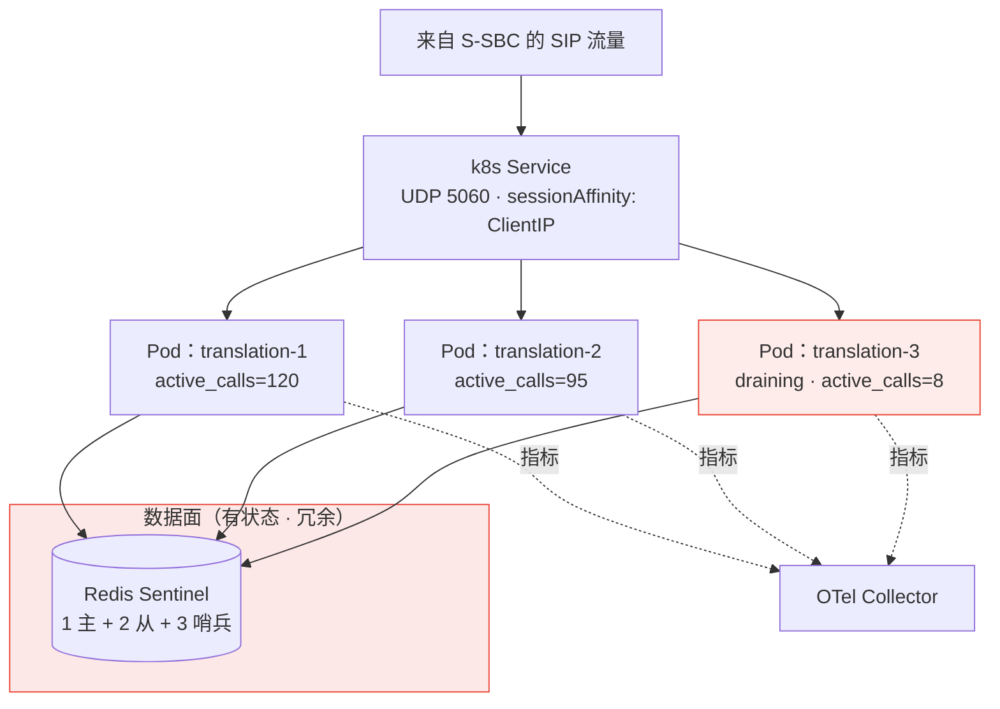

**要点**

- **一进程一用例**：`sippy` 自带阻塞 `ED2.loop()`，天然一进程跑一个用例；进程边界 = 故障域边界 = 独立灰度/扩缩容边界。
- **无状态化是硬前提**：状态外置到 Redis（seam 已存在于 `as_platform/state_store.py`，ADR-0010 已铺路）。POC 现在的 `InMemoryStateStore` 重启即丢会话，生产不可用。
- **亲和性双保险**：LB 层 `sessionAffinity: ClientIP` + 应用层 Redis 会话表兜底（S-SBC 可能复用源端口）。
- **优雅下线**：sippy 阻塞模型下需要 `preStop` draining + 延长 `terminationGracePeriodSeconds`。

### 4.2 单节点容量基线

| 栈 | CPS | 并发会话 | 来源 |
|---|---|---|---|
| Python `sippy` | 150–400 | 5,000–10,000 | `docs/SIP_stack_selection.md` |
| Go `go-b2bua` | ❓ 待实测 | ❓ 待实测 | README 自述：单核约 4x、内存约 2.5x 小、吃满所有核 |

> 容量目标数字（CPS / 并发会话 / 建立时延预算）**尚未给出**，见 §12 未决清单。没有这个数，Go 是否够用、是否需要 C/C++ 都无法裁决。

---

## 5. 控制面：规则治理与变更流水线

### 5.1 为什么不是 GitOps

运营商网络对 GitHub/GitLab 接入有限制，自建 Git 的成本不在部署而在**运维**：

| 自建方案 | 形态 | 资源 | 结论 |
|---|---|---|---|
| Gitea | Go 单体，单二进制/单容器，内置 SQLite | 1 核 1GB 起（推荐 2 核） | 部署轻，但**只用到 diff/审批一小部分**，且仍要 HA/备份/升级/用户体系 |
| GitLab CE | Nginx + Redis + PG + Sidekiq + Gitaly + Prometheus | **4GB 起，推荐 8GB** | 为一个配置版本库引入分布式系统，**不合算** |

更关键的约束是：**不应要求运营商运维人员为了改号段规则去学 Git/PR**。因此采用 **PostgreSQL + 变更单状态机**。

### 5.2 变更流水线

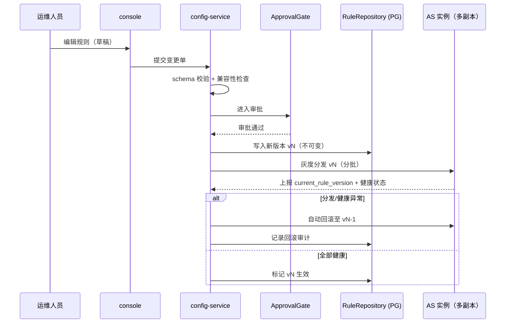

**要点**

- 规则仍是**声明式数据**（YAML），业务侧纯函数（`routing/engine`、`screening`）一行不改。
- **每个 AS 实例上报"当前加载的规则版本"** —— 这是 ISSU 期间判断新旧版本规则兼容性的依据（见 §6.2）。
- 接口抽象：`RuleRepository`（版本读写/diff/回滚）与 `ApprovalGate`（审批）。**审批可外置对接客户 OSS/工单系统**，但版本库必须自有 —— 不把规则的可用性绑在客户系统的可用性上。
- 全量操作审计落 PG（承接 §10 安全）。

---

## 6. 运营商级三件套

### 6.1 Redundancy

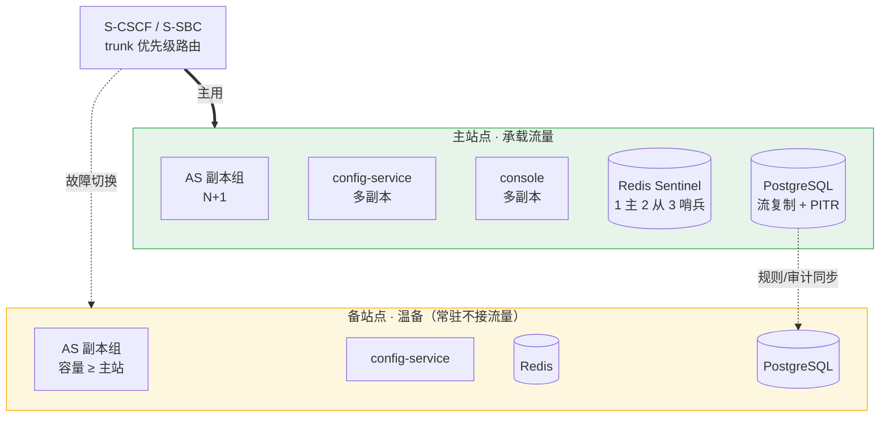

**站点内：零单点**（N+1，容忍单节点故障）
- AS 无状态多副本；config-service / console / 可观测汇聚多副本；
- Redis 升 Sentinel；PG 流复制 + 定期备份 + PITR；
- 有状态组件（Redis、PG）均纳入冗余与备份清单。

**跨站点：1+1 温备**
- 备站常驻但不接流量，规则/配置经 config-service 同步；
- 切换靠 S-SBC 侧 trunk 优先级 + 自动/手动脚本；
- **不采用双活（active-active）**：流量如何两站点分担由运营商网元配置决定，不在我方控制范围；且双活要么跨站点共享会话状态（延迟 + 脑裂），要么接受故障瞬间在途呼叫丢失 —— 这个 SLA 应由运营商定义。温备的切换语义最简单：备站无在途呼叫。

> ⚠️ 若要求容忍**整个机架/AZ** 故障（N+M），Redis 需跨 AZ、Pod 强制打散 —— 当前按 N+1（单节点）记，需变更请指出。

### 6.2 In-Service Upgrade（ISSU）

**前提事实**：`sippy==2.4.2` 是阻塞 `ED2.loop()`，SIP 事务/对话状态**全在进程内存**、无序列化与迁移接口 —— 因此"把在途呼叫无缝移交给新版本"在架构上**不成立**。ISSU 只能走 **draining**。

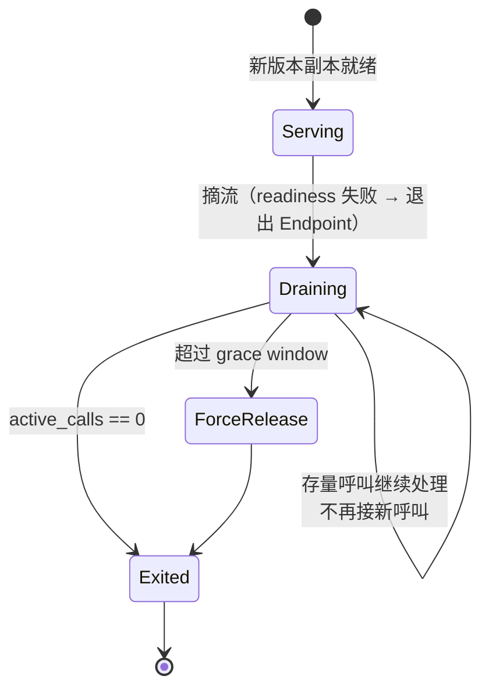

**规则与约束**

| 项 | 约束 |
|---|---|
| 升级窗口 | ≈ 存量呼叫最长时长，grace window 可配；需定义"超时强制释放"策略与呼叫时长硬顶 |
| 版本共存 | 新旧版本并存期间**规则 schema 必须双向兼容** —— 因此"规则 schema 版本化 + 兼容矩阵"是 ISSU 的硬前置 |
| 证书轮换 | 视同一次配置热更新，**不得触发重启**、不得中断在途呼叫 |
| 编排 | k8s RollingUpdate + `preStop` draining + 延长 `terminationGracePeriodSeconds` + PDB |
| v1 不做 | Operator（Helm + 标准 Deployment/ConfigMap/Secret 足够） |

### 6.3 动态扩缩容（grown / down-grown）

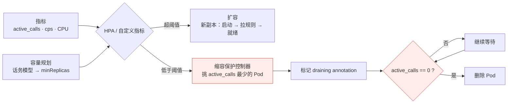

**要点**

- **不用标准 CPU/内存 HPA**：sippy 是阻塞事件循环，CPU 与真实 SIP 负载相关性差；更致命的是它**看不见活跃会话**，缩容必然掉话。
- **缩容保护控制器是必需品，不是优化项**：先摘流 → draining → `active_calls==0` 才删除。原生 controller 挑 Pod 策略不可控（类似 cluster-autoscaler 的 safe-to-evict 思路）。
- **新增两个指标**：`active_calls`（gauge）、`cps`（rate）。现有 `MetricsRegistry` 只有 `CallDisposition`/`PeerStatus`，需扩展；这两个指标同时服务于 OTel 与扩缩容。
- **扩容时延**：新副本要启动 + 从 config-service 拉规则才能接呼叫 → 潮汐预扩（D 方案）留 **v1.1**，v1 只做 A。
- 配置基线 `minReplicas` 按话务模型设定，HPA 只做**突发兜底**（节假日、群呼、以及反诈场景下针对本系统的呼叫洪峰）。

---

## 7. 数据面

| 存储 | 承载 | 冗余要求 | 说明 |
|---|---|---|---|
| **Redis** | 会话状态、速率窗口、信誉衰减 | Sentinel（1 主 2 从 3 哨兵） | seam 已有：`StateStore` + `InMemoryStateStore` / `RedisStateStore` |
| **PostgreSQL** | 规则版本、变更单、审计流水、控制台用户/权限 | 流复制 + 备份 + PITR | 数据量极小（规则条目千级、审计慢增长） |
| **呼叫轨迹** | 按 Call-ID 的逐消息记录 | 短期持久化（保留期可配） | 运维/举证数据，**非话单** |

**明确不做**：CDR 采集、CDR 投递通道、CDR 归档存储 —— 网外不计费（修正 2）。

**Redis 脑裂兜底**：Sentinel 切换窗口内，反诈速率窗口可能重复计数 → 判决需在极端情况下保持幂可接受，风险见 §12。

---

## 8. 可观测性

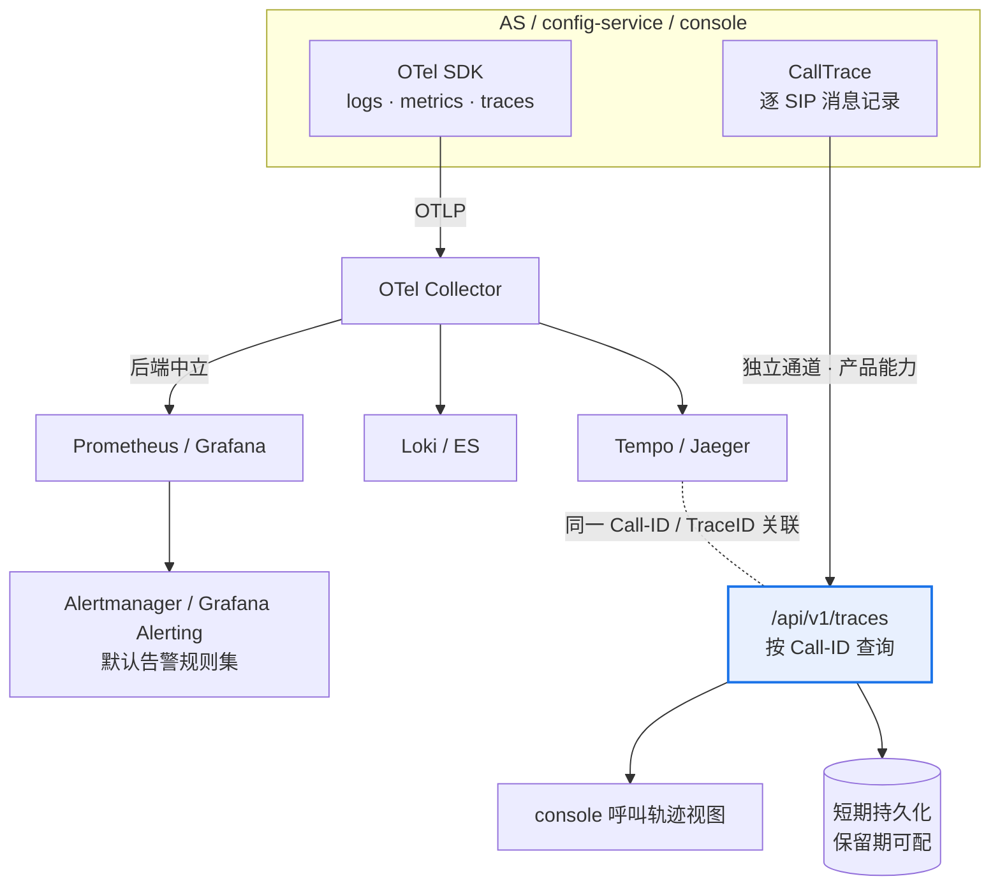

**双重身份必须拆开**：呼叫轨迹既是**运维信号**（走 OTel trace 进 Tempo/Jaeger），又是**产品能力**（控制台按 Call-ID 查询、投诉追溯、反诈举证）。后者**不能依赖客户是否部署了 trace 后端**，因此保留 AS 自身的 `/api/v1/traces` 查询通道，两条通道用同一 **Call-ID / TraceID** 关联。

**两个硬约束**

1. **导出不能阻塞呼叫路径**：sippy 阻塞 `ED2.loop()`，OTel 批量导出必须走独立线程/后台 flusher，否则可观测性会变成 SLA 杀手。
2. **进程内内存指标在多副本下无意义**：现状 `MetricsRegistry` 是进程内内存视图，必须改成每 Pod 暴露 endpoint + 集中抓取聚合。

**告警**：POC 没有告警，v1 补上；规则集随产品提供，不绑定后端。

---

## 9. 媒体与安全边界

### 9.1 媒体：不碰，但留口

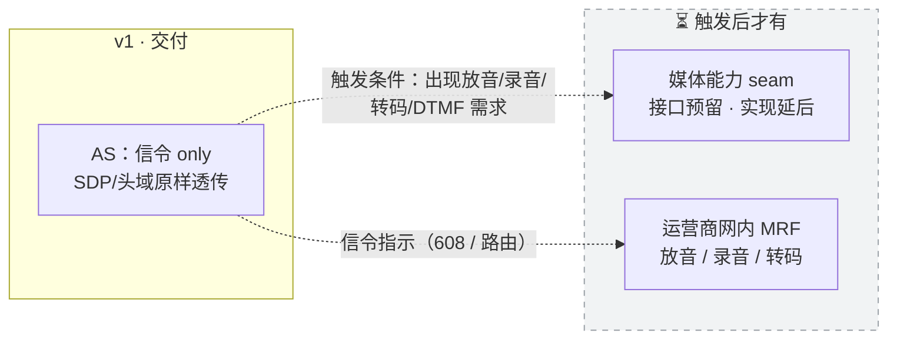

理由：网外第三方 AS 做媒体中继是**三角路由**（媒体绕出网再绕回，带宽翻倍 + 时延增加），且网外节点处理用户语音涉及合法监听与隐私合规；反诈若要放音提示，应由**网内 MRF 播放**，AS 只给判决。

### 9.2 安全：边界内安全，不碰 LI

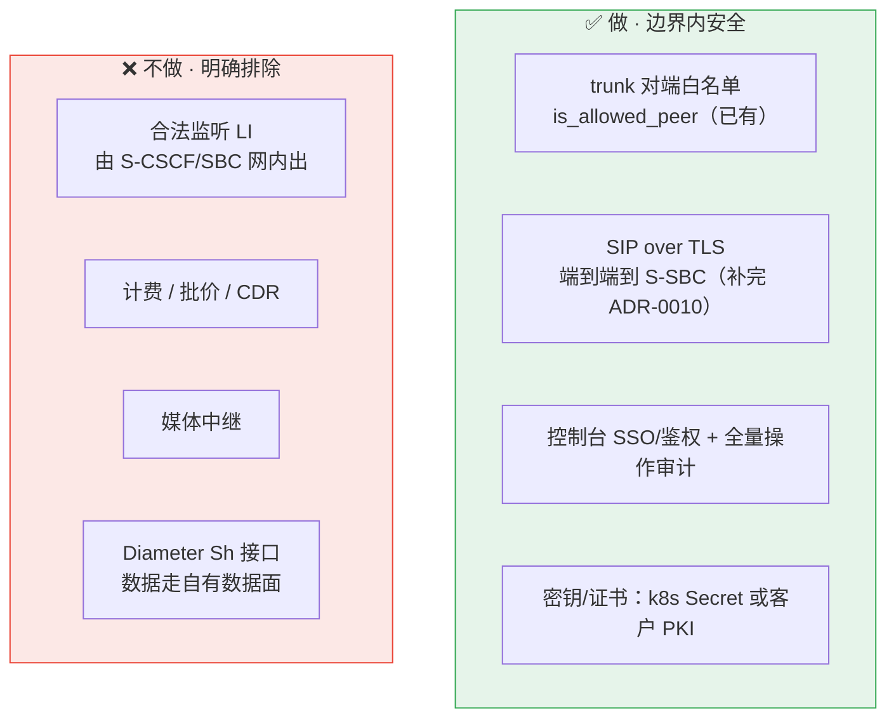

**为什么 TLS 必做**：网外 trunk 跨越运营商信任边界；且按 §1.1，AS 侧认为对端"就是 S-CSCF" —— 这条链路的**对端真实性**必须靠 TLS + 白名单双重保证，否则任何人伪装 S-SBC 即可灌入呼叫。ADR-0010 目前只到监听侧，v1 需补到端到端（含证书轮换，不能是静态证书）。

**为什么不做 LI**：Q11 已定不碰媒体，LI 的通信内容（CC）本就抓不到；信令层 IRI 应由网内网元出，第三方 AS 介入带来跨主体/跨地域合规风险。

---

## 10. 双栈迁移路径（Python → Go）

### 10.1 为什么是 `go-b2bua`

| 事实 | 值 |
|---|---|
| 项目 | `sippy/go-b2bua`（sippy 作者本人的**官方 Go 移植**） |
| 许可 | **BSD-2-Clause**（与现状一致，无新增合规负担） |
| 活跃度 | 460 commits / 70 stars，**两个月前仍有提交** |
| 自述收益 | 内存约 **2.5x 小**、吃满所有核、单核约 **4x 快**、**配置对象非全局 → 单进程可跑多个 B2BUA 实例** |
| 风险 | **无 release/tag** → 必须按 commit pin + vendoring，并跑上游回归 |
| 溯源文件 | `python-sippy_version.txt` 指向 Python sippy **commit `61f1da28`**（非版本号）→ 与 POC 锁定的 `sippy==2.4.2` 需人工比对行为差异 |

### 10.2 迁移状态机

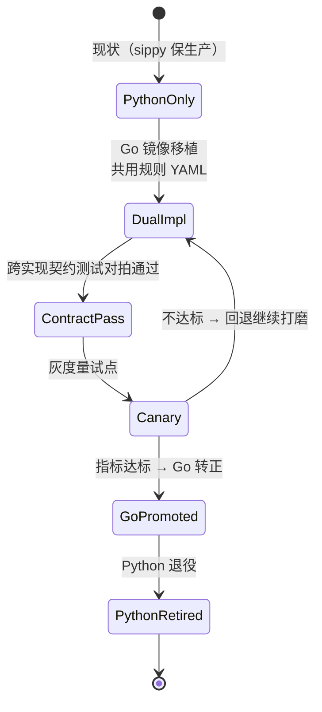

### 10.3 镜像移植 + 对拍

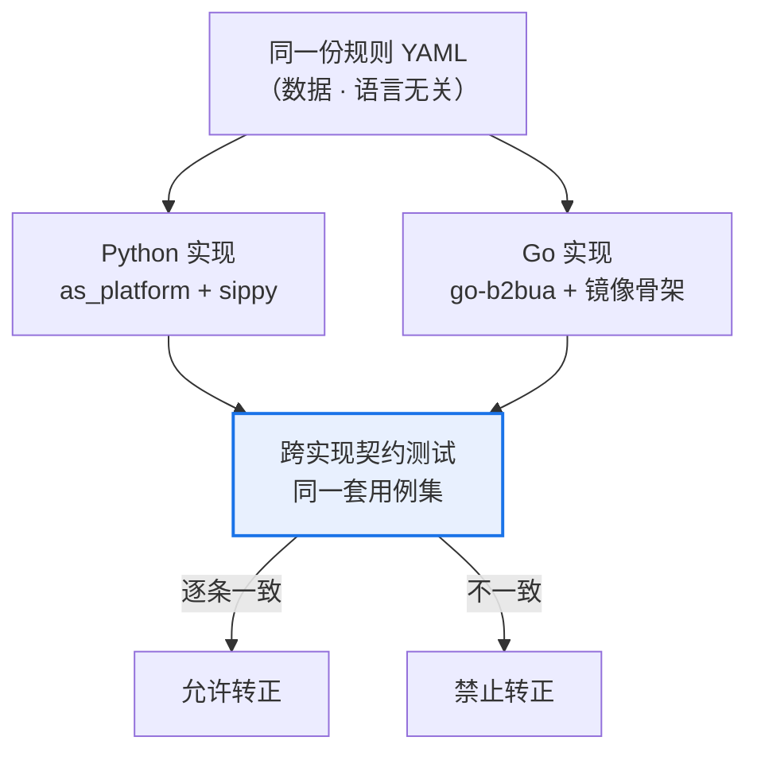

**镜像移植的内容**：进程壳、决策缝 `decide()`、`Transport` / `StateStore` 两个 seam —— 概念模型 1:1，**不是重写设计，只是换语言**。

**必须钉死的语言无关契约**：规则 schema、OTel 语义、内部 API（`/healthz`、`/metrics`、`/traces`）、配置分发接口、呼叫轨迹格式。这份契约是两个实现可互换的前提，也是 testbed 对拍的准入门槛。

**⏳ C/C++ 栈（open，不裁决）**：候选 `reSIProcate`(BSD)、`libre/baresip`(BSD-3)、`sofia-sip`(LGPL)；`PJSIP`(GPLv2/商业)、`Kamailio`/`OpenSIPS`(GPL 且是服务器) 有许可/形态顾虑。除非容量指标证明 Go 不够，否则不选。详见 `docs/SIP_stack_selection.md`。

---

## 11. 仓库组织与工程治理

### 11.1 monorepo 结构（Q3 = B）

现状硬伤：CI 每个 job 都要 `git clone ../as_platform`；`deploy/Dockerfile.as` 因构建上下文在仓外而失败；`VERSION`(0.2.0) 与 `pyproject`(0.1.0) 已漂移。monorepo + uv workspace 一次性解决。

```
as-product/                       # 单仓 · uv workspace
├── platform/                     # 内核库（原 as_platform，并入）
│   ├── src/as_platform/
│   └── tests/                    # 含 test_library_independence.py（不反向依赖守卫）
├── apps/
│   ├── translation/              # 号码翻译 AS（原 as_app）
│   ├── anti-fraud/               # 反诈 AS（原 anti_fraud_as）
│   └── <future>/                 # 未来用例
├── services/
│   ├── config-service/           # 规则版本库 + 变更单 + 分发
│   └── console/                  # 运维控制台
├── testbed/
│   ├── simulators/               # s_sbc_mock / ims_mock 转正为仿真网元
│   ├── load/                     # 真实 socket 压测（capacity_harness 产品化）
│   └── contracts/                # 跨实现契约用例集
├── deploy/
│   ├── helm/                     # 生产交付形态
│   └── compose/                  # 仅 dev 环境
├── docs/adr/                     # ADR 制度化（承接原 0009–0015 并扩展）
└── AGENT.md                      # 开发规则 / DoD / AI 规则
```

**"不反向依赖"不靠仓库边界保证，靠测试保证**：`test_library_independence.py` 用 AST 扫 `APPLICATION_PACKAGES`，搬进 monorepo 后继续跑，并把守卫范围扩到 `services/`、`testbed/`。

### 11.2 四层 CI 门禁

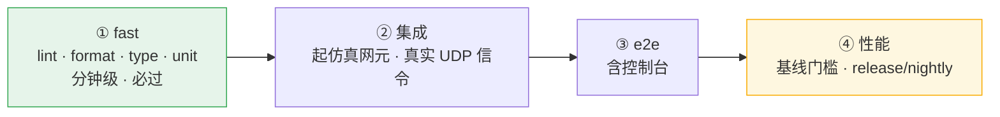

### 11.3 开发模式（Q16 = A）

| 层 | 方法 | 理由 |
|---|---|---|
| **业务决策层**（`routing/engine`、`screening`） | **强制 TDD**，Red-Green-Refactor | 纯函数，TDD 收益最高、成本最低 |
| **协议/接入层** | 契约测试 + 仿真集成测试为主 | 不做严格 TDD，成本高收益低 |
| **设计决策** | **ADR 制度化** | 本次每一项决策（无状态化、ISSU、扩缩容、配置治理、栈迁移）都落 ADR |

**AI 辅助（loop engineering）硬规则**（写入 `AGENT.md`）：
1. AI 产出的代码必须过**完全相同**的门禁与对拍测试，**不得**因"是 AI 写的"降低标准；
2. PR 需标记"AI 生成"，便于 review 时重点审查；
3. Go 镜像移植是 AI 辅助收益最高的场景（同构翻译 + 对拍验证）—— 收益要用，标准不放。

**版本治理**：
- 产品用**统一 release 版本号**（交付给运营商的是一个系统版本），组件内部接口独立做语义化版本 —— 杜绝 `VERSION` 与 `pyproject` 漂移；
- 上游 pin：`sippy==2.4.2` 继续锁死；`go-b2bua` 无 tag → **commit pin + vendoring** + 上游回归。

### 11.4 测试平台

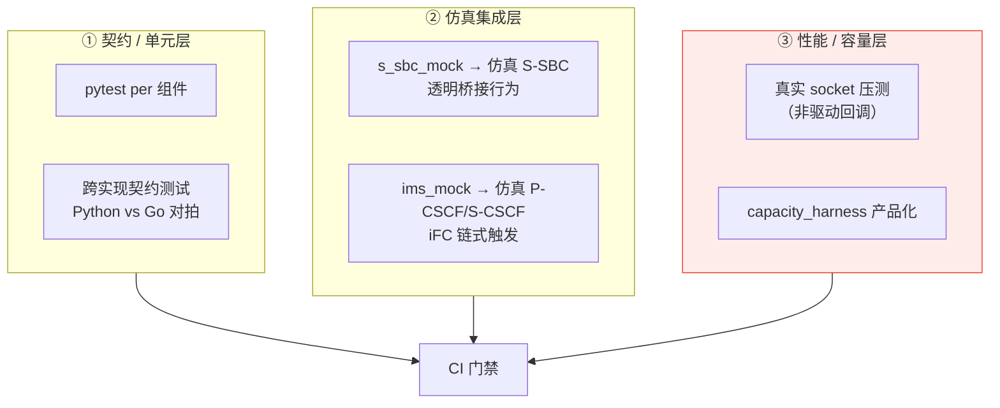

**关键点**

1. **性能测试必须从"驱动回调"升级到"真实 socket 压测"**：现有 `CapacityDriver` 直接调回调，绕过 socket 与事件循环，测的是业务逻辑而非系统容量。容量基线不可比，就无法判断"CPS 是否撞墙"、也就无法裁决 Go 是否够用。
2. **仿真网元是一等资产**：交付环境里 S-CSCF/S-SBC 是运营商网元，本地只能靠仿真；iFC 链与 S-SBC 透明桥接行为必须能被仿真，否则集成测试无处可跑。
3. 压测工具可用 SIPp（GPL，**仅内部测试使用、不随产品分发**，无合规问题）或自研压测器。
4. ⏳ **v1 不把 testbed 当交付物**，只作研发资产；客户验收测试能力留 v1.1。

---

## 12. 未决清单与风险登记

### 12.1 ❓ 未决（open，不裁决）

| # | 条目 | 影响 | 需要什么才能裁决 |
|---|---|---|---|
| O1 | **容量目标数字**：单节点 CPS / 并发会话 / 呼叫建立时延预算 | 决定 Go 是否够用、是否需上 C/C++；也是扩缩容阈值的依据 | 业务话务模型 |
| O2 | **C/C++ 栈选型** | 备选路线 | 先有 O1；参考 `docs/SIP_stack_selection.md` |
| O3 | `go-b2bua` 与 `sippy 2.4.2` 的行为比对 | 迁移风险基线 | 人工比对（上游只标到 commit `61f1da28`） |
| O4 | 呼叫轨迹保留期 | 存储成本与合规 | 客户合规要求 |
| O5 | 跨站点容灾等级：N+1（单节点）还是 N+M（机架/AZ） | Redis 是否跨 AZ、Pod 打散策略 | 客户 SLA |

### 12.2 ⚠️ 风险登记

| # | 风险 | 触发条件 | 缓解 |
|---|---|---|---|
| R1 | **UDP 会话亲和性失效**导致 dialog 请求落到无状态副本 | S-SBC 复用源端口 / LB 无亲和 | LB 亲和 + Redis 会话表兜底（双保险） |
| R2 | **缩容掉话** | 缩容时 Pod 仍有活跃呼叫 | 缩容保护控制器（摘流 → draining → 归零才删） |
| R3 | **ISSU 窗口过长** | 长通话导致 grace window 拉长 | 呼叫时长硬顶 + 强制释放策略 |
| R4 | **规则 schema 不兼容**导致滚动升级中途解析失败 | 新旧版本并存 | schema 版本化 + 兼容矩阵 + 版本上报 |
| R5 | **Redis 成为新 SPoF** | 无状态化之后 | Sentinel + 脑裂窗口下判决保持幂可接受 |
| R6 | **`go-b2bua` 无 release/tag**，上游变动 | 依赖更新 | commit pin + vendoring + 上游回归 |
| R7 | **OTel 导出阻塞呼叫路径** | 阻塞事件循环下同步导出 | 独立线程批量 flusher |
| R8 | **证书轮换中断在途呼叫** | TLS 证书到期 | 轮换视同配置热更新，不触发重启 |
| R9 | **`sippy` 单进程吞吐上限** | CPS 撞墙（150–400） | 多副本水平扩展；Go 栈试点（§10） |

---

## 13. 与原 POC 的差距清单（v1 需新建/改造）

| 组件 | 现状 | v1 动作 |
|---|---|---|
| 状态存储 | `InMemoryStateStore` | 切 `RedisStateStore` + Sentinel |
| 配置 | 本地 YAML 文件 + 热加载 | config-service + PG 版本库 + 变更单 + 灰度分发 |
| 控制台 | 只读、无鉴权、vendored Chart.js | 读写 + SSO/鉴权 + 全量审计 |
| 可观测性 | 自建 log/metric/trace + 内存 registry | OTel 三信号 + 告警 + Pod endpoint 聚合 |
| 告警 | 无 | 默认规则集 |
| TLS | 仅监听侧（ADR-0010） | 端到端 + 证书轮换 |
| 部署 | docker-compose（演示） | Helm（生产唯一形态） |
| 扩缩容 | 无 | 自定义指标 HPA + 缩容保护控制器 |
| 追踪 | 内存 `CallTrace` | 短期持久化 + 按 Call-ID 查询（CDR 替代） |
| 测试 | unit 21 / integration 9 / e2e 6 | + 契约对拍层 + 真实 socket 压测 |
| SIP 栈 | `sippy==2.4.2` | 双栈并行 + `go-b2bua` 试点 |
| 版本 | VERSION 0.2.0 vs pyproject 0.1.0 漂移 | 统一 release 版本 + 接口语义化版本 |

---

*本文由 grill-me / plan-grilling 流程逐条确认后落盘。任何一条决策的变更都应同步更新本文并新增对应 ADR。*
